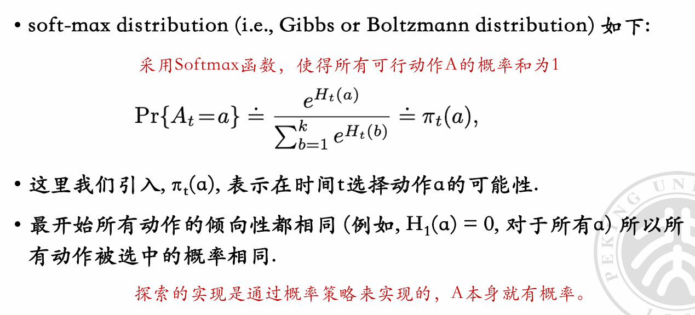

# AI BASIS 2025 spring

#### By Jiaming Yang

### Reinforcement Learning

生物基础：斯金纳箱

强化理论：通过奖励/惩罚改变智能体的行为方式

随机奖励：使智能体上瘾-->本质：可变比率强化程序

随机奖励通过**可变比率强化的高持续性**和**神经奖励系统的正反馈机制**，使智能体（包括人类和 AI）形成对 “不确定性收益” 的依赖。这种依赖表现为持续寻求奖励的行为，即使平均收益低下，类似 “上瘾”。理解这一机制不仅有助于解释动物和人类的成瘾行为，也为设计更理性的 AI 系统提供了理论基础 —— 避免过度依赖随机奖励，转而构建目标明确、反馈稳定的强化机制。

随机奖励使得智能体更趋向于去“探索”,而非稳定地优化核心策略

‘

问题模型：

输入现在的state（状态），做出action（动作），在外部环境中产生状态的改变/更新，然后收到反馈的reward(回报/奖励)，然后循环

（智能体的目标是学习获得更好的reward

针对具体问题，上来第一步就是建模

我们要回答的就是环境（S0、ST、S空间、A空间、R、以及具体的状态转移）、策略以及衡量的目标

e.g. 井字棋

对于这种状态空间较少的情况，我们往往采用一种直观的方式表达，即**状态估值表**

每个状态⼀个⼊⼝，记录从该状态出发下到终局的胜率：学习状态估值表，就是强化学习要解决的问题

智能体根据这个不断更新的状态估值表来做出决策，通史决策之后的反馈动态更新状态估值表

状态估值表的初值一般通过游戏规则来确定

• 利用：⼤概率根据估值表贪⼼选 价值最⼤的地⽅下； • 探索：偶尔随机地选择以便探索 之前没有探索过的地⽅； • 利用和探索要平衡； • 值函数表决定了我们的策略，改进值函数表就改进了策略

α:步长，相当于lr

对手若在环境中：那就是单智能体的训练；

否则就是多智能体

泛化模型：

状态转移和奖励都不一定是确定性，可以带上概率

• 状态转移不⼀定是确定性 的，可以按概率状态转移

 • 𝑃	: 状态转移函数 -> R+， 𝑃 当前状态和动作， 𝑠是下⼀状态。 

• 对于任意𝑠,𝑎，有 ∑ 𝑃 𝑠, 𝑎,𝑠 = 1 𝑠, 𝑎, 𝑠 =Pr[𝑠|𝑠,𝑎]	， 𝑠,𝑎是 给定S所有可⾏动作A下的状态 概率之和为1 

• 奖励也不⼀定是确定性的，可以是⼀个概率奖励 

• 𝑅	: 奖励函数 -> R+ ， 𝑅 𝑠, 𝑎, 𝑟 = Pr[𝑟|𝑠,𝑎] ， 𝑠,𝑎 是当 前状态和动作， 𝑟是奖励。 

• 对于任意𝑠,𝑎，∑𝑅 𝑠, 𝑎,𝑟 = 1 给定S和A时所有可能奖励的概率之和为1

而针对策略Π，也可以引入概率分布，以及一个超参gamma（γ），用以衡量对未来受益的考量看重的程度（让智能体的决策看到几步之后）

引入概率后让图有更多分支

dh:一个策略就是一张状态到动作的映射表

妙哉

给每个格子赋初值非常关键，直接决定了这个智能体的“思维”

评估一个策略：

在强化学习中，动作价值函数 *Q**π*(*s*,*a*) 有时比状态价值函数 *V**π*(*s*) 更方便，主要原因如下：

1. **直接指导动作选择**

- **状态价值的局限性**：*V**π*(*s*) 描述的是状态 *s* 的 “整体好坏”，但未直接区分该状态下不同动作的优劣。若要基于 *V**π*(*s*) 选择动作，需结合策略 *π*(*a*∣*s*) 对所有可能动作的价值进行加权，计算复杂度较高（尤其是动作空间较大时）。
- **动作价值的直接性**：*Q**π*(*s*,*a*) 直接给出了在状态 *s* 下执行动作 *a* 的 “即时收益预期”。例如，在最优策略中，只需对 *Q*∗(*s*,*a*) 取最大值即可得到最优动作 *a*∗=argmax*a**Q*∗(*s*,*a*)，无需依赖策略的概率分布。

2. **无模型学习中的灵活性**

- 在环境动态未知（即转移概率*P*(*s*′∣*s*,*a*)和奖励函数*R*(*s*,*a*,*s*′)未知）的场景中，

  *Q**π*(*s*,*a*)更适合通过交互直接估计。例如：

  - **Q-learning** 等无模型算法可通过 “试错” 直接更新 *Q*(*s*,*a*)，无需显式建模环境转移，而 *V**π*(*s*) 的估计通常需要知道转移概率（或通过 *Q* 的期望间接计算）。
  - 贝尔曼方程对 *Q* 的表达更直接：*Q**π*(*s*,*a*)=*R*(*s*,*a*)+*γ*∑*s*′*P*(*s*′∣*s*,*a*)∑*a*′*π*(*a*′∣*s*′)*Q**π*(*s*′,*a*′)
    该式可直接通过采样下一个状态 *s*′ 和动作 *a*′ 进行近似，而 *V**π*​(*s*) 的贝尔曼方程需依赖 *Q* 的期望，在未知策略时更难处理。

3. **策略更新的高效性**

- 策略迭代或优化时，*Q**π*(*s*,*a*) 可直接用于贪心策略改进（如 *π*′(*a*∣*s*)=1 当 *a*=argmax*a**Q**π*(*s*,*a*)），而 *V**π*(*s*) 需通过策略的动作分布间接关联动作选择，步骤更繁琐。
- 例如，在动态规划中，计算 *V**π*(*s*) 后仍需通过 *π*(*a*∣*s*)=argmax*a**Q**π*(*s*,*a*) 来更新策略，而 *Q* 可跳过中间步骤直接指导策略改进。

4. **处理随机策略与确定性策略的一致性**

- 对于确定性策略 *π*(*a*∣*s*)=1（当 *a*=*π*(*s*)），*V**π*(*s*)=*Q**π*(*s*,*π*(*s*))，即 *V* 是 *Q* 在特定动作下的特例。而 *Q* 可统一处理随机策略（对所有动作的价值加权）和确定性策略（直接取特定动作的价值），应用场景更广泛。

5. **最优策略的表示更简洁**

- 最优状态价值 *V*∗(*s*)=max*a**Q*∗(*s*,*a*)，即 *V*∗ 是 *Q*∗ 的特例。反之，若已知 *V*∗(*s*)，仍需结合环境动态计算 *Q*∗ 才能选择动作。因此，*Q*∗ 包含了更完整的决策信息 —— 既描述状态价值，又区分动作优劣。

总结

*Q**π*(*s*,*a*) 的优势在于**直接关联动作选择**，且在无模型学习、策略优化和最优策略表示中更高效。当需要 “在某个状态下选择最优动作” 时，*Q* 能避免 *V* 需结合策略加权的复杂性，这也是许多强化学习算法（如 Q-learning、DDPG 等）以 *Q* 为核心的原因。

从图上直观来看，状态价值是从一个点出发，而动作价值是一个边

看这个也比较直观，要想从Q-V，需要一个加权和，而若我们从V-Q，其实Q中所含的可以直接从这一步的即时奖励中看到，然后剩下的就只是下一时刻的V了，最后再用p(概率)加权

• 得到最优V*或者Q*就能得到最优策略π* 

途径：

• 算出来 • 使用各种⽅法探索出V*或者Q*  

• 存起来 • 状态多时，查找表保存所有状态的价值不现实（如王者荣耀） 

-->• 用带参数的函数来保存 Vπ (s)和 Qπ (s,a)(参数数目小于状态数)   (相当于用一个参数量少的函数来近似)

#### **函数近似的本质：用参数化映射替代枚举**

- 用含参数 *θ* 的函数 *f*(*s*;*θ*) 近似 *V**π*(*s*)，或 *f*(*s*,*a*;*θ*) 近似 *Q**π*(*s*,*a*)。

- 参数数量∣*θ*∣≪状态数，例如：

  - 线性函数 *f*(*s*;*θ*)=*θ**T**s*，参数数等于状态特征维度；
  - 神经网络 *f*(*s*;*θ*)，参数数由网络层数和神经元数量决定，远小于状态数。

  （其实就化约到神经网络这样的结构上）

  优点：**参数效率**和**泛化能力**，但需平衡函数复杂度与训练样本量，确保参数能拟合真实价值或策略的分布规律。

 • 学习过程中我们会调整参数，使之更符合观察到的实际收益。 

• 学习效果取决于带参数的近似函数的好坏。 

• 也可以直接用⼀个模型来模拟策略π(a|s)

直接用模型的意思也即直接用别人创建好的一个”映射“的结构

策略->交互->经验->策略……

#### 寻找最优策略的思路汇总

1. 多臂老虎机

   构建Q*(a)

   增量计算动作价值

   

   

   在老虎机这个场景可以理解为：用大部分的赌注去执行目前已知的期望，而流出epsilon（小概率）去探索新的老虎机，然后不断去更新期望的动作收益Q_A

   

   更新逻辑：要考虑α作为学习率（步长），我们只应4看更新的这一步计算中Rn,和R之前的系数对比

2. 绝对贪心；

   epsilon-贪心

   适当的epsilon是有益于探索：0.1时效果还在上升（>0.01)

   乐观初值贪心：

   我们初始时把期望设的较高

   

   也即把Q1（α）设大一些，这样鼓励探索：

   不管开始选了 哪个动作，奖励都比初值小，算法就 会尝试其他动作 

   • 这会导致估值收敛前所有动作都被尝试⼏次，系统做了相当的尝试，即使每次都使用贪⼼⽅法

   #### 两类方法的 **探索机制差异** 驱动曲线变化：

   1. **乐观初值贪心（蓝色，\**Q\**\**1\**\**=\**\**5\**\**,\**\**ε\**\**=\**\**0\**）**：

      - 初始动作值估计极高（远高于真实值），**贪心策略下仍会主动探索**（因实际回报低于初始期望，智能体会尝试其他动作，通过 “失望” 倒逼探索）。

      - 前期虽有波动（探索阶段），但因探索更 “高效”（针对性尝试），快速收敛到高比例最优动作，最终稳定在较高水平。

      - 确定性的解释：

        为什么探索是 “确定性” 的？

        乐观初值贪心的探索 **不是随机选择（如 ε- 贪心的随机试错），而是由 “期望落差” 驱动的必然行为**：

        - 贪心策略的本质是 **“选当前估计价值最高的动作”**。
        - 若人为将**所有动作的初始 Q 值设得过高（远高于真实值）**，则**第一次选择任何动作后，实际奖励必然低于初始估计**（因为真实值≤初始乐观值）。
        - 这会导致该动作的 Q 值更新后**下降**，而**未被选择的动作仍保留高初始 Q 值**。此时，贪心策略会**必然转向下一个 “估计值最高” 的动作**（即未被尝试的、仍保持高 Q 值的动作）。

        由此，智能体会**按 “Q 值从高到低” 的顺序依次尝试动作**（因每次尝试后该动作 Q 值下降，下一个最高 Q 值的动作自然成为候选），探索过程是**可预测、非随机**的，故称为**确定性探索**。

        （简单来说，这样的乐观估值使得智能体一定会优先把所有没试过的情况试一遍，因为没试过的就是初值，而试过的都达不到初值，贪心下会选择没试过的）

   2. **ε- 贪心（灰色，\**Q\**\**1\**\**=\**\**0\**\**,\**\**ε\**\**=\**\**0.1\**）**：

      - 初始值 “现实”（*Q*1=0），仅靠 **随机探索（10% 概率）** 突破贪心陷阱。
      - 随机探索效率低（无针对性），故前期收敛慢；但长期仍能逐步发现最优动作，最终比例低于乐观初值（因乐观初值的 “强制探索” 更高效）。

   **本质**：乐观初值通过 **“虚假高期望” 驱动确定性探索**，ε- 贪心依赖 **随机探索**，前者探索更高效，故收敛更快。

这样的乐观估值探索也会更快收敛，因为“找到方向后”，他就不会”乱探索“（而epsilon会一直以一个固定的概率“瞎试”）

当然乐观初值探索也有局限性：不适用于环境或奖励动态变化！

非固定问题的核心挑战：**环境动态变化（奖励分布、最优动作随时间改变）**

例如：

- 某动作早期奖励低（非最优），但后期环境变化，其奖励突然升高（变成最优）；
- 或原有最优动作的奖励逐渐下降，新动作成为最优。

 为什么乐观初值的探索是 “临时性” 的？

1）**探索动力的 “一次性消耗”**：

乐观初值的探索 **仅依赖 “初始 Q 值> 实际奖励” 的落差**。一旦所有动作都被尝试过，它们的 Q 值会 **收敛到当时的真实值**（不再有虚高偏差），后续不再有 “失望驱动的探索”—— 此时贪心策略会**固守当前估计的最优动作**，失去探索动力。

2）**无法跟踪动态变化**：

非固定问题中，**奖励分布持续变化**，但乐观初值没有 **“持续探索” 的机制**：

- 若环境变化导致**新的最优动作出现**（或原有最优失效），智能体的 Q 值仍停留在 “过去的真实值”，贪心策略会忽略这些变化（因为没有新的 “虚高 Q 值” 推动它重新尝试）。
- 对比 ε- 贪心：持续以 ε 概率随机探索，能主动发现环境变化；但乐观初值的探索是**前期被动触发，后期彻底停止**。

简言之：乐观初值的探索是 **“初始偏差催生的被动行为”**，一旦初始偏差被 “修正”（Q 值收敛到当时的真实），就不再探索；而非固定问题需要 **“持续主动探索” 跟踪变化**，两者机制不匹配，故探索仅具临时性。

3. Upper Confidence Bound(UCB)

应对环境等等的“不确定性”，UCB应声而出，它通过记录加权一个“新鲜程度‘，来确保持续探索，而不只是考虑当下最好（贪心）

其中*r*ˉ*j*是动作 j 的平均奖励，N 是总步数，*n**j*是动作 j 被选次数，c 是探索系数。加权的话，可能是对这两个部分（均值和置信项）添加权重，或者在更一般的框架里，比如结合不同的项进行加权。

步骤分解：

1. 明确 UCB 的决策核心：计算每个动作的 “上置信界”，选最大的。
2. 加权的场景：比如对平均奖励和置信区间部分赋予不同权重，或者扩展公式中的系数调整（比如 c 可以看作权重）。
3. 决策流程：不管怎么加权，核心步骤是：
   - 统计每个动作的历史数据：被选次数*n**j*，累计奖励（计算平均*r*ˉ*j*）。
   - 计算加权后的置信上界：比如*U**C**B**j*=*w*1⋅*r*ˉ*j*+*w*2⋅(*c**n**j*ln*N*)，其中*w*1+*w*2=1（或其他权重分配），或者更灵活的加权方式。
   - 比较所有动作的加权 UCB 值，选择最大的那个。

加权后，就是调整这两部分的比重：如果想更偏向利用，就提高平均奖励的权重；想更探索，就提高置信项的权重。

所以整理一下：

UCB 算法加权后的决策逻辑

UCB（上置信界）算法的核心是 **用 “平均奖励 + 置信区间” 衡量动作价值**，加权决策是对这两部分（或扩展项）赋予不同权重，平衡探索（不确定性）和利用（历史收益），具体步骤：

#### 1. 定义加权公式（以经典 UCB 扩展为例）

设动作 *j* 的历史数据：

- *n**j*：已选择次数；
- *r*ˉ*j*=*n**j*∑*t*=1*n**j**r**j*,*t*：平均奖励（利用部分）；
- 置信项（探索部分，衡量不确定性）：Conf*j*=*c*⋅*n**j*ln*N*（*N* 是总步数，*c* 是探索系数）。

**加权 UCB 值** 可表示为：Weighted-UCB*j*=*w*1⋅*r*ˉ*j*+*w*2⋅Conf*j*
（*w*1​,*w*2​ 是权重，满足 *w*1​+*w*2​=1，或灵活分配，甚至引入更多项。）

#### 2. 决策步骤（动态迭代）

在每一步决策时：
① **统计历史数据**：更新每个动作的 *n**j*​ 和 *r*ˉ*j*​（每次选择后，记录奖励并更新）。
② **计算加权 UCB**：对每个动作，代入公式计算 Weighted-UCB*j*​（权重 *w*1​,*w*2​ 可固定或动态调整，比如前期提高 *w*2​ 加强探索，后期提高 *w*1​ 侧重利用）。
③ **选择最优动作**：比较所有动作的 Weighted-UCB*j*​，选 **值最大的动作**。（所以如果之前完全没选过这个动作，这个动作的值就是+∞，所以一定会探索到这个动作而这个UCB相比于乐观初值贪心，相当于对这个探索次数有了一个记录，使得1次就比2次还是更有”置信度“，乐观估值贪心只在初始（即0次）时赋值特殊处理

#### 3. 加权的意义与调控

- **偏向探索**：提高 *w*2（或增大 *c*），让 “不确定性高的动作” 更易被选（比如新动作，*n**j* 小，置信项大）。
- **偏向利用**：提高 *w*1，让 “历史平均好的动作” 更易被选（压缩探索，快速收敛）。

示例（结合代码逻辑）

参考代码中经典 UCB 的计算是 UCB*j*=*r*ˉ*j*+*n**j*ln*N*（等价于 *w*1=1,*w*2=1，探索系数 *c*=1）。若加权调整为 *w*1=0.8,*w*2=0.2，则公式变为：Weighted-UCB*j*=0.8*r*ˉ*j*+0.2*n**j*ln*N*
决策时始终选该值最大的动作，实现 **“利用为主、探索为辅”** 的策略。

综上，加权 UCB 的决策本质是 **通过权重调控 “历史收益” 和 “不确定性” 的占比**，最终选择加权后置信界最高的动作，灵活平衡探索与利用。

c作为超参是一个经验值。（c=2时效果比epsilon=0.1时要好）

4. 梯度下降

   基本逻辑是为每个动作引入”优先度“，并且每次决策后根据反馈不断更新

   

   在梯度下降中，我们常常引入一个baseline，来降低梯度估计的方差。

   （一般就用Vt(s),状态估值函数！！！)(这个baseline的选择要求就是与梯度无关，不依赖于动作)

   在 **策略梯度（强化学习中用梯度下降优化策略的方法）** 里，**baseline** 指 **不依赖于动作的函数**（如状态价值 *V**π*(*s*)），核心作用是 **降低梯度估计的方差**，让训练更稳定，以下展开：

   1. **定义与核心属性**

   - **定义**：baseline 是一个 **仅依赖状态\*s\*（或与动作\*a\*无关）的函数**（记为*b*(*s*)），比如状态价值函数 *V**π*(*s*)（某状态下所有动作的期望价值）。
   - **关键性质**：对策略梯度的**期望无影响**（保证梯度估计无偏），但能**减小单次梯度的波动**（降低方差）。

   2. **为什么需要 baseline？**

   策略梯度的核心公式（简化版）为：∇*θ**J*(*θ*)≈E[∇*θ*ln*π*(*a*∣*s*;*θ*)⋅*Q**π*(*s*,*a*)]
   其中 *Q**π*​(*s*,*a*) 是**动作价值**（状态*s*选动作*a*的未来累计奖励）。但 *Q**π*​(*s*,*a*) 的**方差很大**（不同动作的*Q*值差异可能极不稳定），导致梯度更新震荡甚至不收敛。

   引入 baseline *b*(*s*) 后，梯度修正为：∇*θ**J*(*θ*)≈E[∇*θ*ln*π*(*a*∣*s*;*θ*)⋅(*Q**π*(*s*,*a*)−*b*(*s*))]
   由于 *b*(*s*) 与动作*a*无关，可证明 **E[∇\*θ\*​ln\*π\*(\*a\*∣\*s\*;\*θ\*)⋅\*b\*(\*s\*)]=0**（期望为 0，不改变原梯度的期望），但 ***Q\**π\*​(\*s\*,\*a\*)−\*b\*(\*s\*) 的方差更小**（若*b*(*s*)接近*Q**π*​(*s*,*a*)的均值，如*V**π*​(*s*)=E*a*​[*Q**π*​(*s*,*a*)]，则差值的波动被压缩）。

   3. **常见的 baseline 选择**

   最典型的是 **状态价值函数 \*V\**π\*(\*s\*)**：

   - 它是*Q**π*(*s*,*a*)在动作上的**期望**（*V**π*(*s*)=E*a*[*Q**π*(*s*,*a*)]），天然接近*Q*的 “平均水平”，能有效降低方差。
   - 可通过**价值网络**（如 Critic 网络）实时估计*V**π*(*s*)，配合策略网络（Actor）形成 Actor-Critic 框架。

   总结

   策略梯度中的 baseline 是 **“与动作无关的基准值”**，通过 “削去动作价值的均值波动”，让梯度更新更稳定，同时保证无偏性。它是**策略梯度降方差的核心技巧**，但仅在 ** 策略梯度（强化学习）** 场景中针对性设计，并非通用梯度下降的概念。

   

   - **baseline 的核心目标**：
     通过 “动态校准动作价值的偏差”（*Q*−*V*）来稳定梯度，是**优化过程中的关键组件**，必须满足 “与动作无关”“无偏性” 等约束（如 E*a*​[*V*(*s*)]=E*a*​[*Q*(*s*,*a*)]）。
   - baseline与初始的期望估值不同，是动态更新。

   - **关联点**：baseline 的初始参数可能基于初始期望估值，但二者在功能、约束、生命周期上完全不同。

   梯度下降法不是估计动作的价值，⽽是动作的优先顺序，使用  softmax 选动作. 其实有探索，因为动作采用softmax有概率

5. 多臂老虎机上的应用对比：

   

### LLM大语言模型

语言是人类思维的工具。

输入语言  ---   语言->语言的计算   --- 输出语言

语言模型（Language Model，LM）和大语言模型（Large Language Model，LLM）在技术发展路径上存在显著的演进关系，二者的关键区别主要体现在模型规模、能力边界、训练方式等核心维度，以下是具体分析：

**一、模型规模：参数数量与计算资源的差异**

- 语言模型（LM）
  - **参数规模**：通常在百万到数十亿参数之间，例如早期的 Word2Vec、GPT-1（1.17 亿参数）。
  - **计算资源**：训练所需算力较低，可在单机或小型集群完成，适合特定场景的轻量级应用。
- 大语言模型（LLM）
  - **参数规模**：动辄数百亿到数万亿参数，如 GPT-3（1750 亿参数）、PaLM 2（5400 亿参数），甚至部分模型参数超过万亿（如 Switch Transformers）。
  - **计算资源**：依赖大规模分布式训练（如数千块 GPU/TPU），训练成本极高（单轮训练可能消耗数百万美元）。

**二、能力范围：从 “语言理解” 到 “通用智能” 的跨越**

- 语言模型（LM）

  - **核心能力**：以 “概率预测” 为目标，主要解决语言生成、文本补全、词向量表示等基础任务，例如根据前文预测下一个词（如 “今天天气很__” 预测 “热”）。
  - **局限性**：缺乏复杂逻辑推理、跨领域知识整合能力，难以处理多轮对话、常识理解等任务。

- 大语言模型（LLM）

  - 核心能力

    ：通过海量数据训练获得 “涌现能力”，具备：

    - **上下文理解**：支持数千到数万 token 的长文本处理（如 GPT-4 支持 3.2 万 token）；
    - **逻辑推理**：可完成数学题解答、代码生成、因果推断等任务；
    - **知识泛化**：无需针对特定任务微调，即可实现问答、翻译、文本摘要等跨领域应用（即 “零样本 / 少样本学习”）。

**三、训练数据：规模、多样性与质量的差距**

- 语言模型（LM）
  - **数据量**：通常使用数千万到数十亿 tokens 的语料（如维基百科、书籍文本）。
  - **数据类型**：以单一领域（如新闻、学术论文）或结构化数据为主，多样性较低。
- 大语言模型（LLM）
  - **数据量**：训练数据达数万亿 tokens（如 GPT-3 使用约 5000 亿 tokens），覆盖网页、书籍、代码、对话等多模态数据。
  - **数据处理**：需通过数据清洗、去重、掩码等技术提升质量，例如 GPT-4 的训练数据包含网页内容、学术论文、人工标注对话等。

**四、技术架构：从 “简单网络” 到 “深度优化架构” 的升级**

- 语言模型（LM）

  - **架构**：多采用单层或浅层 Transformer（如 GPT-1 仅 12 层），或 RNN、LSTM 等传统神经网络，计算效率较高但表达能力有限。

- 大语言模型（LLM）

  - 架构优化

    ：

    - **深度 Transformer**：层数增加至数十层（如 GPT-3 有 96 层），并引入并行计算、模型并行等技术；
    - **稀疏激活机制**：如 Mixture of Experts（MoE）模型，通过动态激活部分参数降低计算成本（如 GShard、Switch Transformers）；
    - **注意力机制改进**：支持长距离依赖建模（如旋转位置编码 RoPE、ALiBi 等）。

**五、应用场景：从 “特定任务” 到 “通用工具” 的拓展**

- 语言模型（LM）

  - 场景

    ：多用于垂直领域的单一任务，如：

    - 搜索引擎关键词优化；
    - 文本自动纠错；
    - 简单聊天机器人（如基于规则的应答）。

- 大语言模型（LLM）

  - 场景

    ：作为通用智能助手，支持：

    - **复杂任务**：编程（GitHub Copilot）、医疗诊断辅助、法律文书生成；
    - **多轮交互**：智能客服（如 ChatGPT）、知识问答（如 Bing Chat）；
    - **创意生成**：文案写作、代码生成、艺术创作（如 AI 绘画联动）。

**六、关键差异总结表**

| **维度**     | **语言模型（LM）**                     | **大语言模型（LLM）**                                  |
| ------------ | -------------------------------------- | ------------------------------------------------------ |
| **参数规模** | 百万到数十亿（如 GPT-1：1.17 亿）      | 数百亿到数万亿（如 GPT-3：1750 亿）                    |
| **核心能力** | 文本概率预测、基础语言生成             | 逻辑推理、跨领域泛化、长上下文理解                     |
| **训练数据** | 数千万到数十亿 tokens，单一领域为主    | 数万亿 tokens，多模态、跨领域数据                      |
| **技术架构** | 浅层 Transformer 或 RNN/LSTM           | 深度 Transformer、稀疏激活（如 MoE）、长距离注意力优化 |
| **应用场景** | 垂直领域单一任务（如纠错、关键词预测） | 通用智能助手（如编程、问答、创意生成）                 |

**七、本质区别：从 “统计模型” 到 “通用智能载体” 的质变**

语言模型的本质是基于概率统计的 “语言计算器”，其能力局限于对训练数据的模式拟合；而大语言模型通过 “规模放大” 实现了 “智能涌现”，不仅能处理语言，还能模拟人类的逻辑推理、知识迁移能力，成为连接 “语言理解” 与 “通用人工智能” 的关键桥梁。尽管 LLM 仍存在事实性错误、伦理风险等问题，但其跨领域泛化能力已显著超越传统语言模型，标志着自然语言处理技术进入了新的发展阶段。

构造LLM的第一阶段：

#### Pretraining

学会”语言“(即能做单个token的填空)：

1-n-1  ->  n

这一阶段的目标是大致对齐输入和输出

第二阶段：

#### Post-training

适配到人类应用场景

m个输出词序列 = 𝒇 𝜽 𝒏 个输入词序列 

可能的目标包括：

（1）使LLM更加适合于各种人类沟通场景中的表述习惯； （2）使LLM更加对齐到人类的期望和价值观； （3）让LLM在一定程度内“学”某些领域的“知识”； （这个目的能否达到，是存在争议的） （4）对模型进行进一步处理，如在保持性能的同时缩减参数等；

第三阶段：

TEST TIME SCALE：

在大型语言模型（LLM）训练场景中，**Test Time Scale** 的核心含义是通过动态调整训练过程中的时间维度参数或计算资源分配策略，实现训练效率与模型性能的优化。这一概念突破了传统「固定超参数 + 静态训练流程」的模式，通过**时间敏感的动态适配机制**提升训练效果。以下是其具体解释与作用分析：

一、技术内涵与核心机制

#### 1. 动态时间参数调整

- **学习率调度的时间优化**：通过时间敏感的学习率衰减策略（如余弦退火、阶梯式衰减），在训练后期自动降低学习率，避免震荡并加速收敛。例如，Meta 的 LLaMA-3 在训练中采用「时间 - 误差双驱动」学习率调整，使训练时间减少 18% 的同时保持性能不变7。
- **批次大小的动态适配**：根据训练阶段的时间进度和计算资源负载，动态调整批次大小。例如，谷歌的 Dynamic Batching 技术在 Transformer 模型训练中，将批次大小从固定的 2048 动态调整至 4096，吞吐量提升 35%15。

#### 2. 增量训练的时间分层

- **分阶段时间尺度管理**：将训练过程划分为「基础训练→复杂任务适配→领域精调」多个时间阶段，每个阶段采用不同的时间分辨率（如天级、小时级）管理数据输入和模型更新。例如，DeepSeek-R1 通过「时间窗滑动」技术，在预训练阶段以周为单位处理通用文本，在微调阶段以小时为单位处理代码数据，使代码生成任务性能提升 22%1。
- **时间序列数据的多尺度分解**：对于时间序列任务（如金融预测、事件推理），将原始数据分解为趋势、季节性、残差等不同时间尺度的组件，分别训练模型捕捉各尺度特征。例如，LLM-Mixer 框架通过多尺度分解，在电力负荷预测任务中 MAE 降低 19%6。

#### 3. 计算资源的时间分配优化

- **动态并行策略**：在分布式训练中，根据不同训练阶段的时间需求动态调整数据并行与模型并行比例。例如，ReaLHF 系统通过参数重分配技术，在 RLHF 训练中动态平衡各 GPU 节点的计算负载，使吞吐量提升 4 倍12。
- **时间预算强制技术**：在训练早期设置严格的时间预算（如每步推理时间上限），迫使模型快速聚焦关键特征；后期逐步放宽预算以优化细节。例如，s1K 数据集通过「截断 - 延长」机制，在数学推理任务中使模型错误修正率提升 14%14。

二、关键作用与应用场景

#### 1. 训练效率提升

- **资源利用率优化**：通过动态调整批次大小和并行策略，减少 GPU 空闲时间。例如，PyTorch 的 AutoBatch 技术在训练 GPT-4 规模模型时，使 GPU 利用率从 65% 提升至 89%15。
- **训练时间压缩**：增量训练策略通过分阶段扩展模型规模，在保持性能的前提下减少总训练时间。例如，GPT-4 采用「模型生长」策略，先训练 1B 参数模型，再逐步扩展至 1.8T 参数，总训练时间缩短 30%8。

#### 2. 模型性能增强

- **时间推理能力强化**：通过时间敏感的强化学习（TSRL），在训练中引入时间维度的奖励函数，提升模型对时间序列关系的理解。例如，TempT5 框架在历史事件推理任务中，使模型准确率从 58% 提升至 73%10。
- **长文本生成连贯性提升**：通过时间控制（Time Control）技术，在训练中显式建模潜在空间的时间动态，改善长文本的全局连贯性。例如，斯坦福的时间控制模型在维基百科文章生成任务中，人类评分提升 28.6%9。

#### 3. 复杂任务适配

- **多时间尺度任务处理**：在训练中融合短期波动与长期趋势的时间特征，提升对多时间尺度任务的泛化能力。例如，LLM-Mixer 在交通流量预测中，同时捕捉小时级波动和周级趋势，MSE 降低 21%6。
- **动态任务优先级调度**：根据任务的时间敏感性动态调整训练资源分配。例如，医疗问答模型在训练中优先处理时效性强的病例数据，使诊断建议的准确率提升 15%10。

三、技术挑战与解决方案

#### 1. 时间维度的过拟合风险

- **问题**：过度依赖时间敏感的动态调整可能导致模型对训练时间分布的过拟合。
- **方案**：引入时间对抗训练（Time Adversarial Training），在训练数据中随机打乱时间顺序，增强模型对时间扰动的鲁棒性。例如，ACL 2023 提出的 TempReason 数据集通过随机时间偏移，使模型在时间推理任务中的泛化能力提升 12%10。

#### 2. 动态调整的计算开销

- **问题**：实时动态调整参数或资源分配可能增加额外计算成本。
- **方案**：采用轻量级元学习（Meta-Learning）框架，预训练一个「时间策略网络」，快速生成最优调整策略。例如，谷歌的 DST 算法通过预训练的参数选择网络，将动态调整的计算开销降低至可忽略水平5。

#### 3. 时间序列数据的处理瓶颈

- **问题**：长序列时间数据的训练面临内存和计算资源限制。
- **方案**：结合时间序列分解与稀疏训练技术，仅保留关键时间点的特征进行训练。例如，LLM-Mixer 通过下采样和平均池化，在保持预测精度的同时将内存占用减少 60%6。

四、前沿进展与未来方向

1. **动态时间 - 空间联合优化**：将时间尺度调整与空间位置编码结合，提升模型对时空数据的建模能力。例如，特斯拉的 Autopilot 模型通过动态时间窗与空间注意力机制，在自动驾驶场景中的决策延迟降低 25%13。
2. **自监督时间特征学习**：利用无监督方法从原始文本中自动挖掘时间相关特征，减少对人工标注时间数据的依赖。例如，ACL 2024 提出的 TimeCLIP 框架，通过对比学习从维基百科中提取时间关系，使时间推理性能提升 18%10。
3. **时间感知的持续学习**：在模型部署后，动态调整训练策略以适应时间变化的任务需求。例如，OpenAI 的 GPT-5 采用「时间漂移补偿」技术，在医疗咨询场景中持续更新模型的时间敏感知识，使诊断准确率每月提升 1.2%13。

五、总结

Test Time Scale 在 LLM 训练中的本质是**通过时间维度的动态适配实现训练过程的智能化升级**。它不仅是提升训练效率的工具，更是构建具备时间推理能力、长序列建模能力和动态任务适配能力的下一代 LLMs 的关键技术路径。随着动态优化算法、分布式训练框架和时间序列处理技术的不断突破，这一概念将推动 LLM 训练从「静态规模化」向「动态智能化」范式转变，为科学研究、工业应用和社会治理带来深远影响。

？还是抽象

GPT架构

？？？

encoding --- embedding --- attention --- add&norm --- feed forward --- add&norm --- linear --- softmax 

deepseek V3/R1 架构

V3模型结构技术细节 

• MOE：Mixture-of-Experts • 混合专家模型，是DeepSeek大参数模型的基础

• MOE: 

• 专家 (Experts) 

• 路由或门控网络 (Router or Gate) 

• 神经网络从原来的Dense Model变为Sparse Model

通过router来选择这个问题调用哪个专家（即走哪条网络）

一般选择FFNN层来分配专家（Transformer)

MOE中的关键性问题： 

•怎么选？ •如何在训练和推理时挑选Expert 

传统的MOE： • 输入的内容被转化为每个Expert上的概率，依照概率选择前k 个Expert进行训练和推理 • 这个概率被称为亲和度：token-to-expert affinity • 输入一个token，这个token的后续计算中选择某个Expert 的概率大小

而在DeepSeek中稍作修改： **引入：• 共享专家（Shared Expert）：我们固定选择 少数几个Expert，每次都激活** 

• 路由专家（Routed Expert）：保持传统MOE

•怎么平衡“越训越好，越好越训” ？ •在训练过程中，有些Expert会越训越好，同时模型就又越容易选择这些Expert，训练资源被集中在了少数Expert上 • MOE在训练和推理的部署时，不同Expert会在不同的机器上，训练不平衡就会导致推理时机器的负担不平衡

• MLA：Multi-head Latent Attention • 推理性能优化，推理成本低的关键 

本质就是KV cache的压缩

首先介绍KV cache,这是一种能够储存之前的推理结果，针对Self-Attention带来的重复计算的优化方案

保存之前计算以后还需调用的K、V矩阵，简化运算

（先降维，再升维）

• MTP：Multi-Token Prediction • 稳定训练加速推理的技巧

多词预测

训练时预测3个token，预测时可以反复过模型来投机采样加速

MTP（Multi-Token Prediction，多词预测）其实可以理解为 “一口气猜多个词” 的智能功能，就像你和朋友聊天时，对方没说完的话你能一下子猜到接下来好几句一样。下面用更接地气的例子和说法来解释：

**一、啥是 MTP？先看日常场景类比**

- **普通预测（单词预测）**：比如手机输入法的联想功能，你打 “今天天气很”，它猜下一个词是 “热”“好”“冷”，一次只猜 1 个词，像挤牙膏一样慢慢蹦字。
- **MTP 多词预测**：同样输入 “今天天气很”，它直接猜 “今天天气很好，我们去公园散步吧”，一下子预测出好几句话（多个词），就像你脑子里突然 “闪现” 出一整段话的下文，效率更高。

**二、MTP 的核心：为啥能 “多猜”？和普通模型有啥区别？**

- **普通语言模型（如早期 GPT）**：
  每次只预测 1 个词，比如生成 “你今天吃了” 之后，再基于这个结果算下一个词 “饭”，再算 “吗”，一步步来，像玩接龙游戏，每一步都要等前一步结束。
- **用 MTP 的大模型（如最新 GPT-4）**：
  直接把 “你今天吃了饭吗” 作为一个整体来预测，同时算出多个词的概率，就像考试时做填空题，一眼看出 “[你今天吃了__]” 的空里该填 “饭吗”，而不是一个字一个字猜。

**三、MTP 的优势：更快、更顺、更像人说话**

1. **生成速度快**：
   比如写邮件时，普通模型要分 10 次生成 10 个词，MTP 可能 2 次就生成 10 个词，减少 “思考” 次数，像打字手速快的人一口气敲完一句话。
2. **语义更连贯**：
   普通模型每次只看前一个词，可能出现 “今天天气热，我要穿棉袄” 这种逻辑矛盾；MTP 会同时考虑整个句子的上下文，比如 “热” 和 “穿短袖” 的关联，生成更合理的内容，像人说话时会先在脑子里组织好整句话再开口。
3. **更贴合人类表达习惯**：
   人类说话时习惯按 “短语” 或 “意群” 表达（比如 “今天下午 - 去看电影 - 怎么样”），MTP 能预测出这种成块的内容，而不是零散的单词，让 AI 回复更自然。

**四、MTP 怎么实现？技术上的 “小聪明”**

- **简单说**：MTP 就像让模型 “开上帝视角”，不再逐词生成，而是用数学方法同时计算多个词的可能性，找到最符合上下文的组合。
- **举个例子**：
  当模型看到 “明天周末，我打算”，它会同时考虑 “去爬山”“看电影”“睡懒觉” 等多个短语的概率，而不是先猜 “去”，再猜 “爬”，再猜 “山”。就像你计划周末时，脑子里会同时冒出多个选项，再选一个最合适的。

**五、MTP 的应用：你可能每天都在用**

- **聊天机器人**：比如 ChatGPT 回复你时，不再是一个字一个字蹦出来，而是一段一段 “唰” 地出现，因为它用 MTP 提前预测了整段话。
- **输入法 / 写作工具**：比如微软 Word 的 “智能写作”，能一下子补全多个词，比如输入 “建议方案已发送，请查收并__”，它可能直接补 “给出反馈，谢谢！”。
- **翻译软件**：翻译 “我爱中国” 时，普通模型可能先翻 “我”，再翻 “爱”，再翻 “中国”；MTP 会直接生成完整的英文 “I love China”，更流畅。

**总结：MTP 就是让 AI “说话不结巴” 的技术**

如果把普通语言模型比作 “说话卡顿的人”，每次只说一个词；那 MTP 就是 “口才好的人”，能一口气说出连贯的整句话，让 AI 生成内容更快、更自然，也更接近人类的思维习惯。

Deepseek R1:

首个仅通过RL激发LLM推理能力的开源研究，跳过监督微调（SFT）步骤，将无监督强化学习（RL）直接应用于基础模型，成功开发出具备自我验证、反思和长思维链能力的DeepSeek-R1-Zero模型

从deepseek V3 base  到 deepseek-R1-ZERO是纯强化学习，自监督；

但再进化到deepseek-R1就中间有了标注数据和监督微调（SRT）

#### 1. 预训练：-->deepseek V3 BASE（671B，实际调用由于MOE,只经过32B）

#### 2. **V3 BASE --> PURE RL  --> R1zero**

（注意R1-ZERO训练中没有语言一致性奖励，而R1中运用了）

3. #### R1-ZERO  ---> R1

   或者可能是，已经RL好了R1-ZERO，但我们此时依然把V3-BASE作为基础模型，通过4步来得到R1

(rmk:个人感觉这里应该主要描述的是R1-ZERO  -->  R1)，所以上面应是R1-ZERO？

1. 输出格式要求，以及监督微调

2. RL 增强推理能力

3. 经过RL_1之后有checkpoint，执行拒绝采样来生成推理轨迹数据，然后再进行监督微调

   

   

4. RL_2，提高有用性和无害性，针对这两点来给奖励

   

一些很玄很玄的~：

（待深入？

GRPO:

TTS：

（RL based???

训练昂贵成本：

主要在数据

能力评估--一些平台和数据//

### Embodied AI 具身智能

被赋予物理身体的智能体，通过感知理解物理世界、做出规划决策并与环境交互从而完成任务或解决问题的能力

难点：

planning-----navigation-----manipulation(三大核心任务)

perception（这三大任务的基础）

研究路线：

1. 端到端
2. 大脑+小脑
3. 世界模型（x

#### 技术基础

强化学习  &  模仿学习

1. 基础是attention的多模态大模型框架：

主流是decoder-only

2. 视觉 Transformer（Vision Transformer，简称 ViT）是一种将自然语言处理领域的 Transformer 架构迁移到计算机视觉任务的模型。它打破了传统计算机视觉中卷积神经网络（CNN）的主导地位，通过自注意力机制直接处理图像块序列，为视觉任务提供了全新的建模思路。以下是对 ViT 的详细解析：

**一、背景：从 NLP 到 CV 的 Transformer 迁移**

1. **Transformer 的核心思想**
   Transformer 最初用于自然语言处理（NLP），其核心是**自注意力机制（Self-Attention）**，能捕捉序列中元素的长距离依赖关系（如句子中单词的关联）。与 CNN 不同，Transformer 不依赖局部卷积操作，而是通过 “全局关联” 建模序列信息。
2. **CV 领域的挑战**
   图像是二维网格数据，传统 CNN 通过卷积核的局部滑动提取特征，并利用 “归纳偏置（如平移不变性、局部连接）” 高效处理视觉信息。但 CNN 的多层堆叠可能限制对全局语义的捕捉，且难以直接扩展到高分辨率图像。
   ViT 的目标是：**去掉 CNN 的归纳偏置，用纯 Transformer 结构处理图像，验证其在视觉任务中的可行性**。

**二、ViT 的核心结构与工作原理**

**1. 图像分块与序列转换**

- **分块（Patch Embedding）**：将输入图像（如 224×224）分割成多个固定大小的图像块（如 16×16），每个块视为一个 “token”。例如，224×224 的图像分成 (224/16)²=196 个块，每个块的维度为 16×16×3=768。
- **线性投影**：每个图像块通过线性层映射为低维向量（如维度 d=768），形成 “补丁嵌入（Patch Embedding）”，相当于 NLP 中的词嵌入。

**2. 位置编码与序列输入**

- **位置信息融入**：图像块的空间位置至关重要，ViT 通过**可学习的位置编码（Position Embedding）** 为每个 token 添加位置信息，类似 NLP 中句子里单词的位置顺序。
- **序列构建**：将所有补丁嵌入与一个额外的**分类 token（CLS token）** 拼接（类似 NLP 中的起始符），形成长度为 N+1 的序列（N 为块数），输入 Transformer 编码器。

**3. Transformer 编码器架构**

ViT 的编码器由多层 Transformer 块组成，每个块包含：

- **多头自注意力（Multi-Head Self-Attention）**：每个 token 与所有 token 计算注意力，捕捉全局依赖关系。例如，某个图像块中的 “眼睛” 可能与另一个块中的 “脸” 建立关联。
- **前馈神经网络（FFN）**：由两个线性层和激活函数（如 GELU）组成，增强特征表达能力。
- **层归一化（LayerNorm）**：稳定训练过程，位于每个子层前后（类似 NLP 中的 Transformer 结构）。

**4. 分类输出**

- 编码器输出的 CLS token 经过全连接层，得到图像分类结果。
- 与 CNN 不同，ViT 无需池化操作，直接通过自注意力机制聚合全局信息。

**三、ViT 与 CNN 的关键区别**

| **对比维度**     | **CNN**                  | **ViT**                                      |
| ---------------- | ------------------------ | -------------------------------------------- |
| **归纳偏置**     | 依赖局部卷积、平移不变性 | 无归纳偏置，完全依赖数据学习                 |
| **特征提取方式** | 局部滑动窗口，层级抽象   | 全局自注意力，直接建模长距离关系             |
| **计算复杂度**   | 与图像尺寸成线性关系     | 与块数平方相关（当图像分块后，复杂度可控制） |
| **数据依赖性**   | 中小数据集表现更优       | 大规模数据集（如 ImageNet-21K）性能超越 CNN  |

**四、ViT 的优缺点与改进**

#### **优点：**

1. **全局建模能力强**：自注意力机制直接捕捉图像中任意区域的关联，适合需要全局语义的任务（如目标检测、图像生成）。
2. **结构统一**：无需设计复杂的 CNN 模块（如残差连接、空洞卷积），模型架构更简洁，便于迁移和扩展。
3. **数据效率高（大规模数据下）**：在大规模预训练后，ViT 对下游任务的泛化能力显著，例如在 ImageNet 上达到 SOTA 性能。

#### **缺点：**

1. **中小数据集性能不足**：缺乏 CNN 的归纳偏置，在数据量较小时容易过拟合。
2. **计算复杂度问题**：原始 ViT 处理高分辨率图像时，块数增多会导致自注意力计算量剧增（O (N²)）。
3. **空间细节捕捉弱**：早期 ViT 对像素级细节（如边缘、纹理）的建模不如 CNN，后续通过改进结构优化（如 Swin Transformer 引入局部窗口注意力）。

3. CLIP模型

   CLIP（Contrastive Language–Image Pretraining）是由 OpenAI 在 2021 年提出的多模态预训练模型，其核心目标是通过对比学习建立图像与文本之间的语义关联，使模型能够直接利用自然语言描述理解和处理图像内容。以下是 CLIP 的深度解析：

   **一、核心思想：跨模态对比学习**

   CLIP 的核心在于**对比学习**，即通过将图像和文本映射到同一特征空间，迫使匹配的图像 - 文本对在空间中距离更近，而不匹配的对距离更远。具体来说：

   1. **数据基础**：CLIP 在 4 亿对互联网图像 - 文本数据上训练，涵盖丰富的视觉概念和语言表达，例如 “一只在草地上奔跑的金毛犬” 与对应图像的配对。
   2. **训练目标**：使用 InfoNCE 损失函数，最小化正样本（匹配对）的余弦相似度，同时最大化负样本（不匹配对）的差异。温度系数 τ（通常设为 0.07）用于调整相似度的尺度，控制模型对正负样本的区分敏感度。

   **二、模型架构：双编码器协同**

   CLIP 由两个独立的编码器组成，分别处理图像和文本，并通过共享特征空间实现跨模态对齐：

   **1. 图像编码器**

   - **可选架构**：支持卷积神经网络（如 ResNet-50）或视觉 Transformer（ViT）。例如，ViT 将图像分割为 16×16 的补丁，通过自注意力机制聚合全局信息。
   - **输出**：生成固定维度的图像特征向量（如 512 维），捕捉颜色、形状等视觉信息。

   **2. 文本编码器**

   - **Transformer 架构**：采用 12 层 Transformer，8 个注意力头，通过字节对编码（BPE）处理文本序列，并以 EOS 标记的输出作为文本特征5。
   - **输出**：将自然语言描述（如 “一只红翼黑鸟栖息在公园的树枝上”）转换为与图像特征同维度的向量。

   **3. 联合嵌入空间**

   - 图像和文本特征向量在同一空间中直接比较，通过余弦相似度衡量匹配度。例如，输入图像 “金毛犬” 和文本 “狗” 的相似度得分会显著高于 “猫”。

   **三、零样本学习：无需标注的智能分类**

   CLIP 的革命性在于**零样本学习能力**：无需针对特定任务重新训练，仅通过文本描述即可完成图像分类等任务d。具体流程如下：

   1. **类别文本嵌入**：将目标类别的名称（如 “飞机”“汽车”）输入文本编码器，生成类别特征向量。
   2. **图像特征提取**：通过图像编码器获取待分类图像的特征。
   3. **相似度匹配**：计算图像特征与所有类别向量的余弦相似度，选择得分最高的类别作为预测结果。

   例如，在 ImageNet 分类任务中，CLIP 仅通过 “a photo of a {类别}” 的文本提示，即可达到与传统 ResNet-50 相当的准确率，而无需使用 128 万张标注图像。

   **四、应用场景：从基础到前沿**

   CLIP 的跨模态能力使其在多个领域展现出突破性应用：

   1. **图像分类与检索**
      - 零样本分类：直接通过文本描述识别未见过的类别，如 “识别包含独角兽的图像”。
      - 跨模态检索：输入 “寻找夕阳下的海滩”，CLIP 可从图像库中匹配最相关的图片。
   2. **生成任务**
      - 文生图：作为 DALL-E、Stable Diffusion 的核心组件，CLIP 通过文本语义约束生成符合描述的图像。
   3. **医学影像分析**
      - 结合临床报告与 X 光、病理切片等图像，辅助医生诊断肺炎、肿瘤等疾病，提升细粒度识别能力。
   4. **开放词汇检测**
      - 突破传统模型对固定类别标签的依赖，支持识别 “戴着蓝色帽子的人”“背景中有彩虹的场景” 等复杂描述。

   **五、优缺点与改进方向**

   **优势**：

   1. **泛化能力强**：大规模预训练使其能适应未见过的任务，如视频动作识别、地理定位等。
   2. **跨模态理解**：直接关联图像与文本语义，支持 “以文搜图”“以图生文” 等交互场景。
   3. **数据效率高**：仅需文本描述即可完成分类，大幅降低标注成本。

   **局限**：

   1. **计算资源需求大**：训练需 4 亿对数据和大规模算力，推理时对高分辨率图像的处理速度较慢。
   2. **细粒度建模不足**：全局对齐机制可能忽略局部细节，例如难以区分 “陶瓷茶杯” 与 “玻璃茶杯” 的材质差异。
   3. **文本长度限制**：默认仅支持 77 个 token，难以处理长文本中的复杂语义（如医学报告）。

   **改进进展**：

   - **FG-CLIP（2025）**：通过引入区域对比学习和难细粒度负样本，显著提升局部细节识别能力，例如准确区分 “浅棕色木凳” 与背景中的 “蓝狗”。
   - **医学领域优化**：针对 X 光、病理切片等数据，结合长文本描述和局部特征提取，提升病灶检测精度。

   **六、总结**

   CLIP 的诞生标志着多模态学习进入新纪元，其通过对比学习将文本监督引入视觉模型，彻底改变了传统计算机视觉依赖标注数据的范式。尽管存在计算成本和细节建模的挑战，但 CLIP 的零样本能力、跨模态理解及广泛的应用场景，使其成为图像生成、智能检索、医疗诊断等领域的核心技术。未来，结合更高效的架构优化（如局部注意力）和领域特定数据（如医学报告），CLIP 有望进一步突破多模态交互的边界，推动 AI 从 “感知” 向 “理解” 跃迁。

4. diffusion model

   正向扩散，逆向去噪

5. 什么是多模态大模型（LLAVA为例）

多模态大模型是指能够同时处理文本、图像、语音等多种模态数据，并通过跨模态交互实现复杂理解、推理和生成任务的人工智能模型。这类模型通过统一的架构将不同模态的信息进行对齐和融合，打破了单一模态的局限性，具备更接近人类认知的多维度感知能力。例如，它可以根据用户的文本描述生成对应的图像，或分析医学影像并结合临床报告给出诊断建议。

**一、多模态大模型的核心技术与挑战**

**1. 跨模态对齐与特征融合**

- **对齐机制**：通过对比学习（如 CLIP）或生成任务（如 DALL-E）将不同模态的特征映射到同一语义空间，确保 “狗” 的文本描述与对应图像的视觉特征在空间中紧密关联。

- 融合方式

  ：

  - **早期融合**：在输入阶段将图像和文本拼接后统一编码（如 LLaVA 的视觉 - 语言连接器）。
  - **晚期融合**：分别编码后通过注意力机制或门控网络聚合（如 BLIP-2 的 Q-Former）。

**2. 大规模预训练与指令调优**

- **预训练数据**：使用海量无标注数据（如 4 亿图文对）进行自监督学习，捕捉通用语义关系。
- **指令调优**：通过人工或 GPT 生成的多模态指令数据（如 “描述图像中的异常区域并解释原因”），使模型学会遵循特定任务的交互规则。

**3. 多模态推理与泛化能力**

- **复杂推理**：结合视觉细节与语言逻辑解决多步骤任务，例如分析科学实验图像中的因果关系47。
- **零样本迁移**：通过文本提示直接适应新任务，如仅用 “识别包含热带雨林生态系统的图像” 指令完成分类29。

**4. 技术挑战**

- **跨模态一致性**：避免文本描述与图像内容的语义冲突（如 “红苹果” 对应绿苹果图像）912。
- **计算效率**：处理高分辨率图像或长视频时，Transformer 的二次复杂度导致显存和算力需求激增1011。
- **数据偏见**：训练数据中的模态分布不均可能导致模型对某些领域（如医疗影像）的理解偏差912。

**二、LLAVA：多模态大模型的典型范式**

**1. 模型架构与核心创新**

LLAVA（Large Language and Vision Assistant）是由 Haotian Liu 团队开发的开源多模态大模型，其核心设计目标是通过视觉指令调优实现 GPT-4 级别的视觉 - 语言交互能力17。

- 双编码器架构

  ：

  - **视觉编码器**：采用 CLIP 的 ViT-L/14，支持 336×336 高分辨率图像输入，通过 AnyRes 技术可扩展至 672×672 或处理视频帧序列310。
  - **语言模型**：基于 Vicuna、Llama3 等开源 LLM，通过两层 MLP 投影器将视觉特征映射到语言嵌入空间，实现跨模态对齐38。

- 视觉指令调优

  ：

  - **数据生成**：使用 GPT-4 将图像 - 文本对转换为指令格式（如 “描述图像中的动物及其行为”），构建包含对话、推理等场景的 158K 多模态指令数据集。

  - 训练阶段

    ：

    1. **特征对齐预训练**：冻结视觉编码器和 LLM 参数，仅优化投影层，使图像特征与语言嵌入对齐。
    2. **端到端微调**：解冻 LLM，联合优化投影层和语言模型，提升多模态推理能力。

**2. 关键技术突破**

- **高分辨率处理**：通过网格分割和全局上下文拼接，LLAVA-1.5-HD 支持 448×448 图像输入，显著提升 OCR 和细节感知能力。
- **视频理解扩展**：LLAVA-NeXT 引入 AnyRes 技术，将视频帧视为图像序列处理，实现零样本视频分析，支持长达 56 帧的输入。
- **推理加速**：Dynamic-LLaVA 通过稀疏化视觉和语言上下文，在不损失性能的前提下将预填充阶段计算开销减少 75%，显存占用降低 50%。

**3. 应用场景与性能表现**

- **视觉问答与对话**：用户上传医学影像并提问 “该 X 光片中的肺部结节是否恶性？”，LLAVA 结合影像特征和医学知识给出分析。
- **图像描述生成**：输入一张夕阳下的海滩照片，模型生成 “金色的沙滩延伸至地平线，海浪轻拍着岸边的礁石，天空被晚霞染成橙红色”8。
- **科学推理**：在 Science QA 数据集上，LLAVA 与 GPT-4 结合实现 92.53% 的准确率，超越传统方法。
- **医疗领域**：LLAVA-Med 通过生物医学图文数据微调，在 VQA-RAD 等数据集上的召回率达 84.19%，辅助医生解读病理切片。

**三、多模态大模型的未来方向**

1. **高效架构优化**
   - 研究轻量化模型（如 LLAVA-Mini），通过模态预融合和压缩模块，将图像处理时延降至 40 毫秒，显存占用减少 99.8%。
   - 探索动态稀疏化技术（如 Dynamic-LLaVA），根据任务需求自动调整计算量，平衡效率与性能。
2. **多模态交互深化**
   - 开发原生多模态模型（如 Google Gemini），从预训练阶段即支持图文音视频联合建模，提升跨模态一致性。
   - 结合具身智能，实现视觉 - 语言 - 动作的闭环交互，例如机器人根据语音指令操作物体。
3. **领域定制与伦理治理**
   - 针对医疗、教育等专业领域构建领域适配模型（如 LLAVA-Med），通过专业数据增强细粒度理解能力。
   - 建立多模态数据标注规范和模型评估标准，减少偏见并确保生成内容的安全性。

**四、总结**

LLAVA 作为多模态大模型的典型代表，通过视觉指令调优和跨模态对齐技术，实现了从图像理解到复杂推理的全链条能力。其开源生态和持续迭代（如 NeXT 系列、Dynamic-LLaVA）为学术界和工业界提供了可扩展的多模态解决方案。未来，随着算力提升和架构创新，多模态大模型将在智能交互、科学研究、社会服务等领域释放更大潜力，推动人工智能从 “感知” 向 “认知” 跃迁。

**<u>· 设计开发具身多模态大脑大模型是实现大小脑模型协同框架的关键：</u>**

提出跨本体、可泛化的具身智能大脑大模型RoboBrain，通过多模态感知与抽象指令理 解能力，输出原子任务规划（Planning）、可操作区域（Affordance）和操作轨迹 （Trajectory），协同小脑模型实现"感知-认知-决策-控制"的全链路闭环

传统的多模态大语言模型能否作为“大脑”？ 

尽管多模态大语言模型（VLMs，如GPT-4o）在通用任务中表现优异，但其在具身场景中 的应用仍面临显著挑战，特别是在机器人执行复杂任务所需的长程操作能力方面

具身的大脑，完成长程任务的关键：

当前VLMs在具身场景中的性能局限主要归因于缺乏专为机器人长程操作任务设计的 大规模、细粒度且任务导向的训练数据集：

ShareRobot：大规模、高质量、细粒度的异构数据集

开发具备长程任务操纵能力的具身多模态大模型，需要精心设计训练策略和调配训练数据， 以提升模型的核心能力，同时有效缓解模型的灾难性遗忘问题。

慢系统：大脑大模型

快：小脑大模型

#### 具身智能数据

仿真生成数据ROBOGen：存在仿真到现实的差距，自动性高，但可控性低

solution：

举例：

遥操作方案：

键盘：部署简单 操作非常不直观

空间鼠标：6自由度整合 但仍不够直观

同构遥操作：同步性高，质量好，操作直观

同本体：（整一个一模一样的复制品，操作复制品让本体跟着动）：但成本贵

ALOHA：成本可控

GELLO：成本低，但误差稍大

无需本体的数据采集方案：手持夹爪（以 UMI 为例）（e.g. 洗碗直接操纵）

灵巧手遥操作方案：[视觉|手套]动捕映射   手把手示教

人形机器人全身遥操作方案：遥操作方案结合工程

大数据管理：robomind

具身智能大小脑系统

应该基于LLM的指令代码构建

### 用搜索解决问题

问题的定义与解：

通过形式化描述，来判断这个问题是不是我们能够建模到搜索解决

一个问题的定义包含五个部分:  

1.初始状态 S0。  

2.可选动作。在一个给定状态 s, ACTIONS(s) 返回一组可能的动作。 

3.状态转移模型。在状态 s 下执行动作 a 之后所到达的状态用RESULT(s,a) 表示。一个状态经过一个动作后来到的下一个状态我们称之为后继状态 。初始状态、动作、状态转移模型构成了状态空间。 状态空间构成一幅有向图。路径是从一个状态出发通过一系列动作所经过的状态序列。 

4.目标状态。  

5.路径花费。每条路径可以有一个花费，用来度量解的好坏。 

一个问题的解 

是从初始状态出发到达目标状态的一个动作序列。解的质量可以用路径 的花费来度量。最优解是所有解中花费最小的一个

把问题套到这个形式化的描述中大抵就是建模的过程。往往建模比想象中更加重要。（即对问题状态空间的表述与限制）

搜索树：

开节点集：没搜过

闭节点集：已搜过

树搜索：

图搜索：必须先判断这个是不是一个开节点，再搜，否则可能会搜重甚至循环

•问题的难度 problem difficulty 有两种方法来度量：

1. 图规模和搜索树规模：

 •图规模（对应图搜索） •当输入是一个图时，例如罗马尼亚地图寻径问题，理论上，我们用状态空间图的大小 来衡量问题的规模 |V | + |E|,  |V|是点数 ，|E| 边数。 

•搜索树的规模（对应树搜索） •用如下二个指标来度量:  • b, 分支数 branching factor 或者节点所具有的最大子节点数目；  • d,  depth，最浅的目标状态所在； 

2. 算法复杂度 

•时间复杂度经常用搜索树展开的节点的数目表示。 

•空间复杂度通常用需要存储的最大节点数目来估计。

#### 以下是具体的一些搜索算法：

一、全局

1. 无信息

   不同策略的区别仅在于谁先从开节点集出来 不同的出来顺序使用不同的数据结构实现

   1. BFS  用队列实现 队列存储开节点集，方便执行搜索策略；哈希表存储闭节点集，方便判断是否搜过

   2. DFS  用栈实现

   如果内存受限，深度优先可 以搜得更深。 •深度优先搜索因为可以搜的更深，所以是许多AI领域工作的基础性算法。

   总的来说，深度优先更省空间，而BFS能保证最优性、完备性；而DFS不能保证完备性，只有当深度有限时才有完备性

   3. 深度受限

      解决了深度优先可能死循环的问题，限定一个最大的深度L，之后就认为没有子节点了（可能会找不到解，如果真无解/

   4. 迭代加深

      不知解在何处，迭代加深搜索算法是最推荐 使用的方法。

      相当于每层逐层做dfs,这样牺牲一点重复，却能达到接近bfs的效率

      | 算法         | 优点                                         | 缺点                             | 空间复杂度 |
      | ------------ | -------------------------------------------- | -------------------------------- | ---------- |
      | **BFS**      | 保证找到最短路径                             | 空间消耗大（存储所有层级节点）   | O(b^d)     |
      | **DFS**      | 空间消耗小（仅存储当前路径）                 | 可能陷入深分支，无法保证最优解   | O(bd)      |
      | **迭代加深** | 结合两者优点： 1. 空间消耗低 2. 保证最短路径 | 存在重复计算（上层节点多次访问） | O(bd)      |

   5. 双向搜索

      能有效减少bfs需要存的空间

   6. 一致代价

      用优先队列实现，是bfs的扩展相当于，在每一步的代价不同时也可以保证最优性

      注意：这个优先队列的构造和节点的层数无关，完全按“代价”展开
      
      

2. 有信息

   1. 贪心

      其实现原理和一致代价相同，只不过这里我们应用信息来写一个启发式函数

      关键是有信息“f(x)”,作为估值（到目标节点的估计距离）（例如很常用的是用直线距离来做估值）

      对于一个具体问题, 贪婪最佳搜索使用 hSLD没有 展开过一个不在解路径上的节点就找到了解。所以它的搜索花费是最小的。 

      但它找到的有可能不是最优解

   2. A∗算法 （A∗ search 读作 “A-star search”). 

       一致代价只看前面的实际花费g(n)，不够高效；贪婪最佳只看后面的估计 h(n) ，可能找不到最优解。 

      把 g(n) 和 h(n) 结合起来:  f(n) = g(n) + h(n) = 预计经过节点 n 的最短路径的花费。 因为我们要找到的解的好坏是根据全程花费来的，所以优先展开 g(n)  + h(n) 值最小的节点是合理的。

      - f(n) = g(n) + h(n)

         

        是节点 n 的综合评估函数，其中：

        - **g(n)** 表示从起点到当前节点 n 的**实际路径代价**（已知值）；
        - **h(n)** 称为**启发式函数**，表示从节点 n 到目标节点的**估计代价**（基于问题特性的启发式估计）。

      对于A*最优性的讨论：

      树搜索： 如果启发式函数h(n)可采纳（即实际值>=估计值），h (n) 不高估代价

      图搜索：h(n)需要一致性

      - **定义**：若启发式函数 h (n) 对所有节点 n 和其邻居 m 满足 **h(n) ≤ g(n→m) + h(m)**，其中 g (n→m) 是 n 到 m 的边代价，则称 h (n) 是**一致的**。

      - **一致性与可采纳性的关系**：一致性是比可采纳性更强的条件，满足一致性的启发式函数必然可采纳（可通过数学归纳法证明）。

      - **一致性的作用**：当 h (n) 一致时，A * 扩展节点的顺序满足 f (n) 单调递增，类似 Dijkstra 算法。此时，每个节点一旦被扩展（即从优先队列中取出），其最优路径已被确定，无需再更新其 g 值，算法效率更高。

      - 

      - | **性质**     | **定义**                       |      |      |
        | ------------ | ------------------------------ | ---- | ---- |
        | **可采纳性** | *h*(*n*)≤*h*∗(*n*)             |      |      |
        | **一致性**   | *h*(*n*)≤*g*(*n*→*m*)+*h*(*m*) |      |      |

可采纳性相当于要求你一直是“乐观”估计

一致性有点类似“单调性”，需要你每一个节点的估计都必须是足够“乐观”，即我到了下一个节点再展开的时候，g(A-B) +h(B)估值必须得比上一个节点h(A)要大

​	•极端情况下（满足可采纳或者一致性）， •最好即贪心， •最坏（全0）即一致代价（A*算法本身就类似于中和一下贪心和一致代价，希望能在一致代价这种保证最优性的同时，引入贪心和估计来提高效率，减少走过的节点）

 •A∗算法是完备的 

- 当满足所有的单步花费都超过一个有限的值 ε ， 并 且分支数b 有界时，如果所展开的花费等于或小于 C∗ 的节点数目是有限个时（主要说明算法会结束）。 

•A∗ 是最高效的（optimally efficient）（展开所有等高线内的节点）

- 只展开了必要的节点（除了对于  f(n)=C∗的节点)。这是因为如果不展开所有f(n) < C∗ 的节点，就有可能错过最优解。
- 注：只是针对这个f 是最高效的。 
- A∗ 的实际效果取决于启发式函数的好坏。

• 对于大多数问题来说，在目标等高线之内的状态数目相对于解路径的 长度来说依旧是指数关系。

在都能满足一致性/可采纳性的h启发式函数中，我们应当倾向于去选择更大、更接近实际的h（这样会缩小搜索的空间）

当然，我们设计启发式函数时，还是必须保证“松弛”，将原问题做“超图”，足够乐观，才能保证最优性

还有一个insight：

•如果启发式函数不容易解，那么就会使得启发式搜索代价更大

复合多个启发式函数，简单直接

#### 局部优化

通过状态估值函数，代替启发式函数，不再记录全局路径，只找解

没有“父子”节点关系，只有“邻居”

•整个问题的求解过程就是根据状态估值函数不断从当前状态移动 到估值更低（或更高）的邻居状态，直到到达目标状态的过程。

解空间形状：局部极值、全局最值、一般平台（杯底）、肩状平台（就是平一段后趋势不变，是一个阶梯）

#### 具体算法

1. 爬山法

​	每次当前状态移动到 相邻节点中 最好的 一个（则最陡的估值最优的邻居） 

​	爬山法会在一个山峰（四周的点都比它差）处停下。 

​	爬山法并不存储一棵搜索树，所以数据结构只存储当前节点

​	最陡爬山：每次找最优邻居   问题：可能陷入局部最优

​	允许平移：优化，减轻一点，能跳出肩状

​	随机爬山：随机找更优邻居   容易找到更优解，但是收敛更慢

​	•第一选择爬山法 First-choice hill climbing  - 不生成估值表 

​	•随机找一个邻居，计算它的估值，若它的估值比当前状态要好，则 立马跳到那个邻居上；若这个邻居估值没当前的好，则随机再选择 一个邻居做相同的操作。 

​	•好处是不需要生成估值表来获得所有邻居的估值了，当一个状态有 很多后继时 (比如几千个) 这不失为一个好办法。

​	•随机重启爬山法 Random-restart hill climbing  - 找不到解再从随机位置（初始状态）开始  （近乎完备），

​	•一次就找到最优解成功率  p  -> 期望的重启次数是 1/p.  非常高效

**•爬山法是否成功取决于状态空间的形状。如果没有很多局部极值和平台，随机重启爬山法可以很快找到一个好的解。**

​	

2. 模拟退火

   •爬山法 + 随机游走算法 = 高效又完备的算法。模拟退火就是这样一种算法。

   

   （跳出局部，用一个温度让他允许往更差的点跳）

   

   1&2：

   •搜索时一个时刻只需要记录一个节点，则只用一个节点搜索 - 矫枉过正

   

3. 局部束搜索

   

   

   ？？？相关的量？

   在随机束搜索中，后继状态的 “优劣程度” 通常由**评估函数（Evaluation Function）** 来衡量，该函数会为每个后继状态计算一个数值，反映其在当前搜索阶段的 “质量”。而选择概率则基于这些评估值，通过特定转换方式生成，使得 “更优” 的后继有更高的概率被选中。以下是具体解释：

   一、评估函数的定义：优劣程度的量化

   评估函数的设计与具体问题相关，常见场景包括：

   1. **优化问题（如最小化 / 最大化目标函数）**
      - 若目标是最小化（如路径长度、成本）：评估函数值越小，状态越优。
      - 若目标是最大化（如收益、得分）：评估函数值越大，状态越优。
        例如，在旅行商问题中，评估函数可以是当前路径的总长度，长度越短的后继状态越优。
   2. **搜索问题（如路径寻找、规划）**
      评估函数可能结合启发式信息（如 A * 算法中的 f (n)=g (n)+h (n)），综合考虑已花费的代价和未来的估计代价，值越小表示越接近目标。

   二、从评估值到选择概率的转换方法

   得到每个后继的评估值后，需要将其转换为选择概率，常见方法包括：

   1. **基于归一化的概率转换（适用于最大化问题）**

   - 假设评估函数为最大化目标（值越大越优），对于 k 个后继状态的评估值集合

      

     {*v*1,*v*2,…,*v**k*}

     ，可通过以下步骤计算概率：

     - **步骤 1：调整评估值（可选）**
       若评估值可能为负数，可先对其进行平移，例如 *v**i*′​=*v**i*​−min(*v*)，确保所有值非负。

     - 步骤 2：指数加权（增强差异）

       计算每个状态的权重

        

       *w**i*=*e**λ*⋅*v**i*′

       ，其中*λ*>0是调节参数：

       - *λ* 越大，高评估值的状态权重越高，概率分布越 “陡峭”（接近贪心选择）；
       - *λ* 越小，随机性越强，低评估值的状态也有机会被选中。

     - **步骤 3：归一化为概率**
       选择概率 *p**i*​=∑*j*​*w**j*​*w**i*​​，确保所有概率之和为 1。

   2. **适用于最小化问题的转换（评估值越小越优）**

   - 若目标是最小化（如成本），可先将评估值取反或转换为 “适应度”：
     - 适应度 *f**i*=max(*v*)−*v**i*（或 *f**i*=1/(*v**i*+*ϵ*)，*ϵ* 为避免分母为 0 的小数），使适应度越大越优，再按上述最大化问题的方法计算概率。

   3. **示例：旅行商问题中的应用**

   - 假设当前状态有 3 个后继路径，长度分别为 *v*1=10，*v*2=8，*v*3=12（目标是最小化长度）。
   - 转换为适应度：*f*1=8（假设 max(*v*)=12，则 *f**i*=12−*v**i*），*f*2=4，*f*3=0。
   - 用指数加权（*λ*=1）：*w*1=*e*8，*w*2=*e*4，*w*3=*e*0=1。
   - 概率：*p*1∝*e*8，*p*2∝*e*4，*p*3∝1，显然最短路径（*v*2=8）的概率远高于其他路径，但最长路径（*v*3=12）仍有极小概率被选中（体现随机性）。

   三、随机性与 “自然选择” 的类比

   - **适者生存的概率逻辑**：评估值对应生物的 “适应度”，适应度越高（如评估值在最大化问题中越大），被选中的概率越高，类似自然界中适应度高的个体更可能繁殖。

   - **避免局部最优的机制**：与贪心束搜索（只选最优 k 个）不同，随机束搜索允许以一定概率选择次优解，从而跳出局部最优。例如，在某个局部最优附近，次优解可能指向更优的搜索方向，而随机性为探索这种可能性提供了机会。

   - 参数调节平衡探索与利用

     ：通过调整指数加权中的*λ*或其他参数，可以控制随机性的强度：

     - 高 *λ*：偏向 “利用” 当前最优解，接近贪心；
     - 低 *λ*：增强 “探索”，尝试更多样的后继。

   四、与随机爬山法的联系

   - 随机爬山法每次只保留一个当前最优解，然后随机选择一个邻居；而随机束搜索保留 k 个状态，每次按概率从 k 个后继中选 k 个（可能包含次优解）。
   - 两者的核心都是通过随机性打破贪心策略的局限性，减少陷入局部最优的风险，但随机束搜索通过 “束” 的大小 k 和概率分布，提供了更灵活的探索能力。

   总结

   后继的优劣程度由问题特定的评估函数定义，而随机束搜索通过将评估值转换为概率分布（通常结合指数加权或归一化），让优解以更高概率被选中，同时保留探索次优解的可能。这种机制既利用了当前最优信息，又通过随机性模拟 “自然选择” 的概率性筛选，从而在搜索中平衡效率与全局最优性。

4. 遗传变异

   相当于用两个父节点去遗传结合出一个子节点

   当然这里的一个关键是像随机束搜索一样，这个评估函数会决定选择遗传子代“基因”的概率

   e.g.

   （b)每个状态根据目标估值函数（在遗传学 中称为适应性函数）进行打分。适应性函数给好的状态打更高的分数，所以在8皇后 问题中，我们用互相不能攻击的皇后对的数目(目标状态C2/8 =28) 表示适应度，则越 大越好。图示中的值是24, 23, 20 和 11。在这个具体的例子中，被选中繁殖下一代的 概率是适应性函数值的比例。显示在函数值的右边。例 31% = 24/(24+23+21+11)

   

   

   

​	最后还要引入“变异”，每个位置会以一个很小的独立的概率进行变异

​	

5. 连续空间中的局部搜索
   1. 离散化
   2. 梯度

### Transformer

2023 往年题的一些梳理：

状态空间：就是要记录下一个时刻所有的信息

动作空间：所有能选的动作的集合（也即分支数）

马尔可夫过程：

1. 给定策略π，可以通过直接解线性方程组的方式计算状态价值。
2. 在MRP中，若v是u的后继状态，且V(v)>V(u)，则必有u的后继状态w，使得V(w)<V(u)。（只有即时回报为0才正确）
3. 命题1：在任何一个MDP中，如果指定的π是确定性策略，则产生的MRP任意状态间的转移也是确定性的 ；

命题2：若一个MDP的所有可能的状态转移都是确定性的，则任意指定一个策略π，都将得到一个任意状态间转移都是确定性的MRP 

D：都是错误的。

解析：状态转移的不确定性可能来自环境，也可能来自策略。

“鼓励模型参数的取值呈现阶跃特点” 主要是**二值化神经网络（Binary Neural Networks, BNNs）** 或**参数离散化技术**的特点。以下是具体分析：

1. **核心概念：参数的阶跃特点**

- “阶跃特点” 指模型参数的取值不是连续的（如浮点数值），而是被限制为少数几个离散值（如 + 1/-1、0/1），参数更新时在这些离散值之间 “跳跃”，形成类似 “阶跃函数” 的变化规律。
- 这种离散化与传统神经网络中参数的连续优化（如浮点型权重）形成对比。

2. **典型场景：二值化神经网络（BNNs）**

- **核心思想**：将神经网络的权重和激活值约束为二值（如 + 1 和 - 1），或少数几个离散值（如三值化），大幅减少参数存储和计算量。

- 阶跃特点的体现

  ：

  - 权重参数被强制量化为离散的阶跃值（如仅取两种或几种固定值），而非连续的浮点数。
  - 训练过程中通过特定机制（如符号函数、直通估计器等）鼓励参数向这些离散值收敛，使参数更新呈现 “非此即彼” 的阶跃特性。

- **例子**：权重从 + 1 直接跳到 - 1，或从 0 跳到 1，中间没有过渡值，类似阶跃函数的突变。

3. **相关技术：模型量化与离散正则化**

- **模型量化**：将高精度参数（如 32 位浮点）量化为低精度（如 8 位整数、2 位二值），其中二值化是极端情况，本质上也是让参数呈现离散阶跃分布。
- **离散正则化**：部分正则化方法（如针对离散参数的约束）会鼓励参数取特定离散值，间接形成阶跃特性，但不如 BNNs 直接。

4. **与其他概念的区别**

- **稀疏化（如 L1 正则化）**：鼓励参数为 0，侧重 “稀疏性” 而非 “阶跃性”，非零参数仍可能是连续值。
- **梯度阶跃**：某些优化方法可能梯度更新呈现阶跃，但参数本身仍是连续的，与参数取值的阶跃特性不同。

总结

“鼓励模型参数呈现阶跃特点” 的技术核心是**参数离散化**，最典型的应用是**二值化神经网络**。这类方法通过将参数约束为少数离散值，在压缩模型、加速推理的同时，使参数取值呈现明显的阶跃式变化。

以下关于KNN分类器的描述，哪些选项是正确的（多选题）？

A. KNN分类器是有参机器学习方法

B. KNN分类器是无参机器学习方法(√)

C. 训练样本数量是KNN分类器的超参数（x)

D. Distance metric是KNN分类器的超参数（√

A. 卷积神经网络（CNN）的引入正是为了解决全连接层在处理图像时缺乏平移不变性的问题。

B. 池化算法是CNN中常见的降采样操作，有助于减小特征图尺寸、减少参数数量和计算复杂度。

C. 分层表示学习中（Hierarchical Representation Learning），较浅层的卷积可以直接观察到原始输入图像，因此有助于捕捉更广泛的上下文信息。

D. ResNet的核心概念是引入残差结构（Residual Block），通过学习残差函数（即网络的输入与输出之间的差值），而非直接学习原始映射。跳跃连接（skip connection）这种设计可以有效解决梯度消失/梯度爆炸问题，从而使得模型可以进行更深层次的训练。

- **解析**：在分层表示学习中，**浅层卷积**的感受野小，仅能捕捉原始输入的**局部低级特征**（如边缘、纹理），而**深层卷积**通过多层特征融合，才能捕捉更广泛的上下文信息（如物体整体结构、语义关联）。因此，“浅层有助于捕捉广泛上下文” 的表述错误。

在对于词的表示中，独热向量（one-hot vector）和词袋（bag of words）是两个比较简单的表示方法。它们的共同缺点有：A

A. 词汇量较大时，会有“维度灾难”。

B. 丢失了单词的位置信息。

C. 每个词都是独立表征，过于稀疏

D. 无法捕捉句子的语义信息。

在缩放点积的自注意力机制中，，缩放因子**d**的目的是：B

A. 防止点积结果过大，导致softmax 操作时数据溢出，数据变为NaN。

B. 防止点积结果过大，导致softmax操作中梯度过小。

C. 降低自注意力的计算复杂度，加快训练速度。

D. 增加自注意力的非线性能力，使得模型能更好的拟合训练数据。

多头注意力以用独立学习得到的组不同的 线性投射（linear projections)来变换Query、Key和Value。它的设计优势不包括：D

A. 表示能力：多头注意力能够让模型在不同的表示子空间中学习不同的特征。

B. 并行计算：多头注意力的计算可以在各个头之间进行并行计算，从而提高计算效率。

C. 捕捉局部与全局信息：多头注意力可以帮助模型同时关注输入序列的局部和全局信息。

D. 泛化能力：多头注意力可以通过比较不同头之间的信息，从而学到更为核心的具有泛化性的表征。

- 解析

  ：多头注意力的核心是并行处理不同子空间的信息，并通过拼接或加权合并结果，而非 “比较不同头之间的信息” 来学习核心表征。

  - 实际上，每个头的输出在合并时是互补的，而非通过对比优化；
  - 泛化能力的提升主要源于多子空间特征的融合，而非头间的信息比较。
    因此，D 选项的描述不符合多头注意力的设计逻辑，不属于其优势。
