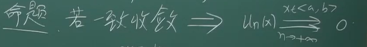
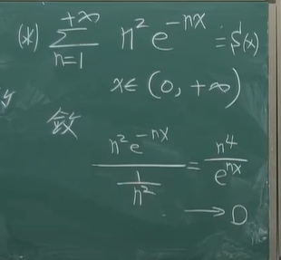
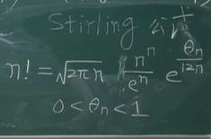
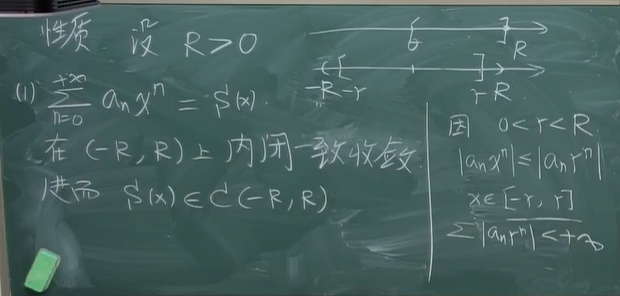

# 2025 spring Math Analysis

## Lec By 刘培东教授

#### Notes By Jiaming Yang

## 0. 总纲与概述

本学期数分在期中后主要聚焦于伍胜键老师的数学分析（二）后三章的内容，函数序列及函数项级数，幂级数，以及傅里叶级数的内容。这份笔记期望不再一味照本宣科以书为纲，而是以刘培东老师上课的讲解为主线，以例题为骨架，搭建完善的知识网络，增进对级数部分的理解。

以及希望结合一点谢惠民

## 1. 函数序列和函数项级数

首先，建立认识：我们本章关心的内容主要是对于一般的函数fn(x)，在什么条件下可以判断收敛、一致收敛等等，后两章的幂级数和傅里叶级数完全可以看作是函数级数的特殊形式下的讨论；所以说我们本章作为基础和重要的铺垫。

4.9 

首先明确概念：

函数序列：{fn(x)},对于所有的n有共同的定义域I_0；而对于每个固定的点x_0，就成一个序列，如果这个序列fn(x_0)收敛，则称函数序列fn(x)在x_0这一点收敛，x_0称为收敛点

而所有收敛点构成的集合称作收敛域

而收敛到的这个函数我们也就可以称之为极限函数，f(x)

函数项级数的相关定义几乎是如法炮制，无非是把fn(x)改成S_n(x) := /sigma（1-n)fn(x),考虑s(x)为1加到正无穷：=S(x),称为和函数

而本章关注的重点：

1.收敛域，收敛半径

2.极限函数（和函数）与原函数的关系，性质的可推导与否，条件？

首先我们可以试着举例，以探索1>连续性、2>可积性、(进一步即使可积，积分号与极限的交换性）、3>可求导、（即使可导求导和取极限的顺序交换性）-----一般都不对

每个都有反例：

连续性：（1-x)^n  [0,1]

可积性：fn(x) =R(x)开n次方，这个函数由于R(x)可积也可积，而这个n趋于无穷后的极限函数，就是D(x)，典型的不可积函数

积分与极限交换：nx(1-x^2)^n

先极限是0，积完肯定也是0；

但先积分在对原函数求极限是1/2

可求导（连续都不对就不用说了）

交换：sinx/n

探究这种现象的本质内在逻辑，大概其实可以理解：

连续性、积分、求导就是不同层次的“邻近点”之间的关系，所以这些东西在去了极限之后就不对了，可以大致理解为：

虽然这个东西的确收敛，但“收敛的步调并不一致”，（这个可以在极限定义中可见一斑），对于一般的数列极限，我们这里是先取定了x0，也就是我们再定义中N除了跟最后的epsilon有关，还与这个x0的取值密不可分，所以导致最后的N并不一定能去到一个合适的“所有x0都满意的”值

--->而这也就将一个新的核心概念呼之欲出：

一致收敛

即对所有的收敛域中的x,可以找到一个与x无关的N，使得这个epsilon被控制住，这样的f(x)就是一致收敛！

（不过一致收敛之后一般都是给出充分条件，特殊情况如dini定理特殊处理）

一致收敛的判断和理解：

1.最常用，也直观可算

（知道f(x)（即能求出具体极限函数时，非常好用）

看不出极值在哪，直接求导就行

2.不知道具体的f(x)时，我们往往可以使用柯西收敛原理：

应用一致收敛：

1.推连续性的传递：

就是用柯西收敛原理里面对相邻x之间差距的控制

（连续性是局部的、逐点的性质）

（所以区间  --->区间的传递；可以被加强到逐点的性质）

2.推可积性

法一：考虑不连续点集的等效长度为0（逐点连续，原来的不连续点集长度  >= 极限后）

法二：用可积性的定义：

注意不一致收敛的判别无非是把上面一致收敛的判断改成反的（存在改任意，任意改存在）

（比如有troublemaker，我们就lim(x->troublemaker)=多少，然后再用这个趋近的结果去证sup不为0就行）

4.14

连续性传递的一个特例情况的充要条件：（Dini定理）

证明：

大致是分段分别用小邻域，取初始足够多的点，之后每个邻域内再用连续性来卡，三个epsilon卡住，最后有限覆盖

（所以需要必须是闭区间，且是单调逼近）

应用：

Weierstrass第一逼近定理：

（大致陈述就是，对于任意连续函数，存在多项式序列一致收敛到这个f(x)

证明：

用Visser引理（其中用到dini)  (|x|可被逼近，即折线函数可以)

然后再把一般的连续函数用折线函数逼近就行

3.推求导的传递

1.考虑加强条件：

（就是加上f'(x)连续）

邻域内积分后仍然一致收敛，然后再用变上限积分

2.回到原来更强的命题，需要构造函数，转化为证连续性：再转化到证一致收敛

用柯西收敛原理，证sup m 和 n 之间差距小于 /epsilon

另外，值得注意的是有定理3中的条件，我们可以推出除了导函数有一致收敛的给定条件外，原函数也一致收敛

具体来说我们只要不÷（x-x0)即可

a,b中有无穷还对不对？

4.16

内闭一致收敛：

有了这个概念，我们可以对之前的条件做减弱，让定理1、3更强（连续性和可导都是逐点的性质）

只需要内闭一致收敛

定理3导数还有另一种加强：

原函数只给一个点的收敛，（比如x0)

可以通过导数的一致收敛，推得原函数在区间内收敛

（对每个点用柯西收敛原理，还是做差和x0比，这时无需一致，所以可以b-a无穷，在x0的邻域附近取就行）

关于函数项级数的各个定理的重新表述：

主要是重新给出一致收敛的定义

即部分和作为一个函数序列一致收敛

（注意，一般这个和函数不好求）

3个定理的新表述：

这里注意，

1. 我们举反例时只需把fn(x)相邻项之间做差就可以；

   nx(1-x^2)^n(做差)

2. ~~注意到求和符号的位置不影响~~

（1-+∞可以展开出一个极限）

下面聚焦于函数项级数的一致收敛性怎么判断，以及应用

判断：

1. 级数的一个特点是和函数不好求，一般就是用柯西收敛原理

2. 特殊情况，可能用dini：

    比如每一项都正/负----保证n趋于无穷的过程中，单调趋近于和函数；

   且 和函数连续

   则可判断一致收敛

应用：

非常常用的控制级数判别法：

（由柯西收敛原理，有限和->epsilon 立得）

右侧例题：

S'（x)不存在不要求（

另一例：

这个导数可以直观看图-->不存在，严谨证也需要定义

> peano曲线和代数拓扑。。？

这一例就是用taylor展开把x^-x写成e形式然后做成函数项级数，然后证一致收敛，积分号和求和号可以交换

4.21

类比以及应用（作为类似”必要性探路“）：

DA法的原理（Abel变换）：

、

D：

A：（前面省略的还是an（x）对n单调

应用：

注意到abel实际上就是表述了一个本身就已经一致收敛，再乘一个单调一致有界的an(x),仍然一致收敛，用的很少

值得注意的是，这个sinnx/n这个函数实际上有其特殊性

它的和函数可以求：

左下角这个积分项-->0就是R-L引理的直接应用

R-L引理的应用可能会考

例：

x固定  ，  用比较判别法就行

想证这个级数任意阶导数都连续

可以”必要性探路“说明在（0，+∞）不一致收敛，但是对连续性，我们只要内闭一致收敛就好，然后：

求导后说明导函数内闭一致收敛，则可以逐项求导，（而逐项的导数自然连续）

例题：

1. 证有瑕点的左式积分是有界、有意义

2. 把1/1-x裂成/sigma（1/x^n)，然后就化约到积分号与求和号交换的证明

3. 再用控制级数放缩来证一致收敛

   

## 2.幂级数

4.23

第十一章 幂级数

幂级数的理论建立在函数项级数的理论之上，下面就研究它的特殊性质。（我们此时主要还是考虑直接把x-x0换元成x以简化)

这条性质就是我们研究幂级数的：收敛域和收敛半径的Motivation，即一个点收敛，则在更小区间内绝对收敛

而唯一需要特别验证和注意的也就是边界点的情况

下面聚焦如何求收敛半径和收敛域：

1. 

证明来源于数项级数的达朗贝尔判别法

应用时，如出现阶乘不好处理，可以考虑用Stirling：

特殊项才有的话：要看清x的次数，

比如下面的例子，要开n^2次方

2. 另一种求法

处理阶乘很方便，相邻项作比

幂级数的性质：

1. 在收敛域内，都有内闭一致收敛（用的是abel）

   用控制级数说明内闭一致（且绝对）收敛

   

   

2. 推论：端点的连续性，就是从函数项级数

   

3. 导数

   

（可逐项求导，且求导后R不变，当然R/-R这一个点的敛散性有可能变

例题：先导完求和，换了更好的一种形式，再积分回去，最后需要取极限，依赖一致收敛后得到的端点连续性

4.28

积分的性质

逐项积分

积分后收敛半径同样不变

幂级数特殊性质：

若在R这一点收敛，那么在（0，R】一致收敛

这也是从内部过渡到端点的关键

这样再利用一致收敛带来的连续性，就可以把区间内的形式过渡到端点（取极限）

例题：

构造幂级数：

法一：利用积分与求和的交换

法二：反过来，用求导的性质

（最后都是，把内部的求导/积分性质过渡到端点）

典型思路：

1. 先求R（两个公式）
2. 然后在R的内部已经满足一致收敛，可以逐项求导/积分
3. 最后验证原函数在R处收敛，（由abel）可得在【0，R】一致收敛，这样就有连续性，这样求导后/积分后的结果可以取极限得到R处

幂级数的四则运算

？？？

乘除感觉一知半解啊

尤其除法，感觉有点抽象。

近似？？？

Taylor 幂级数

首先，候选人是唯一。我们只需考察它是否合格

generally，not!

泰勒展式三步走：

注意经典的几个：

注意规律：奇函数只有奇次项

（偶同理）

（3）cosx = 把sin的2n+1全换成2n

(4)ln其实（-1，1】  利用的就是幂级数端点收敛，然后区间一致收敛，传递连续性，过渡到端点】

Weierstrass 第一逼近定理的另证

后半段一样，只是证|x|能被逼近的过程不同

说穿了就是用泰勒展开构造

## 3. Fourier 级数

（P.S. 考完试有时间就更一下老师拓展内容）

本章与讲义相合的考察重点或许在

1. 求Fourier级数（实质就是定积分）

2. 性质：若f(x)在（-T/2,T/2）分段单调/分段可微，那么f(x)的Fourier级数收敛到  f(x0+0) +f(x0-0)/2,

   特别注意周期的边界处！！！考虑下一个周期的开始）

3. Bessel不等式和Parseval等式，带入特殊x也能得到一些级数的结果

