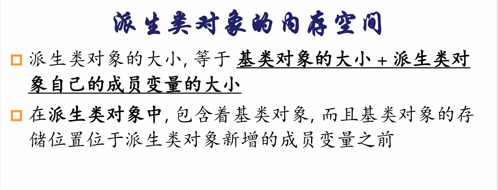
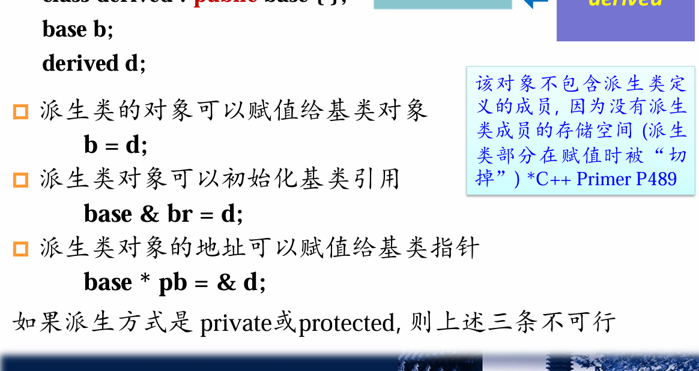
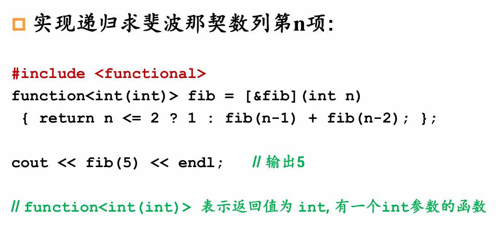

Started from 2025/4/28

### C++ 
#### Lec 1: 类和对象
- 类是抽象的模板，对象是类的具体实现。
- 面向对象：用数据结构来包装事物的共同特点（属性）
           用函数来归纳描述事物的行为，来操作数据结构
           （抽象）

而类就是将数据结构和操作其的函数捆绑在一起
（封装）
（带函数的结构）

-> 类实例化就是对象
（对象就是属于某一类的一个实例）

和结构变量一样,对象所占用的内存空间的大小, 
= 所有成员变量的大小之和

对象之间可以通过=进行赋值，其他运算符需要重载

访问成员变量：
对象.成员变量名
对象->成员变量名（指针）
引用名.成员变量名（引用）（修改引用，原来对象的值也会改变）

通俗的来讲，我们可以把引用当作“别名”，和原来是同一个东西：
类型名& 引用名= 某变量名; 
定义了一个引用,并将其初始化为引用某个变量
某个变量的引用,和这个变量是一回事,相当于该变量的
一个别名

• 定义引用时一定要将其初始化成引用某个变量, 不初始化编译不过
• 引用只能引用变量, 不能引用常量和表达式

引用的作用：
在交换变量中（避免用指针去访问地址），可以用引用来传递参数
可以做函数返回值
可以做参数

常引用：只读的内容，不能通过常引用去修改其引用的内容
即const int& a = n;
a不能出现在左值被赋值
> 当主函数中调用 cout << f(9,7) 时，f(9,7) 是临时对象。
C++ 规定，临时对象不能绑定到非 const 的左值引用（如 f&）。
如果你将 operator<< 参数声明为 f&，编译器会报错：
error: cannot bind non-const lvalue reference of type ‘f&’ to an rvalue of type ‘f’
> !!!所以在<<运算符重载时，如果参数传引用，优先考虑常引用
> 

可以用非常给常赋值，反之则否

成员函数：类内定义/类内声明，类外：：定义
特点：一定要通过对象或对象的指针或对象的引用才能调用

成员访问权限：
public：公共的，可以在任何地方访问
private：私有的，只能在类内访问（缺省被认为私有）
protected：受保护的，可以在派生类中访问

在类的成员函数内部,能够访问：
◼当前对象的全部属性,函数
◼同类其它对象的全部属性,函数
在类的成员函数以外的地方, 只能够访问
该类对象的公有成员

私有的意义：
1.隐藏实现细节，保护数据安全
2.封装变化，提高代码的可维护性

struct:公有类

函数重载：名字相同，参数表不同（个数/类型）
缺省参数：从最右边可以

注意：引用的初始化右侧不能是表达式，只能是一个变量名
引用初始化后,它就一直引用该变量,不再引用别的变量

常量指针：指向常量的指针，不能通过指针修改其指向的内容（指向常量的指针变量）
const int* p = &n;
*p = 10; // error: assignment of read-only variable ‘*p’
p = &m; //成功

指针常量：
指针常量：顾名思义它就是一个常量，但是是指针修饰的。
格式为：

int * const p //指针常量
1
在这个例子下定义以下代码：

int a，b；
int * const p=&a //指针常量
//那么分为一下两种操作
*p=9;//操作成功
p=&b;//操作错误

因为声明了指针常量，说明指针变量不允许修改。如同次指针指向一个地址该地址不能被修改，但是该地址里的内容可以被修改

常量指针是说这个指针指向的东西是一个常量，也即不能用这个指针去修改其内容，联想常引用
可以*p = b;
不能*p = 10;

指针常量是说这个指针本身是一个常量，其指向的地址是不能改变的，但是我们却可以通过指针改变这个地址的值
反之

附加题
指向常量的指针常量该怎么写？
答案：
const int * const b = &a;//指向常量的指针常量
都不能

构造函数：Constructor
default:默认构造函数，无参数，默认调用
◼ 全局基本类型变量—被自动初始化成全0
◼ 局部基本类型变量—初始值随机

可以自定义：注意是无返回值，void也不行
作用：为对象进行初始化,如给成员变量赋初值- 不必专门再写初始化函数,也不必担心忘记调用初始化函数- 避免对象未被初始化就使用而导致程序出错

对象生成时构造函数自动被调用
对象一旦生成,就再也不能在其上执行构造函数
 为类编写构造函数是好的习惯, 能够保证对象生成的时候总是有合理的值
 一个类可以有多个构造函数

最好public!
(private构造函数不能直接用来初始化对象)

思考题：构造一个最多一个对象的类：
class Singleton {
public:
    // 禁止复制和赋值
    Singleton(const Singleton&) = delete;
    Singleton& operator=(const Singleton&) = delete；

    // 获取唯一实例的全局访问点
    static Singleton& getInstance() {
        static Singleton instance;  // C++11 保证静态局部变量线程安全
        return instance;
    }

private:
    // 私有化构造函数
    Singleton() = default;

    // 可选：如果需要显式控制析构逻辑
    ~Singleton() = default;
};

复制构造函数：
只有一个参数, 即对同类对象的引用
◼ 形如X::X( X& )或X::X( const X& ) 二者选一, 后者能以常量对象作为参数

如果没有定义复制构造函数, 那么编译器生成默认复制构造函数
◼ 默认的复制构造函数完成复制功能
如果定义的自己的复制构造函数, 则默认的复制构造函
数不存在。
不允许有形如X::X( X) 的构造函数

调用场景：
a.当用一个对象去初始化同类的另一个对象时
Complex  c2(c1);//初始化语句, 非赋值语句
Complex c2 = c1; 
 对象间用等号赋值并不导致复制构造函数被调用
 默认的=是按位拷贝

b.如果某函数有一个参数是类A 的对象, 那么该函数被调用时, 类A的复制构造函数将被调用
（很好理解，传参就是传递一个引用，即‘复制’）

也因此，为了防止对象作为参数调用复制构造函数的巨大开销，我们常常使用（常量）引用作为参数类型。

c. 如果函数的返回值是类A的对象时, 则函数返回时, A的复制构造函数被调用
（可能有些编译器已经优化）

类型转换构造函数：目的是自动实现类型转换
定义
为了实现类型的自动转换，我们设置类型转换构造函数，生成一个无名的临时对象（or 临时变量）。

当构造函数只有一个参数，且构造函数不是复制构造函数的，一般均看做转换构造函数。

explicit前缀：加上时必须显式调用才能转化：
在构造出一个显式类型转换构造函数之后，每次设计类型转换，则必须将类名声明出来，再不能直接以数字进行简略表示。这样来看，explicit 显然能够提高我们代码的可读性。

析构函数
名字与类名相同, 在前面加‘~’
• 没有参数和返回值
• 一个类最多只有一个析构函数
• 对象消亡时→自动被调用
• 定义析构函数→对象消亡前做善后工作
e.g. 释放分配的空间
• 如果定义类时没写析构函数, 则编译器生成缺省析构函数
• 缺省析构函数什么也不做
• 如果定义了析构函数, 则编译器不生成缺省析构函数

调用时机：

对象数组生命期结束时, 
对象数组的每个元素的析构函数都会被调用
delete 运算导致析构函数调用
特别地，delete[] 运算导致数组的析构函数调用
析构函数在对象作为函数返回值返回后、参数用完后被调用（返回后这个临时对象没用，消亡）

在临时对象生成的时候会有构造函数被调用；
临时对象消亡导致析构函数调用

函数参数：任何有定义的表达式都可以作为参数

this指针：指向当前对象的指针
作用就是指向成员函数作用的对象
非静态成员函数中可以直接使用this来代表指向该函数作用的对象的指针

静态成员变量&函数（有点类似全局

static：
所有的对象公用
sizeof 运算符不会计算静态成员变量
普通成员函数必须具体作用于某个对象 Vs. 静态成员函数并不具体作用于某个对象
静态成员不需要通过对象就能访问

静态成员变量不会属于某个特定对象
静态成员函数不会作用于某个特定对象

必须在定义类定义的外面专门对静态成员变量进行声明
同一行可以初始化; 否则编译能通过,链接不能通过

静态成员函数不能访问非静态成员函数/变量，不能使用this指针,所以真实参数量等于写出参数量

与常引用相似，也不能把常量指针赋值给非常量指针，反过来可以
常量对象只能使用:
构造函数,析构函数和有const说明的函数(常量方法)
在类的成员函数说明后面加const关键字,则该成员函数成为常量成员函数
！ 常量成员函数内部不能改非静态属性的值,也不能调用同类的非常量成员函数(静态成员函数除外)
！ 常量对象上可以执行常量成员函数
在定义常量成员函数和声明常量成员函数时都应该使用
const关键字

rmk:两个函数,名字和参数表都一样
但是一个是const,一个不是,算重载
函数重载的判断：
函数名称必须相同。
参数列表必须不同（个数不同、类型不同、参数排列顺序不同等）。
函数的返回类型可以相同也可以不相同。
仅仅返回类型不同不足以成为函数的重载。

mutable：可以在const成员函数中修改的变量

成员对象：一个类的成员变量是另一个类的对象
这样有成员对象的类叫封闭类

任何生成封闭类对象的语句,都要让编译器明白
→对象中的成员对象,是如何初始化的
具体的做法就是通过封闭类的构造函数的初始化列表（必须要相符）

初始化const成员和引用成员时,必须在成员初始化列表
中进行
(成员初始化列表非常好用，没有不能的情况)

友元：
友元函数:一个类A的友元函数可以访问这个类A的私有成员
应该在A中声明友元
这个函数也可以是类B的成员函数，但也需要在A中声明

友元类: 如果A是B的友元类,那么A的成员函数可以
访问B的私有成员
要在类B中给予声明

#### Lec 2:运算符重载
实质就是函数重载
返回值类型 operator 运算符(形参表)
 {
 ……
 }

赋值运算符‘=’ 只能重载为成员函数
浅拷贝与深拷贝：
浅拷贝：对象间的成员变量是同一份内存
按位拷贝，指向同一地址
深拷贝：对象间的成员变量是不同内存

注意[]的重载返回值应该设为引用，这样数组的元素可以出现在左值被赋值

重载类型转换运算符：
operator 类型名() 常常加const{
……
}

自增/自减：
前置一元，后置二元（多写一个没用的参数，例如int,调用时置为0）

#### Lec 3:继承与派生
class 派生类名:派生方式说明符 基类名{
 …
 }
一般都是public
 

对比复合（封闭类）：
继承是“是”的关系，复合是“有”的关系

当然复合关系的使用可能涉及“循环定义”，此时解决方案是：
在一个类中使用另一个类的指针,
而不是对象作为成员变量

一般地,基类和派生类
不定义同名成员变量

protected：派生类（及其友元）可以访问

了解）：

初始参数表的应用可以解决派生类构造函数中给基类成员访问赋值问题

派生类对象可以赋值给基类，同样，派生类指针也可以强制转换给基类
但这个对象不存在只有派生类拥有的成员，会“切掉”派生类独有的成员
同理，这个指针也不能指向基类没有,而派生类中有的成员
同时注意，调用成员函数时，还是依据本身这个指针的类型，即基类指针调用的是基类的成员函数，而不是派生类的同名成员函数

派生类首部只需声明直接基类，无需间接（a->b->c,那么a是c间接）基类

派生类成员函数中, 可以调用基类的同名同参数表的成员函数

#### Lec 4:多态与虚函数
虚函数：在函数声明中加上virtual
（静态不能虚函数
基类指针调用基类和派生类中的同名虚函数时:
- 若该指针指向一个基类的对象,则被调用是基类的虚函数
- 若该指针指向一个派生类的对象,则被调用的是派生类的虚函数
这种机制就叫做多态
//这也说明在基类和派生类中都需要声明virtual（x
即根据指针引用/指向的对象类型来决定调用的函数
（和一般的函数看指针本身的类型不同！

另一种表现形式，除了指针外即引用：
通过该基类引用调用基类和派生类中的同名虚函数时:
- 若该引用引用的是一个基类的对象,那么被调用是基类的虚函数
- 若引用的是一个派生类的对象,那么被调用的是派生类的虚函数
这种机制也叫多态

 在多层继承情况下, 从定义virtual开始的派生类中同名函数
均为虚函数, 无论在这些派生类的同名函数中是否显示virtual
(所以关键的应该是最基类的之中需要声明virtual)

多态动态联编的内部实现逻辑：
虚函数表

多态的函数调用语句被编译成一系列根据基类指针所指向的(或基类引用所引用的)对象中存放的虚函数表的地址

虚函数的访问权限检查根据指针本身的类型决定（即要看基类是否private

注意：构造和析构函数中调用虚函数时:
调用的函数是自己的类或基类中定义的函数,
不会等到运行时才决定调用自己的还是派生类的函数

虚析构函数
通常来讲，用基类指针来删除派生类对象时，不会调用派生类的析构函数，
而只有将基类的析构函数声明为virtual时，才会先调用派生类析构，再析构基类
一般来说, 一个类如果定义了虚函数, 则应
该将析构函数也定义成虚函数
注意:不允许以虚函数作为构造函数

纯虚函数与抽象类：

summary：

#### Lec 5:输入输出与文件操作
相关类：
iostream（输入输出

fstream（文件操作）

重定向：
不是从stdin/stdout，而是从文件中读/写
流操纵算子：

自定义~：

以上诸多能实现的基础都是iostream类中的重载，例如判断输入结束，是bool的强制类型转换，自定义流操纵算子，则是

文件操作：
顺序文件
读写操作
二进制/文本

（略，待补？

#### Lec 6:类模板和函数模板
模板：
排序：->算法相同，对象类型不同
函数模板的类型参数可以用于函数模板的局部变量声明
函数模板可以重载：
参数数量不同

匹配顺序：
1) 先找一个参数完全匹配的函数
2) 再找一个参数完全匹配的模板
3) 在没有二义性的前提下,再找一个参数经过自动转换
后能够匹配的函数
4) 都找不到, 则报错

类模板：
定义一批相似的类
- 在定义类的时候给它一个/多个参数, 这个/些参数
表示不同的数据类型
- 在调用类模板时, 指定参数, 由编译系统根据参数
提供的数据类型自动产生相应的模板类

同一类模板的两个不同模板类并不兼容，不能互相赋值

派生：
所有类都可以派生出类模板，+
模板类派生普通类

友元：

任意从函数模板生成的函数，都是任意类模板生成的模板类的友元

而最后，类模板做类模板友元时，要注意实例对象类型与声明是否匹配，如不匹配则友元失败

static成员：
类模板中可以定义静态成员, 那么从该类模板实例得到**同一**模板类的所有对象, 都包含同样的静态成员
但是注意，不同的模板类（因为此时元素的类型不同）之间并不共享，需要分别定义初始化

string类：模板类
（待补？

#### Lec 7:STL
不可以有多个类模板名字相同?
类模板重载可能不算多个

vector:

list:

deque:

set:

map:

multi():

queue:

stack:

priority_queue:

放⼊容器的对象所属的类, 往往还应该重载 == 和 < 运
算符
(往往容器中放入的元素都应该有顺序)

其中不排序（按存放序）：vector, list, deque
顺序容器常用：
 front
 back
 push_back 在容器末尾增加新元素
 pop_back 删除容器末尾的元素
 erase 删除迭代器指向的元素(可能会使该迭代器失效), 
或删除⼀个区间, 返回被删除元素后⾯的那个元素的迭代器

共有的成员函数及其对应的一些常见操作：
empty:是否有元素
size:元素个数
front:第一个元素
back:最后一个元素
max_size:最大容量
swap:交换两个容器的内容

迭代器iterator：指向第一类容器中元素，类似指针

//定义⼀个容器类的迭代器的⽅法：
容器类名::iterator变量名;
容器类名::const_iterator变量名;
 //访问⼀个迭代器指向的元素：
*迭代器变量名

迭代器功能强弱决定了这个容器能否支持某种算法，例如排序算法需要随机迭代器，那么list就不支持排序算法(set\map也最多双向)

双向迭代器：不支持[]和<

函数对象：
可以当函数的类！
⼀个类重载了()为成员函数，那么该类为函数对象类

函数对象类模板：
functional
其中有：equal_to, not_equal_to, greater, less, greater_equal, less_equal, plus, minus, multiplies, divides, modulus, negate, logical_and, logical_or, logical_not, bit_and, bit_or, bit_xor, bit_not,

sort中应用函数对象：

其实函数对象的书写方式很简单：
class 类名{
public:
    bool operator()(const 类型1& a, const 类型2& b) const{
        //比较a和b的大小，
        //返回true表示a<b                                                  
        //返回false表示a>=b                                                                    
    }                                                                                             
};   

其实就是在operator(){public的成员函数内写想要在调用函数时实现的操作内容}

set:
template< class Key, class Pred = less<Key>,
 class A = allocator<Key> >
 class multiset {  …  };
• 第一个参数Key: 容器中每个元素类型
• 第二个参数Pred: 函数对象
• Pred决定了multiset 中的元素, “一个比另一个小”
是怎么定义的
即Pred(x, y) 如果返回值为true, 则x比y小
• Pred的缺省类型是less<Key>

unary\binary基类可以更方便实现函数对象
https://blog.csdn.net/sinat_31608641/article/details/109837942

pair基类：
make_pair()函数：

set和map的使用：
 typedef set<double, less<double> > double_set；
 double_set ds;
 typedef multimap<int, double, less<int> > mmid;
 mmidmmpairs;

容器适配器及相关实现
stack:（vector、deque
queue:（deque、list；deque默认
priority_queue:（堆技术

算法：
（待补？

#### Lec 8:C++新特性

auto:
自动判断变量类型

decltype:
decltype(expression)
返回expression的类型

智能指针：
<memory>
https://zhuanlan.zhihu.com/p/150555165
可以让shared_ptr对象托管一个new运
算符返回的指针, 写法如下：
shared_ptr<T> ptr(new T);  // T 可以是 int, char, 类名等各种类型

不要使用同一个原始指针构造多个shared_ptr
创建多个shared_ptr的正常方法是使用一个已存在的
shared_ptr进行创建, 而不是使用同一个原始指针进行创建
(即可以把智能指针之间相互赋值，但不要重复把一个原始指针赋值给多个智能指针)

正确的做法是让shared_ptr之间共享托管权：
shared_ptr<A> ptr = make_shared<A>();
 shared_ptr<A> ptr2 = ptr;  // 共享托管权, 引用计数增加
或者使用reset 时传入另一个shared_ptr：
ptr2.reset(ptr);

右值引用：
 右值：一般来说, 不能取地址的表达式, 就是右值
 左值：能取地址的(代表一个在内存中占有确定位置
的对象) 就是左值

class A { };
A & r = A();  // error, A()是无名变量
, 是右值
A && r = A(); // ok, r是右值引用

std::move是C++11引入的一个标准库函数, 用于将对象显式
转换为右值引用, 支持移动语义(Move Semantics)

无序容器：（哈希表）
unordered_set, unordered_map, unordered_multiset, unordered_multimap

正则表达式：
<regex>

lambda表达式：
{函数体}

[外部变量（可以声明是=/&](参数列表)->返回值类型{函数体}

e.g.
->int{return x+y;}

[&](int x, int y)->int{return x+y;}

[=](int x, int y)->int{return x+y;}

[=, &x](int y)->int{return x+y;}

[&, x](int y)->int{return x+y;}

[=, &x](int y)->int{return x+y;}

