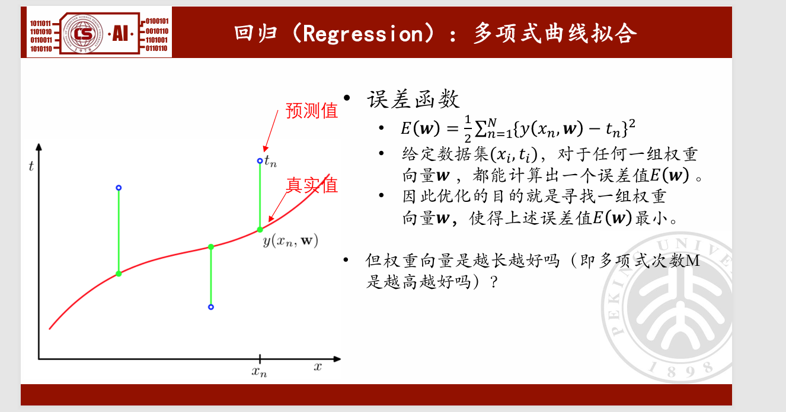
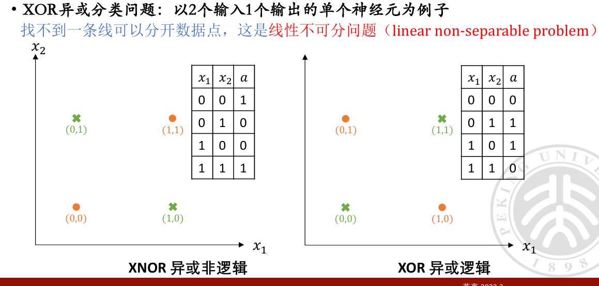

# AI BASIS 
### Midterm Examination Review
#### By Jam.Y

### Lec 1: history and development of AI

1. alphago
   
   
   难点： 可能性多，搜索空间大
   b^d
   围棋： b=250, d=150

   监督学习：（SL）
   学习人类高手--classification

   强化学习：（RL）
   自己与自己下--regression

   蒙特卡洛树搜索：（MCTS）
   蒙特卡洛树搜索是一种在游戏树中进行模拟的搜索算法，它通过随机选择和探索来构建一个搜索树，并在搜索树中选择最佳的动作。

2. chatgpt
   预训练：自监督（无）

   监督学习：（SL）
   --> 得到reward模型
   （强化学习的必要条件）

   强化学习：（RL）
   //--> 得到policy模型（？

### Lec 2: Math Basis
1. Regression
多项式拟合

简单的模型构造：就是用M次的多项式函数来拟合

M次多项式就是要学习w=(w0,w1,...,wm)这一组权重向量参数空间为（m+1）维的函数，使得它能够拟合给定的训练数据集。

当然，注意M的选择，过多的M会导致过拟合，过少的M会导致欠拟合。

过拟合解决方案：
1. 正则化：L1/L2正则化
   

   https://blog.csdn.net/vivian_ll/article/details/78580677
   涵盖一些原理以及对于特征的选择限制方法。
2. 增大数据量

2. Probability Theory
关于概率的概念理解：
贝叶斯定理：

PDF：Probability Density Function，概率密度函数，p(x)
CDF：Cumulative Distribution Function，累积分布函数，p(x)从-∞到x的积分

协方差：

MLE：Maximum Likelihood Estimation，极大似然估计，就是求使得观测数据出现的概率最大的模型参数。

> 独立同分布（Independent Identically Distribution）在概率统计理论中，指随机过程中，任何时刻的取值都为随机变量，如果这些随机变量服从同一分布，并且互相独立，那么这些随机变量是独立同分布。
> (MLE的前提)

MAP：Maximum a Posteriori Estimation，最大后验估计，就是求使得观测数据出现的概率最大的模型参数，同时考虑模型参数的先验分布。

MLE的先验指的是我们选定一个模型，
而MAP则是利用先验知识对模型的参数直接有一个“信念”估计

3. Information Theory
   （可能性低，信息量高）
   熵：
   香农熵：描述一个概率分布的信息量/不确定性

**KL散度**：
KL散度是衡量两个概率分布之间的差异的一种指标。

非对称性！

交叉熵（cross entropy）
• 交叉熵：和KL散度类似，只是多了一项香农熵H(P)，通常来说，最小化其交叉熵
和最小化kl是等价的。
• 𝐻(𝑃,𝑄) = 𝐻(𝑃) + 𝐷𝐾𝐿(𝑃||𝑄)

### Lec 3 & 4: Machine Learning
三要素：
任务、经验、表现

按照任务分类：
有监督：==Label（给定有标签的数据）
(分类、回归)
医疗图像分析
无监督：==Unlabel
自己去学f(x),没有给定的y
(聚类、降维、密度估计)

**线性回归和分类问题**：

最小二乘解：！！！
$ $/theta/$ = (X^T * X)^-1 * X^T *y $
前提：X^t * X可逆（即满秩，非零特征值/X奇异值个数=n）

e.g.

---

**题目一（一元线性回归）**  
给定数据点：  
$(1, 2)$，$(2, 3)$，$(3, 5)$，  
求一元线性回归模型 $y = a + bx$ 的最小二乘解（斜率和截距）。

---

**题目二（多元线性回归）**  
给定数据集：  
$$
\begin{array}{c|c|c}
x_1 & x_2 & y \\
\hline
1 & 2 & 4 \\
2 & 3 & 5 \\
3 & 5 & 7 \\
4 & 5 & 8 \\
\end{array}
$$
估计回归模型 $y = \beta_0 + \beta_1 x_1 + \beta_2 x_2$ 的最小二乘解（参数 $\beta_0, \beta_1, \beta_2$）。

---

**题目三（变量转换后的线性回归）**  
假设 $x$ 和 $y$ 满足 $y = a + b \ln(x)$，现有数据点：  
$$
\begin{array}{c|c}
x & y \\
\hline
1 & 2 \\
e & 5 \\
e^2 & 8 \\
\end{array}
$$
请通过最小二乘法估计参数 $a$ 和 $b$ 的值。

---

https://blog.csdn.net/weixin_42364196/article/details/102964407

有解的必要条件是：
特征维度（参数空间的维度） <= 数据数（即方程的个数）

关于不可逆的解决方案：
本质是因为数据提供的信息不够->所以应该对参数空间有提供先验估计，
如
   prior        regularization
1. guissan -- ridge regression -- L2
2. Laplace -- lasso -- L1 regularization
3. elastic net -- L1+L2 regularization

regularizarion正则化的本质是对解向量的维度进行“惩罚”，使得解向量的范数（模长）小于某个值，从而使得解向量更加稳定。
L1正则化：  
L1正则化的目标是使得参数向量的绝对值之和（L1范数）最小，即：  
$min \sum_{i=1}^n |w_i| + \lambda \sum_{i=1}^n w_i^2$  
L2正则化：  
L2正则化的目标是使得参数向量的平方和（L2范数）最小，即：  
$min \sum_{i=1}^n w_i^2 + \lambda \sum_{i=1}^n w_i^2$  

区别：
L1让更多维度参数值为0，能够有效降维(稀疏性)（菱形的顶点常作为最优解）
L2则是让参数更小，更稳定

广义：
广义的线性模型:我们可以考虑任意一种单调可微的函数g(.):

 𝑦=𝑔−1(𝑤𝑇𝑥+𝑏)

Q in the end:
线性回归的概念？

线性模型的概念？

线性回归之外，另一种线性模型的应用：

讲x分类到离散标签y

**Logistic Regression**

loss的选择：
将线性回归的平方误差（Square Error）直接用于逻辑回归（Logistic Regression）会导致**优化目标与模型输出不匹配**，具体原因如下：

**1. 模型输出的本质不同**
- **线性回归**：输出是**连续值**（例如房价、温度），直接预测数值大小。  
- **逻辑回归**：输出是**概率值**（通过Sigmoid函数压缩到 [0,1] 区间），用于分类问题（例如判断是否患病）。

**问题**：平方误差假设误差服从正态分布，但逻辑回归的标签是二元值（0或1），其误差分布与平方误差的假设不符。直接使用平方误差会破坏概率建模的逻辑。

---
**2. 损失函数的梯度特性不同**
- **平方误差 + 逻辑回归**：  
  损失函数为：
  \[
  \text{Loss} = \frac{1}{2}(y - \sigma(w^Tx))^2
  \]
  其中 \(\sigma\) 是Sigmoid函数。计算梯度时会引入 Sigmoid 的导数项 \(\sigma' = \sigma(1-\sigma)\)，导致梯度表达式为：
  \[
  \nabla_w \text{Loss} = (y - \sigma(w^Tx)) \cdot \sigma(w^Tx)(1 - \sigma(w^Tx)) \cdot x
  \]
  **问题**：当预测值 \(\sigma(w^Tx)\) 接近 0 或 1 时，梯度中 \(\sigma(1-\sigma)\) 会趋近于 0（梯度消失），导致参数更新停滞，模型难以收敛。

- **交叉熵损失（Log Loss） + 逻辑回归**：  
  损失函数为：
  \[
  \text{Loss} = -y \log \sigma(w^Tx) - (1-y) \log (1 - \sigma(w^Tx))
  \]
  梯度为：
  \[
  \nabla_w \text{Loss} = (\sigma(w^Tx) - y) \cdot x
  \]
  **优势**：梯度仅与预测误差 \((\sigma(w^Tx) - y)\) 相关，避免了 Sigmoid 导数的影响，优化更稳定。

---
**3. 优化目标的合理性**
- **平方误差**：  
  要求模型输出尽可能接近真实标签（例如让 \(y=1\) 的预测值接近1，\(y=0\) 的预测值接近0）。  
  **缺陷**：当预测值 \(\sigma(w^Tx)\) 接近真实标签时，损失函数对参数的梯度会变得极小（如上述梯度消失问题），导致优化效率低下。

- **交叉熵损失**：  
  直接衡量预测概率分布与真实分布的差异，梯度始终与误差成比例，优化过程更高效。此外，交叉熵损失是**凸函数**，能保证找到全局最优解。

---

**4. 概率解释的冲突**
- 逻辑回归的核心是**极大似然估计**（MLE），即通过最大化观测数据的似然函数来拟合参数。  
  - 交叉熵损失等价于负对数似然，直接对应 MLE 的目标。  
  - 平方误差与似然函数无直接关联，无法保证概率建模的一致性。

---

**总结**
| **差异点**               | **平方误差**                  | **交叉熵损失**                |
|--------------------------|-------------------------------|-------------------------------|
| **输出类型**             | 连续值（回归问题）            | 概率值（分类问题）            |
| **梯度特性**             | 梯度消失，优化困难            | 梯度稳定，易于优化            |
| **概率建模一致性**       | 不匹配                        | 匹配（极大似然估计）          |
| **损失函数凸性**         | 非凸（可能陷入局部最优）      | 凸（全局最优解）              |

**结论**：逻辑回归必须使用交叉熵损失（而非平方误差），以确保模型输出为概率、优化过程稳定，且符合概率建模的统计基础。

综上所述，logistic regression 是一个典型的线性分类模型，其输出为概率值，损失函数为交叉熵损失，优化目标为极大似然估计。

logistic（单层）局限性：
解决不了// edited XOR异或问题

解决方案：套两层神经网络
--> deep neural network（DNN）

多分类：

应用的举例：
图片分类器：
Linear Classifier

相当于还是单层，有很多二维上不好线性刻画的问题难以描述和实现解决：
引入的解决方案依然是深层神经网络

多项式逻辑回归分类器：
把原来线性分类器的分数变成概率形式

而相比于二分类的logistic regression，多项式逻辑回归分类器可以解决多分类问题，通过把sigmoid换成softmax

K-近邻分类器：
典型的无参方法！！！

就是根据“最邻近的k个点”来决定分类！！！
我们所要考虑的就是关于“距离”的定义

这样的无参分类器非常依赖初始种子的选择：
保证随机，尽量互相远离
验证集的应用

**聚类**：

算法：
分割：
K-means

对比K-means和K近邻分类（knn）：

K-means聚类和K近邻分类器（KNN）是两种名称相似但本质完全不同的机器学习方法，主要区别体现在以下几个方面：

---

**1. 算法类型**
- **K-means**：**无监督学习**  
  不需要预先标注的标签，目的是发现数据内在结构，自动将数据划分为K个簇。
- **KNN**：**监督学习**  
  需要带标签的训练数据，通过邻近样本的标签对新样本进行分类或回归。

---

**2. 核心目标**
- **K-means**：**聚类（Clustering）**  
  将相似的数据点归为同一簇，目标是使同一簇内数据点尽可能相似，不同簇之间差异尽可能大。
- **KNN**：**分类或回归（Classification/Regression）**  
  根据最近的K个邻居的标签（多数投票或均值）预测新样本的类别或数值。

---

**3. 工作原理**
- **K-means**：  
  1. 随机初始化K个聚类中心；  
  2. 迭代更新中心点：将数据分配到最近的中心，重新计算中心位置；  
  3. 直到中心点不再变化或达到最大迭代次数。
- **KNN**：  
  1. 计算新样本与所有训练样本的距离（如欧氏距离）；  
  2. 选取距离最近的K个邻居；  
  3. 根据邻居的标签投票决定新样本的类别（或取均值做回归）。

---

**4. 训练过程**
- **K-means**：需要显式训练过程，通过迭代优化聚类中心。  
- **KNN**：属于“惰性学习”（Lazy Learning），没有显式训练过程，直接存储所有训练数据，预测时实时计算。

---

**5. 参数意义**
- **K-means中的K**：指定希望将数据划分成的簇数量。  
- **KNN中的K**：指定投票时参考的邻居数量（如K=3表示取最近的3个样本投票）。

---

**6. 典型应用场景**
- **K-means**：  
  - 客户分群（如电商用户分层）  
  - 图像压缩（颜色聚类）  
  - 异常检测（离群点远离簇中心）  
- **KNN**：  
  - 手写数字识别  
  - 推荐系统（相似用户/物品推荐）  
  - 简单回归任务（如房价预测）

---

**7. 输出结果**
- **K-means**：为每个数据点分配一个簇标签（如Cluster 0/1/2）。  
- **KNN**：为新样本预测一个类别标签或连续值。

---

**直观对比举例**
- **K-means**：将散乱分布的100个点自动分成3组，每组中心用★标记。  
- **KNN**：已知红🔴、蓝🔵两类样本，新样本⚪的类别由最近的3个邻居（2红1蓝）投票决定为红色。

---

| **特征**         | K-means                     | K近邻（KNN）               |
|------------------|----------------------------|--------------------------|
| **学习类型**      | 无监督                     | 监督                     |
| **目标**         | 聚类                       | 分类/回归                |
| **是否需要标签**  | 否                         | 是                       |
| **计算复杂度**    | 训练时高，预测时低         | 训练时低，预测时高       |
| **参数K的含义**   | 簇数量                     | 邻居数量                 |

理解两者的区别有助于在实际问题中选择合适的方法：若数据无标签且需探索结构，用K-means；若有标签且需预测新样本，用KNN。

KNN无参但仍然属于分类问题，时有标签的监督学习

K-means:
种子选择以及outlier(极端值)敏感

层级：
blabla~一些略例算法未讲

### Lec 5: neural network basis

对“神经元”的理解：

每层神经元的数目：指的就是该层输出的维度

激活函数：
为神经网络的输出提供非线性性
sigmoid函数：
二分类：将输出限制在0-1
tanh函数：
输出范围为-1到1（常用于回归）
ReLU函数：
线性整流函数，输出大于0时不变，小于0时输出0
Leaky ReLU函数：
在ReLU函数中加入一定的负值，使得负值部分不饱和，从而提高了网络的鲁棒性(负部分不全为0，而是保持一定斜率继续降)
softmax函数：指数+归一化（多分类）

多层感知器（MLP）：

所以需要两层网络

多层：
更强的表达能力，表达（描述）的是上一层的特征

损失函数：
Logistic:
二分类
(其实也是多分类交叉熵的特殊形式而已)
Cross-entropy:
多分类

Lp 范数：

特别的，MAE（Mean Absolute Error）：为L1范数
均方误差MSE（Mean Squared Error）：为L2范数

优化：

主要梯度下降+反向传播

反向传播的本质就是用中间层的梯度“链式”来求所有层的梯度

层数过深问题：
梯度消失：

随机梯度下降：

自适应学习率：
“动量法”：

超参：验证集的设立保证模型的泛化能力

而对于稀有数据，不拿出当验证集，那么我们考虑用K折交叉验证（K-fold cross-validation）来估计模型的泛化能力。

K折交叉验证：将整个数据集平分k份，其中一份当测试集，做k次，选平均最好的一组超参

正则化：减缓过拟合
1. 数据增强：生成更多的训练数据
2. 提前停止：早停法，在验证集上表现不好时停止训练（以测试集的准确率为基准）
3. 权重衰减：（只用于weight,不用于bias）L1对小数惩罚>L2
4. dropout：随机让某些神经元不工作，防止过拟合
 
  

### Lec 6: Convolutional Neural Network
1. Motivation：
   高维度数据，如图像，视频，语音信号等，传统的神经网络无法处理，（再类比人眼，人眼也不是逐个像素都要考虑的“全连接”神经网络，所以我们依据“平移不变性”，设计卷积神经网络（CNN）

2. 具体举例：
   
   
   1D-CNN：
   

一维向量的卷积是信号处理、数学和工程中的基础操作，其核心是通过滑动加权叠加提取信号特征。
**一维卷积的原理**
1. **数学定义**
对于两个离散序列 \( f[n] \)（输入信号）和 \( g[n] \)（卷积核），其卷积结果为：
\[
(f * g)[n] = \sum_{k=-\infty}^{\infty} f[k] \cdot g[n - k]
\]
实际操作中，序列通常是有限长度的（如向量长度 \( N \) 和 \( M \)），结果长度为 \( N + M - 1 \)。
1. **计算步骤**
- **翻转**：将卷积核 \( g \) 翻转（如 \( [a, b, c] \) 变为 \( [c, b, a] \)）。
- **滑动加权**：将翻转后的核沿输入信号滑动，逐点相乘后求和。
- **填充（可选）**：可通过补零（Padding）控制输出长度，或保持输入输出尺寸一致。

**示例**：
输入信号 \( f = [1, 2, 3] \)，卷积核 \( g = [0.5, 1] \)：
- 翻转核：\( [1, 0.5] \)
- 计算结果：
  - \( n=0 \): \(1×1 = 1\)  
  - \( n=1 \): \(1×2 + 0.5×1 = 2.5\)  
  - \( n=2 \): \(1×3 + 0.5×2 = 4\)  
  - \( n=3 \): \(0.5×3 = 1.5\)  
- 输出：\( [1, 2.5, 4, 1.5] \)

---

**核心应用场景**
1. **信号滤波**
- **平滑去噪**：使用均值核（如 \( [1/3, 1/3, 1/3] \)）抑制高频噪声。
- **边缘检测**：高通滤波器（如 \( [-1, 1] \)）提取信号突变（如心电图的R波检测）。

2. **音频处理**
- **回声模拟**：通过卷积叠加延迟信号模拟声学效果。
- **降噪算法**：与预设噪声模板卷积以消除干扰。

3. **时间序列分析**
- **趋势提取**：通过长窗口卷积核（如移动平均）分析金融数据趋势。
- **特征提取**：在传感器数据中识别特定模式（如振动信号中的故障特征）。

4. **自然语言处理（NLP）**
- **文本分类**：一维卷积神经网络（CNN）从词序列中提取局部语义特征（如情感分类）。

5. **通信系统**
- **符号解调**：通过匹配滤波器（与发送信号卷积）优化信噪比。

---

2D-CNN：
边缘检测

关于卷积算法的概念和公式：
kernel/filter size:卷积核形状
(filter_height × filter_width × input_channels × n_filters)
其中n_filters=filter数量=输出的channel数

paddings:填充

stride:步长

output_height = (input_height + 2 * paddings[0] - filter_height) / stride[0] + 1
output_width = (input_width + 2 * paddings[1] - filter_width) / stride[1] + 1

output_channels = n_filters

receptive field:感受野

//
公式待检验与完善

计算题目：

更多扩展：
3D：
多一个filter_depth维度
体素？？？

空洞卷积：增大感受野
等效卷积核尺寸

注意下取整！！！
注意此处si：指的就是第i层的stride

反卷积：输入输出互换计算

池化算法：
目标增强平移不变性（防止一些细微的细节（平移变化）来影响）
最大池化：取一个filter内max
平均池化：...mean

空间金字塔池化：
先对图像进行不同尺度的池化，然后再拼接起来

分层表示学习：-->VGGNet(较大数字，较深隐藏层)
一些具体的结构：
AlexNet：
VGG16Net：
用连续小卷积层等效大：
更多非线性变换，更少参数量
//GoogLeNet：
ResNet：残差神经网络：残差连接，防止深层梯度消失

SqueezeNet：

逐点卷积
MobileNet：
深度可分离卷积：深度+逐点

ShuffleNet：

反卷积的motivation：
卷积&池化只能保持或缩小特征尺寸

### Lec 7:CNN's Application
1. 目标检测
效果评估：交并比IoU

p: 所有预测为真的中预测对的比例
r: 所有真实为真的中预测对的比例
AP = p-r曲线下面积
平均精度mAP

算法：R-CNN、Fast R-CNN、SPPNet、Faster R-CNN、

R-CNN： selective search + VGG（特征提取） + SVM(分类器)

NMS：保留最有可能的边框

SPP：

全局特征、图像尺度保留

Fast R-CNN：

利用神经网络做分类器、回归器，近似端到端

Faster R-CNN：

取消区域提议：（不画框）
YOLO：
（FCN）完全卷积

小物体（x-->v2:预先定义更细密的先验框

SSD：（google，yolo）

1. 图像分割

semantic segmentation：语义分割
instance segmentation：实例分割
逐点分类问题
FCN：
Skip connection：跳跃连接(保持特征图的完整性，低级别特征！)

实例分割：mask R-CNN
镜像填充：避免失去边界信息
损失加权：边缘和小物体up

3. 人脸识别
   open:固定模型，比对特征

   close:多分类

人脸认证，判断两张图是不是一个人（不需要具体信息）

4. 姿势识别
   top-down:先人，再特征

   bottom-up:先特征，再人

   

   多阶段：感受野大，关键点精细

   

   
   PPN快但模糊（

more:...

### Lec 8:GAN

生成式模型！

对抗学习！

Loss:对抗，重点！

min-max 博弈：最好效果是学到平衡点

训练：循环更新

dcgan: 发挥卷积神经网络！

VAE：
adversarial loss：对抗损失
X->Z->X'

### Lec 9: More GAN
1. Conditional GAN
相当于distributor多判别一个条件，joint distribution

2. 寻找潜在表示
   
   学习编码器！
   
   暴力法：
   缺点：1.没见过真图 2.可能模式崩溃

3. 解决方案： Bigan
   

4. CoGAN
   学习领域之间的相似映射关系
   “权重共享”
   （高级语义的提取

5. Cycle GAN
   

   BIGAN + COGAN

### Lec 10:RNN

Recurrent Neural Network:
专门处理时间序列
（NLP,CNN都是前馈神经网络）

**Word Representation**

1. One-hot Encoding
维数灾难，太稀疏

2. Bag of Words
词袋模型，词频统计
还是有维数灾难，而且没有统计顺序

3. Word Embedding
    词向量，用向量表示词
    
    自监督的学习方法！

4. Word2Vec
CBOW：上下文词预测中心词
不同词学同一个词嵌入表
Skip-Gram：中心词预测上下文词
用sigmoid:多标签二分类！

NCE：随机加入N个负样本，加速计算

**Sequential Data**

one to one: FNN(不涉及时间等序列)
one to many: 图片描述 --所有输出计算损失
many to one: 文本分类(情感预测) --最后一个输出计算损失
many to many: 序列到序列学习
异步：翻译
CHATBOT：先编码
同步：天气预测， 交通计数（需要预先定义序列长度）
文本生成/语言建模

**Vanilla RNN**
hidden vector(将前一个时间步信息传给下一~)

局限性：长期依赖，无法记忆长期信息

减缓->
**LSTM**
加入门控函数

在LSTM（长短期记忆网络）中，**输入门（Input Gate）**的候选记忆单元（Candidate Memory Cell）使用 **tanh** 激活函数，而输入门本身使用 **sigmoid** 函数，两者的分工不同。具体原因如下：

---

1. **输出范围不同**
   - **Sigmoid**：输出范围为 `(0, 1)`，适合作为“门控信号”（如输入门、遗忘门、输出门），用于控制信息的保留比例（例如，输入门决定“多大比例的新信息需要添加到当前状态”）。
   - **tanh**：输出范围为 `(-1, 1)`，适合生成“候选记忆值”（即需要添加到记忆单元中的新信息）。其对称性（正负值均可）能更灵活地表示信息的增强或抑制，避免单向偏差。

---

2. **梯度特性**
   - **tanh** 的梯度在接近零时更大（最大梯度为 `1`），在反向传播中能更有效地传递梯度，缓解梯度消失问题。
   - **Sigmoid** 的梯度最大值为 `0.25`（当输入为 `0` 时），梯度衰减更快，不利于深层网络的训练。

---

3. **数据中心化**
   - **tanh** 的输出均值为 `0`，具有数据中心化的特性，有助于加速训练过程（类似于归一化效果）。
   - **Sigmoid** 的输出均值为 `0.5`，可能导致后续层的输入存在系统性偏移，增加训练难度。

---

4. **信息表示的多样性**
   - 记忆单元需要存储长期信息，而 `tanh` 的正负值允许记忆单元同时表示“增强”和“抑制”两种模式，增强模型的表达能力。
   - 如果使用 `sigmoid`（仅正输出），记忆单元的更新会受到限制，可能丢失部分信息。

在LSTM中：
- **Sigmoid** 用于门控（控制信息流），因为其输出范围 `(0,1)` 适合调节比例。
- **tanh** 用于生成候选记忆值，因为其对称性、梯度特性以及数据中心化的优势，能更好地表示和传递信息。

这种分工是LSTM设计的关键，确保了网络既能长期记忆，又能灵活更新和遗忘信息。

GRU： 没有cell state, 简化计算

**Applications**
文本输入往往需要添加结束标记 "< EOS >"(编码器末尾)
解码器开头：< start >标记

#### 习题所得
1. K-means 属于无参！
2. cross-entropy 相对于 均方loss， 对于logistic regression，好处在于1.收敛更快
2.不易梯度消失

3. 池化：能增加感受野
4. welcome to complement!
   

2025/4/28
updated
