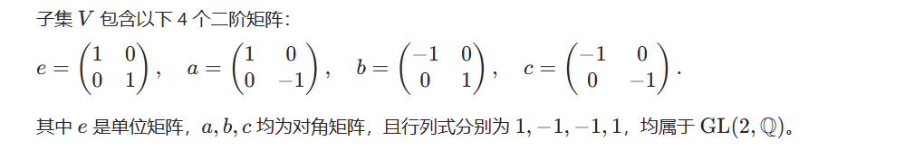
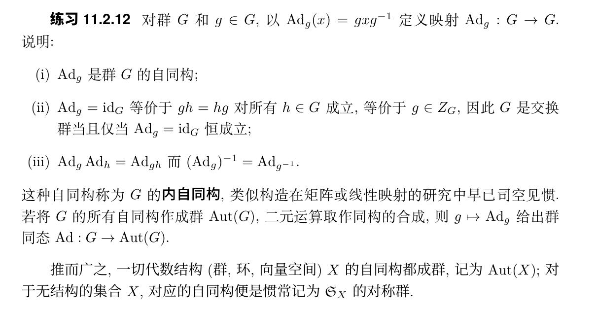
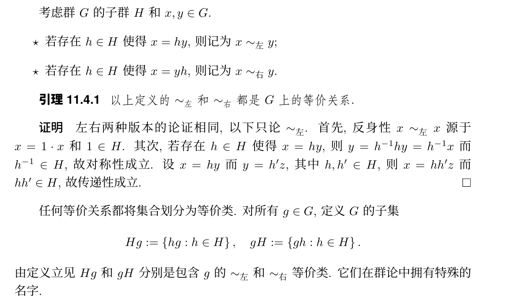
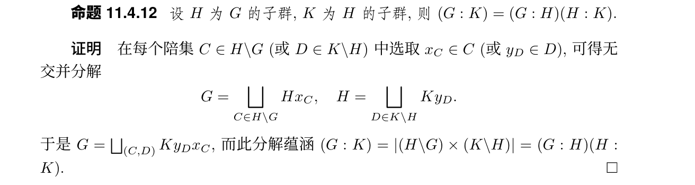
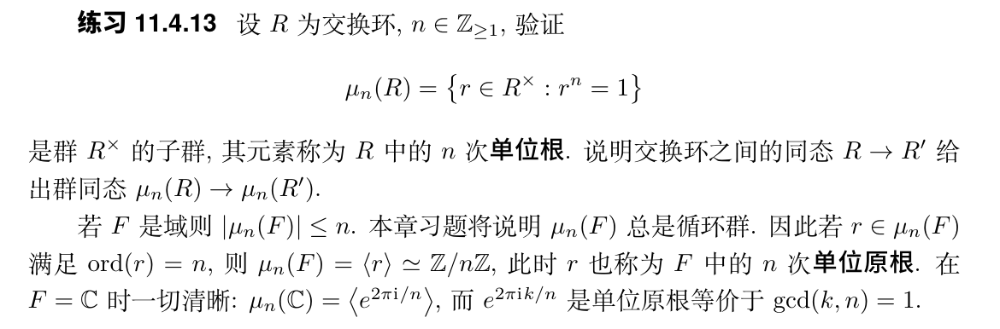
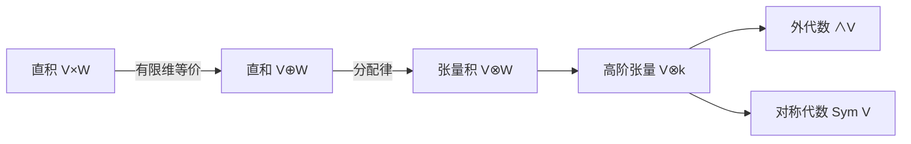

# Advanced Algebra
### Lecture By WWLI
### Notes By Jiaming Yang

## 0. Introduction
高代期中之后主要聚焦于群论、模论相关知识的探索和系统梳理。

### 11.群
def:结合律、幺元、逆元
prop:
幺元唯一
逆元唯一
乘法消去律

平凡群：只有1
群 G 作为集合的基数|G|称为其阶数
交换群/Abel:乘法满足交换

子群：
群的子集，满足幺元和原来相同，对乘法和取逆封闭

任意一组子群的交仍是子群

群的中心：ZG := {z ∈G:∀g ∈G, zg =gz}
（群中满足交换的部分）
注意到这个中心即是子群的一个典例

variants:
半群：
倘若在定义11.1.1 中只要求结合律成立,则对应的代
数结构称为半群;
幺半群：
倘若只要求结合律和幺元存在,则对应的代数结构称为幺半群. 
乘法运算满足交换律的半群或幺半群仍称为交换的

相反群：
设 G为群,定义二元运算·op:G×G→G为x·opy:=y·x. 说明G对·op 仍是群, 称为 G的相反群,对应的结构记为Gop. 说明G交换等价于G=Gop.
这套构造对幺半群或半群同样适用.

共轭子群：
设 H 为群G的子群,g∈G. 验证
gHg−1 := ghg−1 : h ∈ H
是G的子群,称为H 对g的共轭子群.

Examples:

(对称群) 非空集X 上的全体置换(定义5.1.1)构成对称群SX,又称置
换群: 它的二元运算是双射的合成(σ1,σ2)→σ1σ2 :=σ1◦σ2, 幺元是恒等映射 idX, 而
σ ∈SX 的逆元无非是它作为双射的逆映射. 所需的结合律等性质全部归结为映射的基
本操作.
对于n∈Z≥1, 群 Sn := S{1,...,n} 也称为 n 元对称群或置换群, 它有 n! 个元素.
行列式的研究中已经广泛运用Sn的群结构.

(交错群) 全体偶置换 (见定义 5.1.12 及其后讨论) 构成 Sn 的子集,
记为 An, 它是 Sn 的子群, 称为 n 元交错群: 首先, 恒等 id 当然是偶置换; 若
σ1,σ2 ∈ An 则 sgn(σ1σ2) = sgn(σ1)sgn(σ2) = 1 蕴涵乘法封闭性; 最后, σ ∈ An 蕴涵
sgn(σ−1) = sgn(σ)−1 = 1
rmk:偶置换：一个置换是偶置换，如果它可以表示为偶数次两元素交换。

(一般线性群) 设 V 为域 F 上的向量空间, 则 V 的所有自同构 T :
V ∼ → V 构成集合GL(V), 它对线性映射的合成运算成群. 这是合理的, 因为同构的合
成仍是同构, 结合律一眼可见. 群GL(V)以恒等自同构为idV 为幺元,而T ∈GL(V)
的逆元是逆同构T−1.
矩阵情形自然是类似的,相当于在上述讨论中取V =Fn. 所有n×n可逆矩阵构
成集合GL(n,F), 它对矩阵乘法成群, 以 1n×n 为幺元, 而 A∈GL(n,F) 的逆元是逆
矩阵A−1. 一切都是矩阵运算的简单推论.

(特殊线性群) 承继上一则例子, 设 V 是有限维的,命
SL(V) := {T ∈ GL(V) : detT = 1},
则SL(V) 是 GL(V) 的子群, 这是因为 det(idV) = 1 而 det(T1T2) = det(T1)det(T2),
 det(T−1) = det(T)−1.
与此类似, SL(n,F) := {A∈GL(n,F): detA =1} 也是 GL(n,F) 的子群. 这些
群称为域F上的特殊线性群

(辛群) 设 F 为满足 char(F)= 2 的域, n ∈ Z≥1. 对 F 上的辛空间
(V,B) (即: V 是有限维 F-向量空间, B :V ×V →F 是非退化反对称双线性形式),命
Sp(V ) = Sp(V,B) := {g ∈ GL(V) : ∀x,y ∈ V, B(gx,gy) = B(x,y)};
熟悉的论证表明Sp(V)是GL(V) 的子群, 称为辛群
（辛群就是保持非退化反对称双线性形式的线性变换构成的群构成的群）

(酉群与特殊酉群) 基于完全类似的思路, 有限维复内积空间 (W,(·|·))
的所有自同构也成群, 称为 (W,(·|·)) 的酉群 U(W), 这是 GL(W) 的子群. 另外记
SU(W) := U(W)∩SL(W), 称之为特殊酉群. 对于标准复内积空间 Cn, 习惯将对应的
群记为U(n) 和SU(n), 它们是 GL(n,C) 的子群.

以上均不交换

而对应的，常见的交换群包括：
整数加法群、同余加法群
(环的加法群) 设 R 为环,则它对环的加法运算+:R×R→R成交换
群, 以环的零元0R 为其幺元,而r∈R对加法的逆元是−r.
(环的可逆元群) 环 R 对乘法不构成群, 它只是幺半群, 以 1R 为幺元,
这是因为非零环总有不可逆元(例如零元0R). 若只看可逆元子集R×,则R× 对乘法
成群. 譬如矩阵环Mn×n(F) 的可逆元群正是GL(n,F)

尽管幺半群和群在本书中出现的顺序晚于环,它们却是比环更基础的结构, 而环是搭建在同一个集合R上的交换群结构(R,+)与幺半群结构(R,·) 的综合,以乘法对加法的分配律为纽带——lww

(加法群) 对于交换群 A, 有时会将 A 的二元运算记为加法+,将A
的幺元记为0A 或0,将元素a∈A对加法的逆元记为−a. 这时我们称A为加法群以资区分
加法群是交换群！

 < S >: 生成群
def 为所有形如s_1^a1···s_m^am  的元素构成的子集，易得为子群，
出S是包含S的最小子群: G的任何子群若包含S,则包含所有形如~的元素,故包含S. 特别地, ∅ :={1}是完全合理的.
对于S 为有限集{s1,...,sm} 的情形, 我们沿用 S =<s1,...,sm>的方便记法.
若G=S则称S生成G,或称S是G的一族生成元. 如果G能由某个有限子集生成, 则称G为有限生成的

(群的直积) 设 (Gi)i∈I 为一族群, 其中 I 是非空集. 在集合的积ΠGi上定义二元运算
(xi)i∈I · (yi)i∈I := (xiyi)i∈I.

要理解群的直积，首先理解集合的积（笛卡尔积）：
A × B := { (a,b) | a ∈ A, b ∈ B }
（a,b）是有序对

自然地，群的直积中就是形如（g1,g2,...,gn）的元素，其中gi∈Gi是Gi的元素，而在这个直积上定义乘法操作也自然地是按每个分量操作，即化约到每个群Gi内的乘法

容易发现，直积的顺序不影响群结构

### 11.2
保结构的映射是代数学的主角之一,譬如环同态之于环,或者线性映射之于向量空间. ———lww

群相应的，称之为群同态：
 f(xy) = f(x)f(y), x,y ∈ G

自动保幺元和逆，易于验证
（而对于幺半群，没有乘法消去律，所以需要增加保幺元的表述）

针对于群的直积，有“投影同态”,因为是对第j个分量操作，自然也保乘法

互逆的群同态：群同构
（换言之，双射的群同态即为同构）

一般地，验证同构就是先验证同态再反向验证/证双射

而同构有一个必要条件也是性质就是元素必须保阶：
而举例明之：
判断

这个群
和Z/4Z是否同构，我们看：
在V中e为单位元，乘法就是矩阵乘法，a^2 = b^2 = c^2 =e
(a,b,c 阶均为2)

而在Z/4Z这个加法群（乘法默认为整数的加法）中，1的阶为4（1加四次才能到单位元0）

所以不同构

对于练习11.2.12，（iii）参考应用（ii）中复合的运算规律可以立得：
Ad_g `(复合) Ad_g^-1 = Ad_g*g^-1 = id_G
(在映射组成代数群中，幺元自然为id恒等映射，两边重复验一遍即得)

这里给出的内自同构就是一般的定义，也即：
内自同构就是由共轭的作用形式给出
内自同构：由群自身元素通过共轭诱导，本质是群内的 “位置重排”，属于 Inn(G)

### 11.3 循环群
def：能由单个元素生成的群(一切元素都能写作/sigma^n,其中sigma是单位元)

典例也是全部：就是Z/nZ

### 11.4 陪集分解

1. 等价关系：(基于子群)

Hg：左等价类，右陪集
gH：右等价类，左陪集

2. 子群的指数：
H\G：= 所有右陪集Hg构成集合 和 G/H：= {所有gH} ，它们有相同的集合基数
记为(G:H)

3. lagrange:
   (G:H) * |H| = |G|
   (可以理解为G被写作（G：H）个陪集的无交并，而每个陪集的元素个数为|H|，故|G| = |H| * (G:H))

一些推论：
1. H为G子群-->|H| | |G|

2.  设H,K ⊂G为子群,而且|H|和|K|是互素的正整数,证明H∩K = {1} 
   （证明用到子群的交集还是子群）

def: 11.4.9(阶)：设 σ 为群G的元素. 定义ord(σ):=|<σ> |, 称为 σ 的阶.（即这个元素生成的元素的个数为其阶）

而在循环群<σ>：= G'中，蕴含ord(σ) =|G'| =  min {k ∈ Z≥1 : σ^k = 1_G }
事实上，这个min的这个性质（其实类似于群的一种定义）不依赖于G原来是否是循环群，若不是循环群我们只需考虑σ生成的循环群即可，而若不存在σ^k = 1_G,我们自然地定义ord(σ) = ∞

> (与在数论中的定义并不完全相符（？我有一定联想，但是后发现在此时这个同余类的群中幺元其实是0，而此时可以作为σ的一定需要满足σ与Z/nZ中的n互素)
>

推论：|G|为素数->G为循环群

子群的指数具有如下“塔性质”：

单位根：

一、验证 \(\mu_n(R)\) 是 \(R^\times\) 的子群  

#### 1. **定义与前提**  
设 \(R\) 为交换环，\(R^\times\) 表示 \(R\) 的单位群（即所有可逆元构成的乘法群）。定义  
\[
\mu_n(R) = \{ r \in R^\times \mid r^n = 1 \},
\]  
其中 \(1\) 是 \(R\) 的乘法单位元。需验证 \(\mu_n(R)\) 满足子群的判定条件。  

#### 2. **子群判定（一步法）**  
根据子群判别法，若对任意 \(a, b \in \mu_n(R)\)，有 \(ab^{-1} \in \mu_n(R)\)，则 \(\mu_n(R)\) 是子群。具体验证如下：  
- **封闭性与逆元存在性**：设 \(a, b \in \mu_n(R)\)，即 \(a^n = 1\)，\(b^n = 1\)。  
  由于 \(R\) 是交换环，\((ab^{-1})^n = a^n (b^{-1})^n = a^n (b^n)^{-1} = 1 \cdot 1^{-1} = 1\)，  
  故 \(ab^{-1} \in \mu_n(R)\)。  
- **单位元存在性**：\(1^n = 1\)，故 \(1 \in \mu_n(R)\)，满足单位元条件。  

因此，\(\mu_n(R)\) 是 \(R^\times\) 的子群，其元素称为 \(R\) 中的 \(n\) 次单位根。  

二、交换环同态诱导群同态 \(\mu_n(R) \to \mu_n(R')\)  

#### 1. **同态映射的定义**  
设 \(\varphi: R \to R'\) 是交换环之间的同态，即对任意 \(a, b \in R\)，有  
\[
\varphi(a + b) = \varphi(a) + \varphi(b), \quad \varphi(ab) = \varphi(a)\varphi(b), \quad \varphi(1_R) = 1_{R'}.
\]  
需证明 \(\varphi\) 限制在 \(\mu_n(R)\) 上时，是群同态 \(\mu_n(R) \to \mu_n(R')\)。  

#### 2. **群同态的验证**  
- **映射良定性**：若 \(r \in \mu_n(R)\)，则 \(r^n = 1_R\)，且 \(r \in R^\times\)，故 \(\varphi(r) \in R'^\times\)（因环同态将可逆元映为可逆元，且 \(\varphi(r^{-1}) = \varphi(r)^{-1}\)）。  
  进一步，  
  \[
  \varphi(r)^n = \varphi(r^n) = \varphi(1_R) = 1_{R'},
  \]  
  故 \(\varphi(r) \in \mu_n(R')\)，即 \(\varphi\) 诱导映射 \(\varphi|_{\mu_n(R)}: \mu_n(R) \to \mu_n(R')\)。  

- **同态性**：对任意 \(a, b \in \mu_n(R)\)，由于 \(R\) 交换，  
  \[
  \varphi(ab) = \varphi(a)\varphi(b),
  \]  
  即群同态的乘法保持性成立。  

#### 3. **核心原理总结**  
交换环同态 \(\varphi\) 保持乘法和单位元，因此对满足 \(r^n = 1\) 的元素 \(r\)，其像 \(\varphi(r)\) 必满足 \(\varphi(r)^n = 1\)；同时，可逆元的像仍可逆，故 \(\varphi\) 自然将 \(n\) 次单位根映为 \(n\) 次单位根，且保持群运算（乘法）。这一过程体现了代数结构同态的一致性——环同态诱导了对应单位群中子结构的群同态。  

### 三、结论  
1. \(\mu_n(R)\) 作为 \(R^\times\) 中满足 \(r^n = 1\) 的可逆元集合，通过子群判别法验证其为子群；  
2. 交换环同态 \(\varphi: R \to R'\) 自然诱导 \(n\) 次单位根群的同态 \(\mu_n(R) \to \mu_n(R')\)，因同态保持乘法、单位元及可逆性，从而保持 \(n\) 次单位根的性质。

### 11.5 群作用
群 G在非空集X 上的左作用意谓满足下述性质的映射a:G×X→X,
 a(g1g2,x) = a(g1,a(g2,x)),
 a(1G,x) = x,

其中g1,g2 ∈ G 而 x∈X. 我们经常将a(g,x) 简记为乘法gx或g·x,因此条件也相当于说(g1g2)x = g1(g2x) 和 1Gx = x.
类似地, G 在X 上的右作用意谓满足下述性质的映射a :X×G→X,同样将
a(x,g) 简记为乘法 xg 或 x·g:
 x(g1g2) = (xg1)g2, x1G = x

以后不加说明默认左作用

给定群 G 与非空集X, 说明指定G的左作用a:G×X →X 和指定相反群Gop 的右作用a :X×Gop→X 是一回事,方法是通过a(x,g)=a(g,x)相互对应. 因此左作用和右作用的一般性质相通,今后只须处理左作用的情形
（即相反群的右作用就是对应于原来的左作用）

设群 G 作用在X 上. 对所有x∈X,定义其
▷ 轨道 Gx:={gx:g∈G}⊂X,又称G-轨道;
▷ 稳定化子 StabG(x):={g ∈G:gx=x}⊂G.
对于右作用同样有类似定义

稳定化子StabG(x)自动是G的子群: 
1Gx=x蕴涵它非空,
g1,g2 ∈StabG(x) =⇒ (g1g2)x = g1(g2x) = g1x = x 蕴涵它对乘法封闭, 
而 g ∈ StabG(x) =⇒ x = g−1gx = g−1x 蕴涵它对取逆封闭

设群 G 作用在非空集X 上. 在X 上定义二元关系∼G,使得 x ∼G y 当且仅当存在g∈G使得y=gx,则: 

(i) ∼G 是等价关系, (ii) 对 ∼G 的等价类正是X 中的G-轨道. 对应于的商集记为G\X. 对于右作用也有相应的结果,对应的商集记为X/G

设群 G 作用在非空集X 上,则X 是其所有G-轨道的无交并.

我们可以理解为陪集分解是轨道的一种特例，陪集可以看作子群H作用在集合（此时是特殊情况，是‘母群’G)G上之后的轨道（左作用对应右陪集）而轨道对应的商集，通过回忆商集的定义，->集合按等价关系划分后得到的 “等价类的集合”。在群作用中，轨道自然诱导了 *X* 上的等价关系：*x*∼*y*⟺∃*g*∈*G*, *y*=*g*⋅*x*
**轨道对应的商集**记为 *X*/*G*，其元素是所有不同的轨道，即：*X*/*G*={O*x*∣*x*∈*X*}

因此，轨道的商集自然对应到陪集组成的集合：即H\G对应为G\X特殊情况，反方向亦然

轨道对应的商集理解与阐释

一、轨道的基本概念

在群作用的框架下，设群 *G* 作用于集合 *X*，对任意 *x*∈*X*，**轨道**定义为：O*x*={*g*⋅*x*∣*g*∈*G*}
即 *x* 在 *G* 中所有元素作用下的像的集合。轨道体现了群作用下元素的等价类，同一轨道中的元素可通过群作用相互转化。

二、商集的定义与构造

**商集**是将集合按等价关系划分后得到的 “等价类的集合”。在群作用中，轨道自然诱导了 *X* 上的等价关系：*x*∼*y*⟺∃*g*∈*G*, *y*=*g*⋅*x*
此时，**轨道对应的商集**记为 *X*/*G*，其元素是所有不同的轨道，即：*X*/*G*={O*x*​∣*x*∈*X*}
商集 *X*/*G* 的本质是将 *X* 中在群作用下 “等价” 的元素归为一类，忽略类内差异，仅保留类的结构。

三、商集的直观理解角度

1. **几何视角**
   若 *G* 是平面旋转群，作用于平面图形 *X*，每个轨道对应图形绕原点旋转后得到的所有位置，商集 *X*/*G* 则是 “旋转等价类” 的集合 —— 每个等价类代表一个 “旋转形状”。
2. **代数视角**
   当 *G* 作用于自身（如左平移作用 *g*⋅*h*=*g**h*），轨道 O*h*​=*G*⋅*h*=*G*，此时商集 *G*/*G* 仅含一个元素，体现群作用的传递性。
3. **等价关系本质**
   商集的构造依赖于等价关系的三个性质：
   - **自反性**：*x*∼*x*（取 *g*=*e*）；
   - **对称性**：若 *y*=*g*⋅*x*，则 *x*=*g*−1⋅*y*；
   - **传递性**：若 *y*=*g*⋅*x* 且 *z*=*h*⋅*y*，则 *z*=(*h**g*)⋅*x*。

rmk:

直观解释**

- **几何视角**：群元素可看作 “变换”，作用在集合 *X* 上（如旋转、反射等），每个群元素对应一种对 *X* 的重新排列。
- **代数视角**：群作用本质是群到对称群的同态，即存在同态 *ρ*:*G*→*S**X*，其中 *S**X* 是 *X* 的置换群，*ρ*(*g*) 对应置换 *x*↦*g*⋅*x*。

关键概念**

- **轨道**：*x*∈*X* 的轨道为 *G*⋅*x*={*g*⋅*x*∣*g*∈*G*}，即 *x* 在群作用下的所有像。
- **稳定子群**：Stab*G*(*x*)={*g*∈*G*∣*g*⋅*x*=*x*}，是 *G* 中保持 *x* 不变的子群。
- **轨道 - 稳定子定理**：对有限群 *G*，有 ∣*G*∣=∣*G*⋅*x*∣⋅∣Stab*G*(*x*)∣。

EX：

要证明对于群 *G* 左作用于集合 *X*，任意 *g*∈*G* 和 *x*∈*X*，有Stab*G*(*gx*)=*g*Stab*G*(*x*)*g*−1,
需通过**双向集合包含**完成证明，核心在于利用群作用的结合律与稳定子群的定义。

一、证明 Stab*G*(*gx*)⊆*g*Stab*G*(*x*)*g*−1

设 *h*∈Stab*G*(*gx*)，根据稳定子群定义，有*h*⋅(*gx*)=*gx*.
对等式两边左乘 *g*−1，并利用群作用的结合律：*g*−1⋅(*h*⋅(*gx*))=*g*−1⋅(*gx*)⟹(*g*−1*h**g*)⋅*x*=(*g*−1*g*)⋅*x*=*e*⋅*x*=*x*,
其中 *e* 为 *G* 的单位元。这表明 *g*−1*h**g*∈Stab*G*​(*x*)，即存在 *k*∈Stab*G*​(*x*) 使得 *g*−1*h**g*=*k*，从而*h*=*g**k**g*−1∈*g*Stab*G*​(*x*)*g*−1.
因此 Stab*G*​(*gx*)⊆*g*Stab*G*​(*x*)*g*−1。

二、证明 *g*Stab*G*(*x*)*g*−1⊆Stab*G*(*gx*)

设 *h*∈*g*Stab*G*(*x*)*g*−1，则存在 *k*∈Stab*G*(*x*) 使得*h*=*g**k**g*−1.
验证 *h* 对 *gx* 的作用：*h*⋅(*gx*)=(*g**k**g*−1)⋅(*gx*)=*g*⋅(*k*⋅(*g*−1⋅(*gx*))).
由于 *g*−1⋅(*gx*)=(*g*−1*g*)⋅*x*=*e*⋅*x*=*x*，且 *k*∈Stab*G*​(*x*) 故 *k*⋅*x*=*x*，代入得*g*⋅(*k*⋅*x*)=*g*⋅*x*,
即 *h*⋅(*gx*)=*gx*，故 *h*∈Stab*G*​(*gx*)。因此*g*Stab*G*​(*x*)*g*−1⊆Stab*G*​(*gx*).

由上述双向包含关系，得Stab*G*(*gx*)=*g*Stab*G*(*x*)*g*−1.

1. **共轭作用的几何意义**：
   群元素 *g* 将点 *x* 映射到 *gx*，而稳定 *gx* 的群元素 *h* 可通过 *g* 共轭原稳定子群 Stab*G*​(*x*) 得到，体现了群作用下稳定子群的 “协变性”。
2. **与轨道 - 稳定子定理的关联**：
   该等式是轨道 - 稳定子定理的深层结构体现，说明不同点的稳定子群通过群元素共轭关联，进而保证轨道大小的一致性（即 ∣Stab*G*​(*gx*)∣=∣Stab*G*​(*x*)∣）。
3. **代数视角**：
   从子群共轭的角度看，此结论表明：**群作用下不同点的稳定子群互为共轭子群**，而共轭子群作为同构子群，反映了群作用在不同点上的对称性等价性。

#### **1.等式 ∣*X*∣=∑*i*=1*n*(*G*:*H**i*) 的理解与应用**

等式的本质：轨道分解与指数求和

**前提**：群 *G* 作用于集合 *X*，轨道分解为 *X*=⋃*i*=1*n**G**x**i*（互不相交并），其中 *H**i*=Stab*G*(*x**i*) 是 *x**i* 的稳定子群。

##### 1. **等式的来源**

- **轨道 - 稳定子定理**：对每个轨道 *G**x**i*，有 ∣*G**x**i*∣=∣*G*∣/∣*H**i*∣=(*G*:*H**i*)（子群 *H**i* 在 *G* 中的指数）（Hi是stab_G(xi))。即：轨道大小等于稳定子群的指数
- **轨道分解的不交性**：不同轨道无公共元素，故 ∣*X*∣ 等于所有轨道大小之和，即∣*X*∣=∑*i*=1*n*∣*G**x**i*∣=∑*i*=1*n*(*G*:*H**i*).

##### 2. **通俗翻译**

“集合 *X* 的元素个数，等于群 *G* 作用下所有不同轨道对应的‘稳定子群指数’之和。”

- 每个轨道 *G**x**i* 像一个 “等价类”，其大小由 *G* 对 *H**i* 的陪集数决定，而 *X* 由这些等价类拼凑而成，总数量即各等价类大小之和。

具体例子解析

**例 1：对称群 \*S\*3 作用于二元集的幂集**
设 *G*=*S*3​，作用于 *X*=P({1,2,3})（即 {1,2,3} 的所有子集），作用方式为：*σ*⋅*A*={*σ*(*a*)∣*a*∈*A*}。

##### 1. **轨道分解与稳定子群**

- 单元素子集

  ：

  - *x*1={1}，轨道 *G**x*1={{1},{2},{3}}，稳定子群 *H*1=Stab*S*3({1})={*e*,(2 3)}，指数 (*S*3:*H*1)=6/2=3。

- 双元素子集

  ：

  - *x*2={1,2}，轨道 *G**x*2={{1,2},{1,3},{2,3}}，稳定子群 *H*2=Stab*S*3({1,2})={*e*,(3 1 2),(3 2 1)}？不，实际 *σ*⋅{1,2}={1,2} 当且仅当 *σ* 固定 1 和 2 或交换 1 和 2，但 *S*3 中固定 {1,2} 的置换是 *e* 和 (3)（即恒等和对换 (1 2)？等一下，正确计算：*σ*({1,2})={1,2}⟺*σ*(1)∈{1,2} 且 *σ*(2)∈{1,2}，故 *σ* 只能是 *e*,(1 2)，所以 *H*2={*e*,(1 2)}，指数 6/2=3，轨道大小 3。

- 空集与全集

  ：

  - *x*3=∅，轨道 *G**x*3={∅}，稳定子群 *H*3=*S*3，指数 6/6=1；
  - *x*4={1,2,3}，轨道 *G**x*4={{1,2,3}}，稳定子群 *H*4=*S*3，指数 1。

##### 2. **验证等式**

轨道分解：*X*=*G**x*1∪*G**x*2∪*G**x*3∪*G**x*4，
各轨道指数和为：3+3+1+1=8，
而 ∣*X*∣=23=8，等式成立。

**例 2：循环群 Z4 作用于正方形顶点**
设 *G*=Z4​={0,1,2,3}（旋转群），作用于正方形顶点 *X*={*A*,*B*,*C*,*D*}，顺时针旋转 90∘×*k* 对应 *k*∈Z4​。

##### 1. **轨道与稳定子群**

- 每个顶点在旋转下的轨道：
  - *x*1=*A*，轨道 *G**x*1={*A*,*B*,*C*,*D*}（旋转后遍历所有顶点），稳定子群 *H*1={0}（仅恒等旋转固定 *A*），指数 (4:1)=4。
- 无其他轨道（作用传递），故 *n*=1，
  等式：∣*X*∣=4=(4:1)=4，成立。

等式的应用场景

1. **计数复杂集合的大小**
   当群作用自然分解 *X* 为轨道时，通过计算每个轨道对应稳定子群的指数并求和，可避免直接枚举 *X* 的元素。例如：
   - 计算群作用下不同构的图形、染色方式等，先分解轨道，再求指数和。
2. **推导群论基本定理**
   - 若 *G* 作用于自身（共轭作用），轨道为共轭类，等式变为 ∣*G*∣=∑*i*=1*n*∣共轭类*i*∣，即**类方程**，是证明 Sylow 定理等的关键工具。
3. **分析群作用的传递性**
   若 ∣*X*∣=(*G*:*H*) 对某 *H*，则 *G* 在 *X* 上作用传递（仅有一个轨道）。

通俗总结

- **类比理解**：把 *X* 看作 “拼图”，每个轨道是一块 “形状相同的拼图”，(*G*:*H**i*) 是每块拼图的零件数，总零件数 ∣*X*∣ 就是所有块的零件数相加。

- 核心步骤

  ：

  1. 找到群作用下的所有轨道 *G**x**i*；
  2. 对每个轨道求稳定子群 *H**i*，计算指数 (*G*:*H**i*)=∣*G**x**i*∣；
  3. 求和得 ∣*X*∣，或通过 ∣*X*∣ 反推轨道数 / 指数。

此等式是群作用理论从 “定性分析”（轨道分解）到 “定量计算”（数值求和）的桥梁，贯通了群结构（子群指数）与集合大小的关联。

#### 2.Burnside Lemma

设有限群 *G* 作用于有限集 *X*，记 ∣*G*∖*X*∣ 为轨道数（即商集 *X*/*G* 的基数），*X**g*={*x*∈*X*∣*g*⋅*x*=*x*} 为元素 *g* 的不动点集，则∣*G*∖*X*∣=∣*G*∣1∑*g*∈*G*∣*X**g*∣,
等价变形为∣*G*∖*X*∣⋅∣*G*∣=∑*g*∈*G*​∣*X**g*∣.
**核心**：轨道数等于群中所有元素的不动点数目之平均值。

二、定理的双计数证明（Fubini 原理）

考虑集合 *S*={(*g*,*x*)∈*G*×*X*∣*g*⋅*x*=*x*}，从两种角度计算 ∣*S*∣：

##### 1. **按群元素分类求和**

对每个 *g*∈*G*，*S* 中以 *g* 为第一分量的元素数为 ∣*X**g*∣，故∣*S*∣=∑*g*∈*G*∣*X**g*∣.

##### 2. **按轨道 - 稳定子分类求和**

对每个 *x*∈*X*，*S* 中以 *x* 为第二分量的元素数为 ∣Stab*G*(*x*)∣（稳定子群的大小）。
由轨道 - 稳定子定理，对每个轨道 O*x*​，有 ∣*G*∣=∣O*x*​∣⋅∣Stab*G*​(*x*)∣，即 ∣Stab*G*​(*x*)∣=∣O*x*​∣∣*G*∣​。
设轨道数为 *t*=∣*G*∖*X*∣，每个轨道 O*x*​ 中元素的稳定子群指数相同，故对每个轨道求和：∑*x*∈O*x*​​∣Stab*G*​(*x*)∣=∑*x*∈O*x*​​∣O*x*​∣∣*G*∣​=∣O*x*​∣⋅∣O*x*​∣∣*G*∣​=∣*G*∣.
因此，所有轨道的贡献为 *t*⋅∣*G*∣，即∣*S*∣=∑*x*∈*X*​∣Stab*G*​(*x*)∣=*t*⋅∣*G*∣.

##### 3. **等式联立**

由两种计数方式得*t*⋅∣*G*∣=∑*g*∈*G*∣*X**g*∣,
即∣*G*∖*X*∣=∣*G*∣1​∑*g*∈*G*​∣*X**g*∣,
定理得证。

三、直观理解：“平均不动点数等于轨道数”

- **不动点的意义**：∣*X**g*∣ 表示群元素 *g* 作用下保持不变的 *X* 中元素数量，反映 *g* 的 “对称性强度”。

- 平均的本质

  ：当群作用遍历所有元素时，每个轨道内的元素会被不同的群元素 “固定”，而轨道数恰好是这种固定关系的平均结果。

  - 例如：若 *G* 自由作用（除单位元外无不动点），则 ∑∣*X**g*∣=∣*X*∣，故轨道数 *t*=∣*G*∣∣*X*∣，与轨道 - 稳定子定理一致。

四、经典实例：正三角形染色计数

**问题**：用 2 种颜色（红 R、蓝 B）给正三角形的 3 个顶点染色，考虑旋转等价（群 *G*=Z3={0∘,120∘,240∘}），求不同染色数。

##### 1. **计算各群元素的不动点数**

- **恒等元 0∘**：所有 23=8 种染色均不动，故 ∣*X*0∘∣=8；
- **旋转 120∘**：仅当 3 个顶点同色时不动（RRR 或 BBB），故 ∣*X*120∘∣=2；
- **旋转 240∘**：与 120∘ 同理，∣*X*240∘∣=2。

##### 2. **应用 Burnside 引理**

轨道数（不同染色数）为*t*=∣*G*∣1(∣*X*0∘∣+∣*X*120∘∣+∣*X*240∘∣)=31(8+2+2)=4.
**验证**：4 种染色为：全红、全蓝、两红一蓝、两蓝一红，确实在旋转下等价类唯一。

五、进阶应用：立方体顶点染色

**问题**：用 *n* 种颜色给立方体 8 个顶点染色，考虑旋转群 *G*（24 阶）作用，求轨道数。

##### 1. **群元素分类与不动点计算**

*G* 按旋转轴分类：

- **恒等旋转（1 个）**：不动点数 *n*8；
- **绕对面中心轴旋转 90°/270°（6 个）**：需顶点按 4 循环染色，故不动点数 *n*2（每个 4 循环内颜色相同）；
- **绕对面中心轴旋转 180°（3 个）**：顶点按对换配对，不动点数 *n*4；
- **绕对棱中点轴旋转 180°（6 个）**：顶点分为 4 对，每对对称点同色，不动点数 *n*4；
- **绕对角线轴旋转 120°/240°（8 个）**：顶点分为 2 个 4 循环，不动点数 *n*2。

##### 2. **代入 Burnside 引理**

*t*=241(*n*8+6*n*2+3*n*4+6*n*4+8*n*2)=241(*n*8+9*n*4+14*n*2).
当 *n*=2 时，*t*=241​(256+144+56)=17，即 17 种等价染色。

六、定理的本质与价值

- **组合计数的核心工具**：将复杂的等价类计数转化为群元素不动点的简单求和，避免直接构造轨道。
- **群作用的统计视角**：通过 “平均” 消除群作用的对称性影响，揭示集合在群作用下的本质分类数。
- **与轨道 - 稳定子定理的关联**：Burnside 引理是轨道 - 稳定子定理在 “全局轨道数” 上的延伸，前者关注整体计数，后者刻画单个轨道的结构。

### 总结

Burnside 引理的核心等式 ∣*G*∖*X*∣⋅∣*G*∣=∑*g*∈*G*∣*X**g*∣ 本质是通过双计数原理建立的 “轨道数 - 不动点和” 关系，其直观意义在于 “群作用下的平均不动点数等于轨道数”。通过具体染色问题的应用，可清晰看到该定理如何将抽象的群作用转化为可计算的组合数，是代数与组合交叉领域的关键桥梁。

## 模论

### 12.1 基本定义

模是由环R上的加法群M，以及R × M ->M,定义为模的纯量乘法（此时为左R-模，若改为M × R->M，则是右R-模）

这个乘法要满足一些性质

 r(m1 +m2) = rm1+rm2, (r1 +r2)m = r1m+r2m, (r1r2)m = r1(r2m), 1Rm =m, 其中r,ri ∈R 而 m,mi ∈M. 

按照惯例, 这组资料也常简记为M

一些实例：

1. 一个显著的观察是：

   向量空间即是域上模的特例

2.  (交换群作为Z-模) 设 A 为交换群, 群运算表作加法. 已知A具有自然 的整数倍运算 Z×A→A, (n,a)→na, 满足n(a1+a2) =na1+na2, (n1 +n2)a = n1a+n2a, (n1n2)a = n1(n2a) 和 1·a = a 等标准性质,这就说明此运算使A成Z-模. 

   反之设A为Z-模,则对任何n∈Z≥0 皆有 na =(1+···+1 )a = a+···+a n 份 n 份 和(−n)a =−(na), 这说明 A 的纯量乘法能且只能是它作为加法群的整数倍运算. 综上, 模论的解释能力又一次体现为: Z-模 = 交换群.

## 标准型理论

> Some of the following Written with [StackEdit中文版](https://stackedit.cn/).

### 13.1 线性映射与模结构

把向量空间中的线性映射升级为F[X]-模上的运算

### 13.3 有理标准型

史密斯标准型（Smith Normal Form）是矩阵理论中的重要概念，用于研究多项式矩阵的等价性，在计算矩阵的有理标准型、不变因子等问题中起着关键作用。以下是其定义和计算方法的详细介绍：

**一、史密斯标准型的定义**

设 *M*(*λ*) 是一个 *m*×*n* 的多项式矩阵（即矩阵元素为 *λ* 的多项式），其**史密斯标准型**是满足以下条件的对角多项式矩阵 *S*(*λ*)：

1. **形式**：*S*(*λ*)=*d*1(*λ*)*d*2(*λ*)⋱*d**r*(*λ*)0⋱0
   其中 *d*1​(*λ*),*d*2​(*λ*),…,*d**r*​(*λ*) 是首一多项式（最高次项系数为 1），且 *r* 是矩阵 *M*(*λ*) 的秩。
2. **整除性**：
   前一个多项式整除后一个多项式，即*d*1​(*λ*)∣*d*2​(*λ*)∣⋯∣*d**r*​(*λ*).
3. **唯一性**：
   对于给定的矩阵 *M*(*λ*)，其史密斯标准型唯一，且这些多项式 *d**i*​(*λ*) 称为矩阵 *M*(*λ*) 的**不变因子**。

**二、计算史密斯标准型的步骤**

#### **步骤 1：计算行列式因子**

1. **行列式因子的定义**：
   矩阵 *M*(*λ*) 的 *k* 阶行列式因子 *D**k*​(*λ*) 是 *M*(*λ*) 中所有 *k*×*k* 子式的最大公因式（首一多项式）。
   - 若矩阵秩为 *r*，则 *D*1(*λ*),*D*2(*λ*),…,*D**r*(*λ*) 存在，且 *D**k*(*λ*)∣*D**k*+1(*λ*)。
2. **计算方法**：
   - 计算所有 *k*×*k* 子式的行列式。
   - 求这些行列式的最大公因式，得到 *D**k*(*λ*)。

#### **步骤 2：由行列式因子确定不变因子**

不变因子 *d**i*(*λ*) 与行列式因子的关系为：*d*1(*λ*)=*D*1(*λ*),*d*2(*λ*)=*D*1(*λ*)*D*2(*λ*),…,*d**r*(*λ*)=*D**r*−1(*λ*)*D**r*(*λ*).
由定义可知，*d**i*​(*λ*) 满足整除性条件 *d*1​(*λ*)∣*d*2​(*λ*)∣⋯∣*d**r*​(*λ*)。

#### **步骤 3：构造史密斯标准型**

将求得的不变因子 *d*1(*λ*),*d*2(*λ*),…,*d**r*(*λ*) 排列在对角线上，其余元素补零，得到矩阵 *S*(*λ*)。

**三、通过初等变换计算史密斯标准型**

除了行列式因子法，还可通过**初等变换**将多项式矩阵化为史密斯标准型，具体步骤如下：

1. **初等变换类型**：
   - **行变换**：交换两行、某行乘以非零常数、某行加上另一行的多项式倍。
   - **列变换**：类似行变换。
2. **算法步骤**：
   - **步骤 1**：找到左上角非零元素中次数最低的元素，通过交换行列将其移至左上角。
   - **步骤 2**：用该元素消去第一行和第一列的其他元素（通过多项式倍相减）。
   - **步骤 3**：若消元后第一行或第一列仍有非零元素，调整使其次数更低，重复步骤 2。
   - **步骤 4**：对右下角子矩阵重复上述过程，直到矩阵化为对角形。
   - **步骤 5**：调整对角元素的首项系数为 1，并确保前一个整除后一个。

**一、基础概念铺垫**

1. **极小多项式与不变因子**
   - 设矩阵 *A* 的特征多项式为 *χ**A*(*λ*)=det(*λ**I*−*A*)，极小多项式为 *m**A*(*λ*)，即满足 *m**A*(*A*)=0 的次数最低的首一多项式。
   - 矩阵 *A* 的**不变因子**是指其特征矩阵 *λ**I*−*A* 的史密斯标准型对角线上的首一多项式 *d*1(*λ*),*d*2(*λ*),…,*d**n*(*λ*)，满足 *d**i*(*λ*)∣*d**i*+1(*λ*)，且最终不变因子 *d**n*(*λ*)=*m**A*(*λ*)，所有不变因子的乘积为特征多项式。
2. **有理块（Frobenius 块）**
   对首一多项式 *f*(*λ*)=*λ**k*+*a**k*−1​*λ**k*−1+⋯+*a*1​*λ*+*a*0​，其对应的**Frobenius 矩阵**（有理块）为：*C*(*f*)=​010⋮0​001⋮0​………⋱…​000⋮1​−*a*0​−*a*1​−*a*2​⋮−*a**k*−1​​​
   该矩阵的极小多项式和特征多项式均为 *f*(*λ*)。

**二、计算矩阵有理标准型的步骤**

**步骤 1：求特征矩阵的史密斯标准型，确定不变因子**

1. 对矩阵 *A*∈F*n*×*n*，写出其特征矩阵 *λ**I*−*A*。
2. 通过初等行变换和列变换（如交换行列、数乘行列、行列倍加）将 *λ**I*−*A* 化为**史密斯标准型** diag(*d*1(*λ*),*d*2(*λ*),…,*d**n*(*λ*))，其中 *d**i*(*λ*) 为不变因子（首一多项式，且前一个整除后一个）。

**例**：若 *A* 是 3 阶矩阵，史密斯标准型可能为 diag(1,*λ*−1,(*λ*−1)(*λ*−2))，则不变因子为 *d*1(*λ*)=1, *d*2(*λ*)=*λ*−1, *d*3(*λ*)=(*λ*−1)(*λ*−2)。

**步骤 2：分解不变因子为不可约多项式的乘积**

将每个不变因子分解为域 F 上不可约多项式的幂次乘积。例如，在实数域上，不可约多项式为一次式或二次无实根多项式；在复数域上，仅一次式不可约。

**例**：若不变因子为 *d*(*λ*)=(*λ*−1)2(*λ*2+1)（实数域），则分解为不可约因子的乘积 (*λ*−1)2⋅(*λ*2+1)。

**步骤 3：构造有理块（Frobenius 块）**

每个不变因子对应一个或多个 Frobenius 块，规则如下：

- 若不变因子 *d*(*λ*) 是不可约多项式 *p*(*λ*) 的幂次 *p*(*λ*)*k*，则对应一个 deg(*p*(*λ*)*k*) 阶的 Frobenius 块，其特征多项式和极小多项式均为 *p*(*λ*)*k*。
- 若不变因子 *d*(*λ*) 是多个不可约多项式幂次的乘积，如 *d*(*λ*)=*p*1(*λ*)*k*1*p*2(*λ*)*k*2，则需拆分为多个 Frobenius 块，每个块对应一个不可约幂次因子。

**例 1**：不变因子 *d*(*λ*)=*λ*−1（一次不可约），对应 1 阶 Frobenius 块 [1]。
**例 2**：不变因子 *d*(*λ*)=(*λ*−1)2（一次不可约幂次），对应 2 阶 Frobenius 块：(01​−12​)(因 (*λ*−1)2=*λ*2−2*λ*+1,故Frobenius块为(01​−12​))
**例 3**：不变因子 *d*(*λ*)=*λ*2+1（实数域上不可约），对应 2 阶 Frobenius 块：(01​−10​)(因 *λ*2+1=*λ*2+0*λ*+1,故块为(01​−10​))

**步骤 4：拼接有理块得到有理标准型**

将所有由不变因子生成的 Frobenius 块按对角分块排列，即得到矩阵 *A* 的有理标准型 *R*，形式为：*R*=*C*(*d*1)*C*(*d*2)⋱*C*(*d**k*)
其中 *C*(*d**i*​) 是不变因子 *d**i*​(*λ*) 对应的 Frobenius 块，且对角块的顺序不唯一（通常按次数从小到大或从大到小排列）。

**三、实例计算：2 阶矩阵的有理标准型**

**例**：设矩阵 *A*=(0−213)，求其有理标准型。

**步骤 1：求不变因子**

1. 特征矩阵：*λ**I*−*A*=(*λ*2−1*λ*−3)
2. 计算行列式得特征多项式：*χ**A*(*λ*)=*λ*(*λ*−3)+2=*λ*2−3*λ*+2=(*λ*−1)(*λ*−2)
3. 求史密斯标准型：
   - 对 *λ**I*−*A* 进行初等变换：(*λ*2−1*λ*−3)行交换(2*λ**λ*−3−1)第1行乘1/2(1*λ*2*λ*−3−1)第行第行
     对第 2 行元素提取公因子 21​，并将第 1 列乘以 2*λ*−3​ 加到第 2 列，得：(10​0−*λ*2+3*λ*−2​)
     首一化后，史密斯标准型为：diag(1,(*λ*−1)(*λ*−2))
     故不变因子为 *d*1​(*λ*)=1, *d*2​(*λ*)=(*λ*−1)(*λ*−2)。

**步骤 2：构造有理块**

- *d*1(*λ*)=1 对应 1 阶块 [0]（因 1 次多项式为 *λ*−0，但通常 1 阶零矩阵可省略）。
- *d*2(*λ*)=(*λ*−1)(*λ*−2)=*λ*2−3*λ*+2，对应 2 阶 Frobenius 块：*C*(*d*2)=(01−23)

**步骤 3：拼接有理标准型**

由于 *d*1(*λ*)=1 对应 1 阶零块，而 2 阶矩阵的有理标准型只需考虑最高次不变因子，故有理标准型为：*R*=(01−23)
显然，原矩阵 *A* 本身就是 Frobenius 块，故其有理标准型即为自身。

**四、关键总结**

1. **核心思想**：有理标准型通过不变因子唯一确定，每个不变因子对应一个 Frobenius 块，反映矩阵的 “多项式结构”。

2. 与 Jordan 标准型的区别

   ：

   - Jordan 标准型要求域为代数闭域（如复数域），且基于特征值和初等因子；
   - 有理标准型适用于任意域，仅依赖不变因子的多项式分解，更具一般性。

3. **唯一性**：矩阵的有理标准型在块顺序不同的意义下唯一，是相似变换下的典范形。

若需进一步计算具体矩阵的有理标准型，可按上述步骤逐步分解不变因子并构造 Frobenius 块。

总结来说，求有理标准型应该是三步走：

1.写特征矩阵lamda*1 -A;

2.求这个矩阵的史密斯标准型（通过行列变换，搞成对角，逐层整除的形式）

3.根据对角元（不变因子）写frobenius块，组成有理标准型

### 13.5 Jordan 标准型理论

幂零：顾名思义，环R中一个元素r，若r的某d次方为0_R, 那么称r是幂零
其中，d为幂零指数

Jordan 块：
J_d(lamda):
d*d矩阵，对角元为lamda，而次对角线全是1
（可分为上/下）

幂零矩阵可被分为（幂零指数）个Jordan块

计算：
Jordan块个数：
n- rk（T（矩阵A）），也可以理解为几何重数，即带入某个特征值后矩阵的“自由度”，我们在求特征向量的时候可以顺手求出

注意我们要算Jordan标准型分解：
有A	  =  P^-1 * Jd * P
其中P狮有一列列广义特征向量组成：

广义特征向量：指的是一个“链”，针对于几何重数<代数重数的情况，为了补全，构造v{n+1} （A-lamda) = v{n} ,v {1} := A-lamda对应的特征向量

//6.2 update

步骤是：先算特征值，然后算每个特征值对应的rk,确定分成几个Jordan块，每个多大

**一、幂零矩阵的 Jordan 标准型计算步骤**

设 *A* 为 *n* 阶幂零矩阵，即存在最小正整数 *m* 使得 *A**m*=0（*m* 称为**幂零指数**），且所有特征值均为 0。Jordan 标准型由以 0 为对角元的 Jordan 块组成，具体计算步骤如下：

**1. 计算各次幂的秩**

- 定义 *A*0=*I*（单位矩阵），则 rank(*A*0)=*n*。
- 计算 rank(*A**k*)（*k*=1,2,…,*m*），其中 *A**m*=0，故 rank(*A**m*)=0。

**2. 确定 Jordan 块数量与大小**

- 令 *d**k*=rank(*A**k*−1)−rank(*A**k*)，则 *d**k* 表示**大小至少为 \*k\* 的 Jordan 块数量**。
- 大小为 *t* 的 Jordan 块数量为：*c**t*=*d**t*−*d**t*+1(其中 *d**m*+1=0)
- 所有 *c**t* 对应 *c**t* 个 *t*×*t* 的 Jordan 块 *J**t*(0)=010⋱⋱10。

#### Jordan 分解中变换矩阵 *P* 的构造方法与实例

#### 一、变换矩阵 *P* 的构造原理

Jordan 分解的形式为 *P*−1*A**P*=*J*，其中 *J* 是 Jordan 标准型，*P* 由**特征向量**和**广义特征向量**按**Jordan 链**排列组成。每个 Jordan 块 *J**k*(*λ*) 对应一条长度为 *k* 的 Jordan 链：*v*1,*v*2,…,*v**k*满足(*A*−*λ**I*)*v*1=0, (*A*−*λ**I*)*v*2=*v*1, …, (*A*−*λ**I*)*v**k*=*v**k*−1,
其中 *v*1​ 是特征向量，*v*2​,…,*v**k*​ 是广义特征向量，且 *v*1​,…,*v**k*​ 线性无关。

#### 二、实例操作：构造变换矩阵 *P*

以之前的矩阵为例：*A*=002103010,*J*=2000−1001−1.
需构造 *P*=[*v*1​,*v*2​,*v*3​]，使 *A**P*=*P**J*。

##### 步骤 1：构造 *λ*=2 对应的 Jordan 链（1 阶块）

解特征方程 (*A*−2*I*)*v*1=0：*A*−2*I*=−2021−2301−2,
行变换得增广矩阵：​100​010​−41​−21​0​​,
通解为 *v*1​=*t*​124​​，取 *t*=1，得特征向量：*v*1​=​124​​.

##### 步骤 2：构造 *λ*=−1 对应的 Jordan 链（2 阶块）

需找特征向量 *v*2 和广义特征向量 *v*3，满足：

1. (*A*+*I*)*v*2=0（特征向量方程），
2. (*A*+*I*)*v*3=*v*2（广义特征向量方程）。

**子步骤 2.1：求特征向量 \*v\*2**
计算 *A*+*I*=​102​113​011​​，行变换得：​100​010​−110​​,
通解为 *v*2​=*t*​1−11​​，取 *t*=1，得：*v*2​=​1−11​​.

**子步骤 2.2：求广义特征向量 \*v\*3**
解方程 (*A*+*I*)*v*3​=*v*2​，即：​102​113​011​​​*x**y**z*​​=​1−11​​.
行变换得增广矩阵：​100​010​−110​2−10​​,
通解为 ​*x**y**z*​​=​2−10​​+*s*​1−11​​，取 *s*=0（简化计算），得：*v*3​=​2−10​​.

##### 步骤 3：组成变换矩阵 *P*

按 Jordan 链顺序排列向量（先 *λ*=2 的链，再 *λ*=−1 的链）：*P*=[*v*1,*v*2,*v*3]=1241−112−10.

##### 步骤 4：验证 Jordan 分解

计算 *P*−1*A**P*，先求 *P*−1：
通过初等变换得：*P*−1=61​​12−6​2−83​35−3​​,
再计算 *P*−1*A**P*：*P*−1*A**P*=61​​12−6​2−83​35−3​​​002​103​010​​​124​1−11​2−10​​=​200​0−10​01−1​​=*J*,
验证成功。

#### 三、构造广义特征向量的关键技巧

1. **Jordan 链顺序**：每个链按 *v*1,*v*2,…,*v**k*（从特征向量到最高阶广义特征向量）排列，对应 Jordan 块中 “右上 1” 的方向；

2. 方程求解

   ：

   - 特征向量 *v*1：解 (*A*−*λ**I*)*v*1=0，取基础解系；
   - 广义特征向量 *v**i*（*i*≥2）：解 (*A*−*λ**I*)*v**i*=*v**i*−1，通解由特解 + 齐次解组成，齐次解可任取（但需保证 *v*1,…,*v**k* 线性无关）；

3. **线性无关性**：同一特征值的不同 Jordan 链之间的向量自动线性无关，不同特征值的向量也线性无关。

#### 四、复杂情形的处理（以 3 阶 Jordan 块为例）

若 Jordan 块为 *J*3(*λ*)，对应链 *v*1,*v*2,*v*3 满足：(*A*−*λ**I*)*v*1=0, (*A*−*λ**I*)*v*2=*v*1, (*A*−*λ**I*)*v*3=*v*2,
构造时需先求 *v*1​，再求 *v*2​（满足 (*A*−*λ**I*)*v*2​=*v*1​），最后求 *v*3​（满足 (*A*−*λ**I*)*v*3​=*v*2​），且需确保 *v*3​ 不与 *v*1​,*v*2​ 线性相关。

// 5.27 update
## 15 向量空间的张量积
向量空间V 和W 的张量积是将两者元素进行配对,给出新的向量空间的一种标准方法. 所谓配对, 理解为映向某个向量空间L的双线性映射B:V ×W →L,而张 量积则是最“泛”的配对.  ——lww
(理解为张量积是一种“泛”的双线性形式

**张量积**是[线性代数](https://www.bananaspace.org/wiki/%E7%BA%BF%E6%80%A7%E4%BB%A3%E6%95%B0 "线性代数")中的一种构造, 常用 ⊗ 表示. 两个[向量空间](https://www.bananaspace.org/wiki/%E5%90%91%E9%87%8F%E7%A9%BA%E9%97%B4 "向量空间") (或更一般地, 两个[模](https://www.bananaspace.org/wiki/%E6%A8%A1 "模")) V,W 的张量积 V⊗W 是一个向量空间 (或模), 它由形如v⊗w(v∈V, w∈W)的元素张成, 并且满足[双线性](https://www.bananaspace.org/w/index.php?title=%E5%8F%8C%E7%BA%BF%E6%80%A7&action=edit&redlink=1 "双线性 (页面不存在)")关系(a1​v1​+a2​v2​)⊗wv⊗(a1​w1​+a2​w2​)​=a1​(v1​⊗w)+a2​(v2​⊗w),=a1​(v⊗w1​)+a2​(v⊗w2​),​其中 a1​,a2​ 是标量. 这种构造使得 V×W 上的[双线性函数](https://www.bananaspace.org/w/index.php?title=%E5%8F%8C%E7%BA%BF%E6%80%A7%E5%87%BD%E6%95%B0&action=edit&redlink=1 "双线性函数 (页面不存在)")可以等价地看成 V⊗W 上的[线性函数](https://www.bananaspace.org/wiki/%E7%BA%BF%E6%80%A7%E5%87%BD%E6%95%B0 "线性函数").

这种构造也可以推广到多个向量空间. 这样, [多重线性函数](https://www.bananaspace.org/w/index.php?title=%E5%A4%9A%E9%87%8D%E7%BA%BF%E6%80%A7%E5%87%BD%E6%95%B0&action=edit&redlink=1 "多重线性函数 (页面不存在)")可以看成是多个向量空间的张量积上的线性函数. 例如, [内积](https://www.bananaspace.org/w/index.php?title=%E5%86%85%E7%A7%AF&action=edit&redlink=1 "内积 (页面不存在)")、[外积](https://www.bananaspace.org/w/index.php?title=%E5%A4%96%E7%A7%AF&action=edit&redlink=1 "外积 (页面不存在)")、[流形](https://www.bananaspace.org/wiki/%E5%85%89%E6%BB%91%E6%B5%81%E5%BD%A2 "光滑流形")上的[张量](https://www.bananaspace.org/wiki/%E5%BC%A0%E9%87%8F "张量")都是这样的多重线性函数.

张量积是[乘法](https://www.bananaspace.org/wiki/%E4%B9%98%E6%B3%95 "乘法")的[范畴化](https://www.bananaspace.org/wiki/%E8%8C%83%E7%95%B4%E5%8C%96 "范畴化"). 具体地说, [模](https://www.bananaspace.org/wiki/%E6%A8%A1 "模")的[直和](https://www.bananaspace.org/wiki/%E7%9B%B4%E5%92%8C "直和")可以视为模之间的[加法](https://www.bananaspace.org/wiki/%E5%8A%A0%E6%B3%95 "加法"), 可以想象乘法也应有一类似物, 即为张量积, 并在适当条件下满足乘法应有的性质, 例如结合律, 交换律, 分配律.   ——bananaspace

从泛性质-->向量空间的张量积，通过交换图表的操作我们可以较为清晰可视地定义向量空间中的张量积，以及理解其中的运算

诱导映射：

从交换图表的刻画确立诱导映射的性质是标准技巧. 作为补充,有以下性质. 
诱导映射与合成兼容: 设有一族线性映射Ui gi Vi fi Wi, 则 (f1 ⊗··· ⊗fn)(g1 ⊗···⊗gn) = f1g1 ⊗···fngn. 
恒等诱导恒等: idV1 ⊗···⊗idVn =idV1⊗···⊗Vn . 
诱导映射与线性组合兼容: 给定1≤i≤n,a,a∈F 和fi,fi :Vi→Wi, 则 · · · ⊗ (afi +afi)⊗··· = a(···⊗fi ⊗···)+a(···⊗fi ⊗···). 
练习15.1.8 说明若 V1,...,Vn 之中任一者为零空间, 则 V1⊗···⊗Vn 为零空间.

6.3 重新理解张量积：
motivation是把一个双（多）线性映射转化到线性映射，
即通过V tensor W构造出一个新的向量空间，使得V × W ---> T的双线性映射可以分解为tensor运算和这个tensor后的张量积空间到T的线性映射（存在且唯一：这即我们所言的泛性质）

理解张量积的定义和泛性质需要从多线性代数（multilinear algebra）的核心思想出发：**将多线性映射转化为线性映射**。以下是分步解释：

---

### 一、张量积的动机：多线性映射的“线性化”
1. **问题背景**  
   设 \( V, W, U \) 是域 \(\mathbb{F}\) 上的向量空间。考虑一个**双线性映射** \( f: V \times W \to U \)（即固定 \( V \) 中元素时，\( f \) 对 \( W \) 线性；固定 \( W \) 中元素时，\( f \) 对 \( V \) 线性）。  
   **核心问题**：能否将 \( f \) 转化为某个向量空间上的**线性映射**？

2. **解决方案**  
   构造一个新向量空间 \( T \) 和一个双线性映射 \(\phi: V \times W \to T\)，使得：  
   **任何**双线性映射 \( f: V \times W \to U \)，都能通过 \( T \) 上的**唯一**线性映射 \( \tilde{f}: T \to U \) 分解，即：  
   \[
   f = \tilde{f} \circ \phi
   \]  
   这个 \( T \) 就是 **张量积空间**，记为 \( V \otimes W \)，而 \( \phi \) 就是张量积映射 \((v, w) \mapsto v \otimes w\).

---

### 二、张量积的严格定义（通过泛性质）
设 \( V, W \) 是 \(\mathbb{F}\)-向量空间。它们的**张量积**是一个对 \((V \otimes W, \otimes)\)，其中：
- \( V \otimes W \) 是一个 \(\mathbb{F}\)-向量空间，
- \(\otimes: V \times W \to V \otimes W\) 是双线性映射（即 \((v_1 + v_2) \otimes w = v_1 \otimes w + v_2 \otimes w\) 等），

满足以下**泛性质**：  
> 对任意向量空间 \( U \) 和任意双线性映射 \( f: V \times W \to U \)，存在**唯一**的线性映射 \( \tilde{f}: V \otimes W \to U \)，使得下图交换：  
> \[
> \begin{array}{ccc}
> V \times W & \xrightarrow{\quad \otimes \quad} & V \otimes W \\
> & \searrow{\quad f \quad} & \downarrow{\quad \tilde{f} \quad} \\
> & & U
> \end{array}
> \]  
> 即 \( f(v, w) = \tilde{f}(v \otimes w) \) 对所有 \( v \in V, w \in W \) 成立。

---

### 三、关键概念解析
1. **泛性质的直观含义**  
   - **“分解”**：任何双线性映射 \( f \) 都能通过张量积映射 \(\otimes\) 和线性映射 \( \tilde{f} \) 分解。  
   - **“唯一性”**：\( \tilde{f} \) 由 \( f \) 唯一决定（因 \( V \otimes W \) 由元素 \( v \otimes w \) 生成）。  
   - **“最简性”**：\( V \otimes W \) 是满足此性质的最小空间（商掉冗余关系）。

2. **简单张量与一般元素**  
   - **简单张量**：形如 \( v \otimes w \) 的元素（\(\otimes\) 的像）。  
   - **一般元素**：\( V \otimes W \) 中的元素是简单张量的**有限线性组合**，例如：  
     \[
     \sum_{i=1}^k c_i (v_i \otimes w_i), \quad c_i \in \mathbb{F}, v_i \in V, w_i \in W.
     \]

3. **双线性关系的具体表现**  
   由 \(\otimes\) 的双线性性直接推出：  
   \[
   \begin{align*}
   (v_1 + v_2) \otimes w &= v_1 \otimes w + v_2 \otimes w, \\
   v \otimes (w_1 + w_2) &= v \otimes w_1 + v \otimes w_2, \\
   (c v) \otimes w &= v \otimes (c w) = c (v \otimes w).
   \end{align*}
   \]

---

### 四、具体构造（理解存在性）
泛性质定义了张量积的唯一性（在同构意义下），其存在性可通过以下构造证明：
1. **自由向量空间**：  
   令 \( \text{Free}(V \times W) \) 是以集合 \( V \times W \) 为基生成的自由向量空间（元素形如 \(\sum c_i (v_i, w_i)\)）。

2. **商掉双线性关系**：  
   令 \( R \) 是由以下元素生成的子空间：  
   \[
   \begin{align*}
   &(v_1 + v_2, w) - (v_1, w) - (v_2, w), \\
   &(v, w_1 + w_2) - (v, w_1) - (v, w_2), \\
   &(c v, w) - c (v, w), \\
   &(v, c w) - c (v, w).
   \end{align*}
   \]  
   定义 **张量积空间** 为商空间：  
   \[
   V \otimes W := \text{Free}(V \times W) / R.
   \]

（这里是体现具体构造的严谨性，通过商映射保证了双线性性）

张量积空间的构造 \(V \otimes W := \text{Free}(V \times W) / R\) 是一个严谨的数学构造过程，其目的是**通过强制满足双线性关系，将双线性映射转化为线性映射**。以下是详细解释：

---

### 一、构造步骤解析
#### 1. **构造自由向量空间 \(\text{Free}(V \times W)\)**
   - **定义**：以笛卡尔积 \(V \times W\) 为**形式基底**生成自由向量空间。  
     - 元素形式：\(\sum_{i=1}^k c_i (v_i, w_i)\)，其中 \(c_i \in \mathbb{F}\)，\((v_i, w_i) \in V \times W\)。  
   - **关键性质**：  
     - \((v, w)\) 是线性无关的形式符号（即使 \(V, W\) 中有线性相关向量）。  
     - 例如：\((v_1, w) + 2(v_2, w) \neq (v_1 + 2v_2, w)\)（因自由空间未定义双线性关系）。

#### 2. **定义子空间 \(R\)（强制双线性关系）**
   \(R\) 是由以下生成元张成的子空间：  
   \[
   \begin{align*}
   &(v_1 + v_2, w) - (v_1, w) - (v_2, w) \\
   &(v, w_1 + w_2) - (v, w_1) - (v, w_2) \\
   &(c v, w) - c \cdot (v, w) \\
   &(v, c w) - c \cdot (v, w)
   \end{align*}
   \]
   - **目的**：在商空间中消去这些元素，强制等价关系：  
     \[
     \begin{align*}
     (v_1 + v_2, w) &\sim (v_1, w) + (v_2, w) \\
     (v, w_1 + w_2) &\sim (v, w_1) + (v, w_2) \\
     (c v, w) &\sim c \cdot (v, w) \\
     (v, c w) &\sim c \cdot (v, w)
     \end{align*}
     \]

#### 3. **构造商空间 \( \text{Free}(V \times W) / R \)**
   - **定义**：商空间元素是**等价类** \([x]\)，其中 \(x \in \text{Free}(V \times W)\)，且满足：  
     \[
     [x] = [y] \iff x - y \in R.
     \]
   - **张量积映射**：定义 \(\otimes: V \times W \to V \otimes W\) 为：  
     \[
     v \otimes w := [(v, w)]
     \]
     - 此时，\(v \otimes w\) 自动满足双线性性（因 \(R\) 消去了非线性项）。

---

### 二、为什么这样构造满足张量积的泛性质？
设 \(f: V \times W \to U\) 是双线性映射，需证存在唯一线性映射 \(\tilde{f}: V \otimes W \to U\) 使得 \(f = \tilde{f} \circ \otimes\)。

#### 1. **存在性**
   - **步骤1**：将 \(f\) 线性延拓到自由空间：  
     定义 \(F: \text{Free}(V \times W) \to U\) 为：  
     \[
     F\left( \sum c_i (v_i, w_i) \right) = \sum c_i f(v_i, w_i).
     \]
   - **步骤2**：因 \(f\) 双线性，有 \(F(R) = 0\)（例如：  
     \[
     F\big((v_1 + v_2, w) - (v_1, w) - (v_2, w)\big) = f(v_1 + v_2, w) - f(v_1, w) - f(v_2, w) = 0.
     \]
   - **步骤3**：由商空间性质，\(F\) 诱导线性映射 \(\tilde{f}: \text{Free}(V \times W)/R \to U\)：  
     \[
     \tilde{f}([x]) = F(x).
     \]
   - **验证**：\(\tilde{f}(v \otimes w) = \tilde{f}([(v, w)]) = F((v, w)) = f(v, w)\).

#### 2. **唯一性**
   - 因 \(V \otimes W\) 由元素 \(\{v \otimes w\}\) 生成，且 \(\tilde{f}\) 需满足：  
     \[
     \tilde{f}(v \otimes w) = f(v, w),
     \]
     - 故 \(\tilde{f}\) 在生成元上的值被 \(f\) 唯一确定，且线性扩展到整个空间唯一。

---

### 三、构造的直观解释
#### 1. **自由空间的问题**
   - 自由空间 \(\text{Free}(V \times W)\) 包含“过多”元素：  
     - 例如 \((v_1, w) + (v_2, w)\) 与 \((v_1 + v_2, w)\) 是不同的元素。  
   - 但双线性映射要求：\(f(v_1 + v_2, w) = f(v_1, w) + f(v_2, w)\)。

#### 2. **商空间的作用**
   - 通过 \(R\) 将自由空间中应相等的元素**等同**：  
     \[
     [(v_1 + v_2, w)] = [(v_1, w)] + [(v_2, w)] \quad \text{（在商空间中）}.
     \]
   - 商空间 \(V \otimes W\) 是满足双线性关系的“最经济”空间：  
     - 保留双线性性所需的线性结构；  
     - 剔除冗余关系（如自由空间中未定义的分配律）。

#### 3. **简单张量的非平凡性**
   - 在 \(V \otimes W\) 中，元素 \(v \otimes w\) 是等价类 \([(v, w)]\)，但：  
     \[
     \sum c_i (v_i \otimes w_i) \neq v \otimes w \quad \text{（一般不是简单张量）}.
     \]
   - **例**：若 \(V = W = \mathbb{R}^2\)，则 \(e_1 \otimes e_1 + e_2 \otimes e_2\) 不能写成 \(v \otimes w\)（对应秩 2 矩阵）。

---

### 四、与泛性质的对应
| 构造步骤               | 泛性质要求                     |
|------------------------|------------------------------|
| \(\text{Free}(V \times W)\) | 提供形式生成元                 |
| 商掉 \(R\)              | 强制双线性关系 \(v \otimes w\) |
| \(v \otimes w := [(v, w)]\) | 定义张量积映射 \(\otimes\)     |
| \(\tilde{f}([x]) = F(x)\) | 诱导线性映射 \(\tilde{f}\)     |

---

### 总结
此构造的核心是：  
1. **自由空间** 提供形式生成元 \((v, w)\)。  
2. **商掉子空间 \(R\)** 强制双线性关系，使等价类 \([(v, w)]\) 满足：  
   \[
   (v_1 + v_2) \otimes w = v_1 \otimes w + v_2 \otimes w, \quad v \otimes (w_1 + w_2) = v \otimes w_1 + v \otimes w_2.
   \]
3. **商空间 \(V \otimes W\)** 中的元素是等价类，其线性结构天然满足泛性质：  
   - 任何双线性映射 \(f\) 均通过 \(\tilde{f}\) 分解为 \(f = \tilde{f} \circ \otimes\)。  

> **本质**：此构造是泛性质的**具体实现**，将抽象的“最小化双线性空间”具象化为自由空间的商空间。

3. **张量积映射**：  
   定义 \(\otimes: V \times W \to V \otimes W\) 为：  
   \[
   v \otimes w := [(v, w)] \quad \text{（即 } (v,w) \text{ 在商空间中的等价类）}.
   \]  
   此时 \( v \otimes w \) 满足双线性关系（因 \( R \) 的构造强制了这些关系）。

---

### 五、重要例子
#### 例 1：向量空间的张量积（矩阵空间）
设 \( V = \mathbb{R}^m \), \( W = \mathbb{R}^n \)。则：  
\[
V \otimes W \cong \mathbb{R}^{m \times n} \quad \text{(所有 } m \times n \text{ 矩阵的空间)}.
\]
- **同构映射**：将简单张量 \( v \otimes w \) 映射到矩阵 \( v w^\top \)（外积）。  
- **泛性质体现**：  
  任何双线性映射 \( f: \mathbb{R}^m \times \mathbb{R}^n \to U \) 对应唯一的线性映射 \( \tilde{f}: \mathbb{R}^{m \times n} \to U \)，满足 \( f(v, w) = \tilde{f}(v w^\top) \).

#### 例 2：线性映射的张量积（克罗内克积）
设 \( A: V_1 \to V_2 \), \( B: W_1 \to W_2 \) 是线性映射。则存在**唯一**的线性映射：  
\[
A \otimes B: V_1 \otimes W_1 \to V_2 \otimes W_2,
\]  
定义为：  
\[
(A \otimes B)(v \otimes w) = A(v) \otimes B(w).
\]  
在矩阵表示下，若 \( A \) 的矩阵为 \( \mathbf{A} \)（\( m \times n \)），\( B \) 的矩阵为 \( \mathbf{B} \)（\( p \times q \)），则 \( A \otimes B \) 的矩阵是克罗内克积 \( \mathbf{A} \otimes \mathbf{B} \)（\( mp \times nq \) 分块矩阵）。

---

### 六、泛性质的核心意义
1. **范畴论视角**：  
   张量积是双线性映射的**万有对象**（universal object）。泛性质保证了其在同构意义下的唯一性。

2. **功能本质**：  
   - 张量积将**多线性问题**转化为**线性问题**。  
   - 物理中的张量（如应力、电磁场）本质是张量积空间中的元素。

3. **计算应用**：  
   在基 \( \{e_i\} \) 和 \( \{f_j\} \) 下，\( V \otimes W \) 的基是 \( \{e_i \otimes f_j\} \)。元素坐标是“多维数组”（高阶张量），线性映射可表示为张量缩并。

---

### 总结：如何理解？
- **定义核心**：张量积是满足泛性质的对 \((V \otimes W, \otimes)\)。  
- **泛性质**：双线性映射 \( f \) 分解为 \( \tilde{f} \circ \otimes \)（线性映射）。  
- **构造**：商掉自由空间的冗余关系，强制双线性性。  
- **关键点**：  
  - \( V \otimes W \) 的元素是简单张量的线性组合，但**非所有元素都是简单张量**（例如矩阵空间中秩 >1 的矩阵）。  
  - 泛性质是张量积的**本质**，具体构造是实现方式。

> **类比**：张量积类似于“将两个空间打包成一个新空间”，使得原本复杂的双线性映射只需研究新空间上的线性映射。如同将二维曲面投影到一维直线，泛性质保证了投影的“最简性”和“普适性”。

当然，一般地，从motivation我们也有必要定义“多元张量积”，即把交换图表中改成n重线性映射

### 重要实例：
向量空间上的张量积：
理解向量空间张量积的构造需要结合具体例子。我们以 \( V = \mathbb{R}^2 \) 
和 \( W = \mathbb{R}^3 \) 为例，逐步解释构造过程：

---

### 一、构造步骤详解
设：
- \( V \)：二维向量空间，基为 \( \{ e_1 = \begin{pmatrix} 1 \\ 0 \end{pmatrix}, e_2 = \begin{pmatrix} 0 \\ 1 \end{pmatrix} \} \)
- \( W \)：三维向量空间，基为 \( \{ f_1 = \begin{pmatrix} 1 \\ 0 \\ 0 \end{pmatrix}, f_2 = \begin{pmatrix} 0 \\ 1 \\ 0 \end{pmatrix}, f_3 = \begin{pmatrix} 0 \\ 0 \\ 1 \end{pmatrix} \} \)

#### 1. **构造自由向量空间 \( \text{Free}(V \times W) \)**
   - **基底**：所有有序对 \( (v, w) \) 的形式组合：
     \[
     \small
     \left\{ 
     (e_1, f_1), (e_1, f_2), (e_1, f_3), (e_2, f_1), (e_2, f_2), (e_2, f_3) 
     \right\}
     \]
   - **一般元素**：形式线性组合，例如：
     \[
     \small
     2(e_1, f_1) - 3(e_1, f_2) + 4(e_2, f_3)
     \]
     - 此时 \( (e_1 + e_2, f_1) \) 和 \( (e_1, f_1) + (e_2, f_1) \) 是**不同元素**。
     - 下面：（我们定义商空间就是要构造这么一种等价关系或者说等价类，使得它们是同一个东西）

#### 2. **定义子空间 \( R \)（强制双线性关系）**
   \( R \) 由以下生成元张成：
   \[
   \small
   \begin{align*}
   &(v_1 + v_2, w) - (v_1, w) - (v_2, w) \\
   &(v, w_1 + w_2) - (v, w_1) - (v, w_2) \\
   &(c v, w) - c (v, w) \\
   &(v, c w) - c (v, w)
   \end{align*}
   \]
   - **具体例子**：
     - \( (e_1 + e_2, f_1) - (e_1, f_1) - (e_2, f_1) \in R \)
     - \( (2e_1, f_1) - 2(e_1, f_1) \in R \)

#### 3. **构造商空间 \( V \otimes W = \text{Free}(V \times W) / R \)**
   - **商空间元素**：等价类 \( [\text{元素}] \)
   - **关键等价关系**（由 \( R \) 强制）：
     \[
     \small
     \begin{align*}
     [(v_1 + v_2, w)] &= [(v_1, w)] + [(v_2, w)] \\
     [(c v, w)] &= c \cdot [(v, w)] \\
     [(v, c w)] &= c \cdot [(v, w)]
     \end{align*}
     \]

---

### 二、张量积映射 \( \otimes \) 的定义

定义映射 \( \otimes: V \times W \to V \otimes W \) 为：
\[
v \otimes w := [(v, w)]
\]
- **满足双线性**（由商空间性质保证）：
  \[
  \small
  \begin{align*}
  (e_1 + e_2) \otimes f_1 &= [ (e_1 + e_2, f_1) ] \\
  &= [ (e_1, f_1) ] + [ (e_2, f_1) ] \quad \text{（因 } (e_1 + e_2, f_1) - (e_1, f_1) - (e_2, f_1) \in R) \\
  &= e_1 \otimes f_1 + e_2 \otimes f_1
  \end{align*}
  \]

---

### 三、基与维度的计算

#### 1. **简单张量的线性组合**

   \( V \otimes W \) 中的元素形如：
   \[
   \sum_{i,j} c_{ij} (e_i \otimes f_j)
   \]
   - **示例**：
     \[
     \small
     \begin{align*}
     & (2e_1) \otimes (3f_1 + f_2) \\
     =\, & 2e_1 \otimes (3f_1 + f_2) \\
     =\, & 2 \left( 3(e_1 \otimes f_1) + (e_1 \otimes f_2) \right) \\
     =\, & 6(e_1 \otimes f_1) + 2(e_1 \otimes f_2)
     \end{align*}
     \]

#### 2. **基底与维度**
   - **基底**：\( \{ e_i \otimes f_j \mid i=1,2; j=1,2,3 \} \) 线性无关
   - **维度**：\( \dim(V \otimes W) = \dim V \times \dim W = 2 \times 3 = 6 \)
   - **一般元素**：
     \[
     \small
     \sum_{i=1}^2 \sum_{j=1}^3 c_{ij} (e_i \otimes f_j)
     \]

---

### 四、与矩阵空间的同构

张量积空间 \( \mathbb{R}^2 \otimes \mathbb{R}^3 \) 同构于矩阵空间 \( \mathbb{R}^{2 \times 3} \)：
\[
\small
\text{同构映射：} \quad e_i \otimes f_j \mapsto E_{ij} = (\text{第 } i \text{ 行第 } j \text{ 列为 } 1 \text{ 的矩阵})
\]
- **示例**：
  \[
  \small
  \begin{align*}
  e_1 \otimes f_1 &\mapsto \begin{pmatrix} 1 & 0 & 0 \\ 0 & 0 & 0 \end{pmatrix} \\
  e_2 \otimes f_3 &\mapsto \begin{pmatrix} 0 & 0 & 0 \\ 0 & 0 & 1 \end{pmatrix}
  \end{align*}
  \]
- **一般元素对应**：
  \[
  \small
  \sum c_{ij} (e_i \otimes f_j) \mapsto \begin{pmatrix} c_{11} & c_{12} & c_{13} \\ c_{21} & c_{22} & c_{23} \end{pmatrix}
  \]

---

### 五、验证泛性质
设双线性映射 \( f: \mathbb{R}^2 \times \mathbb{R}^3 \to \mathbb{R} \) 定义为：
\[
\small
f(v, w) = v^\top A w, \quad A = \begin{pmatrix} a_{11} & a_{12} & a_{13} \\ a_{21} & a_{22} & a_{23} \end{pmatrix}
\]
- **诱导线性映射** \( \tilde{f}: \mathbb{R}^2 \otimes \mathbb{R}^3 \to \mathbb{R} \)：
  \[
  \small
  \tilde{f} \left( \sum c_{ij} (e_i \otimes f_j) \right) = \sum_{i,j} c_{ij} a_{ij}
  \]
- **验证交换性**：
  \[
  \small
  \tilde{f}(v \otimes w) = \tilde{f} \left( \sum_{i,j} (v_i w_j) (e_i \otimes f_j) \right) = \sum_{i,j} v_i w_j a_{ij} = v^\top A w = f(v, w)
  \]

---

### 关键理解
| 构造步骤          | 具体例子（\( \mathbb{R}^2 \otimes \mathbb{R}^3 \)）                     |
|-------------------|---------------------------------------------------------------------|
| 自由空间基底      | \( \{ (e_i, f_j) \}_{i=1,2; j=1,2,3} \)（6 个形式符号）             |
| 商掉子空间 \( R \) | 强制等价关系如 \( [(e_1 + e_2, f_1)] = [(e_1, f_1)] + [(e_2, f_1)] \) |
| 张量积空间基底    | \( \{ e_i \otimes f_j \} \)（6 个线性无关向量）                      |
| 同构              | \( \cong \mathbb{R}^{2 \times 3} \)（所有 2×3 矩阵）                |

**核心思想**：  
商空间 \( \text{Free}(V \times W)/R \) 通过强制双线性关系，将自由空间中的冗余形式符号转化为满足双线性运算的结构，从而实现了泛性质要求的“最简空间”。

简单来说，其实就是做了两个向量空间的简单“组合”，i tensor j = (i,j)

## 对比：

张量积（Tensor Product）、直和（Direct Sum）和直积（Direct Product）是向量空间的不同构造方式，它们有本质区别但也有深刻联系。以下从定义、性质、几何直观和关系四方面解释：

---

### 一、定义与本质区别
#### 1. **直和（Direct Sum）**  
   - **定义**：\( V \oplus W = \{ (v, w) \mid v \in V, w \in W \} \)  
     - 加法和数乘：分量运算 \((v_1, w_1) + (v_2, w_2) = (v_1 + v_2, w_1 + w_2)\)  
   - **本质**：线性组合的**独立叠加**（如并联电路）。  
   - **维度**：\(\dim(V \oplus W) = \dim V + \dim W\)

#### 2. **直积（Direct Product）**  
   - **有限维时**：与直和等价（\( V \times W \cong V \oplus W \)）。  
   - **无限维时**：直积 \(\prod_{i \in I} V_i\) 允许无穷非零分量（直和 \(\bigoplus_{i \in I} V_i\) 要求有限非零分量）。

#### 3. **张量积（Tensor Product）**  
   - **定义**：\( V \otimes W \) 由形式线性组合 \(\sum c_i (v_i \otimes w_i)\) 商掉双线性关系生成。  
   - **本质**：双线性映射的**线性化平台**（如相互作用力）。  
   - **维度**：\(\dim(V \otimes W) = \dim V \cdot \dim W\)

---

### 二、几何直观对比
| **运算**       | **几何意义**                     | **例子（\(V = \mathbb{R}^2, W = \mathbb{R}^2\)）**               |
|----------------|----------------------------------|--------------------------------------------|
| **直和 \(V \oplus W\)** | 将空间“并排放置”              | \(\mathbb{R}^2 \oplus \mathbb{R}^2 \cong \mathbb{R}^4\)：  \((x_1, y_1, x_2, y_2)\) |
| **张量积 \(V \otimes W\)** | 生成“相互作用网格”          | \(\mathbb{R}^2 \otimes \mathbb{R}^2 \cong \mathbb{R}^{4}\)：  元素同构于 \(2 \times 2\) 矩阵 \(\begin{pmatrix} a & b \\ c & d \end{pmatrix}\) |

> **关键区别**：  
> - 直和中的向量 \((v, w)\) **保留独立性**（如 \((e_1, 0)\) 和 \((0, f_1)\)）。  
> - 张量积中的 \(v \otimes w\) **融合为整体**（如 \(e_1 \otimes f_1\) 对应矩阵单位 \(E_{11}\)）。

---

### 三、代数性质对比
#### 1. **基的构造**
   - **直和基**：若 \(V\) 基 \(\{e_i\}\), \(W\) 基 \(\{f_j\}\)，则 \(V \oplus W\) 的基为：  
     \[
     \{ (e_i, 0), (0, f_j) \}
     \]
   - **张量积基**：\(V \otimes W\) 的基为：  
     \[
     \{ e_i \otimes f_j \}
     \]

#### 2. **线性映射的扩展**
   - **直和**：线性映射 \(f: V \to U\) 和 \(g: W \to U\) 诱导：  
     \[
     h: V \oplus W \to U, \quad h(v, w) = f(v) + g(w)
     \]
   - **张量积**：双线性映射 \(b: V \times W \to U\) 诱导**线性映射**：  
     \[
     \tilde{b}: V \otimes W \to U, \quad \tilde{b}(v \otimes w) = b(v, w)
     \]

---

### 四、三者间的深刻联系
#### 1. **分配律（张量积对直和的分配）**  
   \[
   V \otimes (W \oplus U) \cong (V \otimes W) \oplus (V \otimes U)
   \]
   - **构造**：定义映射：  
     \[
     v \otimes (w, u) \mapsto (v \otimes w, v \otimes u)
     \]
   - **例子**：  
     \(\mathbb{R}^2 \otimes (\mathbb{R} \oplus \mathbb{R}) \cong \mathbb{R}^2 \otimes \mathbb{R}^2 \cong \mathbb{R}^4\)，  
     而 \((\mathbb{R}^2 \otimes \mathbb{R}) \oplus (\mathbb{R}^2 \otimes \mathbb{R}) \cong \mathbb{R}^2 \oplus \mathbb{R}^2 \cong \mathbb{R}^4\).

#### 2. **与直积的关系（无限维）**  
   对无限个空间 \(\{W_i\}_{i \in I}\)：  
   \[
   V \otimes \left( \bigoplus_{i \in I} W_i \right) \cong \bigoplus_{i \in I} (V \otimes W_i)
   \]
   - 但 \(V \otimes \left( \prod_{i \in I} W_i \right) \not\cong \prod_{i \in I} (V \otimes W_i)\)（直积破坏有限线性组合）。

#### 3. **在多线性代数中的统一**  
   - **高阶张量**：张量积空间 \(V^{\otimes k} = V \otimes \cdots \otimes V\) 描述 \(k\)-线性映射。  
   - **外代数**：\(\bigwedge^k V = V^{\otimes k} / \langle v \otimes v \rangle\)（商掉对称关系）。  
   - **对称代数**：\(\text{Sym}(V) = \bigoplus_{k=0}^\infty \text{Sym}^k(V)\)（直和形式）。

---

### 五、物理中的意义对比
| **运算**   | **物理意义**                     |
|------------|----------------------------------|
| **直和**   | 独立系统状态空间（如粒子A **和** 粒子B） |
| **张量积** | 耦合系统状态空间（如粒子A **与** 粒子B纠缠） |
| **直积**   | 经典多粒子系统（相空间）          |

> **量子力学示例**：  
> - 两独立电子：状态空间 \(\mathcal{H}_e \oplus \mathcal{H}_e\)（直和）。  
> - 两纠缠电子：状态空间 \(\mathcal{H}_e \otimes \mathcal{H}_e\)（张量积）。

---

### 总结：核心关系图

- **直和**：线性独立性的**自由组合**。  
- **张量积**：双线性性的**自然线性化**。  
- **直积**：直和在无限维的推广（但需谨慎使用）。  
三者共同构成多线性代数的基石，分别处理**独立性**、**相互作用**和**无限维扩展**。

左边竖着向下这个映射：=张量积映射；
下边横着向右这个映射：=诱导映射（（f1,……fn)的诱导映射）。
交换图表是我们研究诱导映射性质的绝佳工具。

### 15.2 张量积的性质
· 唯一性

· 结合律
（结合用同构约束）

· 幺约束

· 交换约束

· 张量积保直和

理解张量积"保直和"（preserving direct sums）的性质，是掌握张量积运算的关键之一。这一性质表现为张量积对直和的**分配律**（distributive law），它在代数和几何中都有深刻的含义。以下是分层解释：

---

### 一、核心性质：张量积分配律
对向量空间 \( U, V, W \)，有以下自然同构：
\[
\boxed{
\begin{align*}
U \otimes (V \oplus W) &\cong (U \otimes V) \oplus (U \otimes W) \\
(V \oplus W) \otimes U &\cong (V \otimes U) \oplus (W \otimes U)
\end{align*}
}
\]

#### 1. **构造同构映射（以左分配为例）**
定义线性映射：
\[
\phi: U \otimes (V \oplus W) \to (U \otimes V) \oplus (U \otimes W)
\]
满足：
\[
\phi(u \otimes (v, w)) = (u \otimes v, u \otimes w)
\]

#### 2. **验证同构**
- **良定性**：映射 \((v, w) \mapsto (u \otimes v, u \otimes w)\) 是双线性的（固定 \(u\) 时对 \((v,w)\) 线性；固定 \((v,w)\) 时对 \(u\) 线性），故 \(\phi\) 存在。
- **同构**：定义逆映射：
  \[
  \psi: (U \otimes V) \oplus (U \otimes W) \to U \otimes (V \oplus W)
  \]
  \[
  \psi((x, y)) = \tilde{\beta}(x) + \tilde{\gamma}(y)
  \]
  其中：
  - \(\tilde{\beta}: U \otimes V \to U \otimes (V \oplus W)\) 由双线性映射 \(\beta(u, v) = u \otimes (v, 0)\) 诱导
  - \(\tilde{\gamma}: U \otimes W \to U \otimes (V \oplus W)\) 由 \(\gamma(u, w) = u \otimes (0, w)\) 诱导
- 验证：\(\phi \circ \psi = \text{id}\), \(\psi \circ \phi = \text{id}\).

---

### 二、几何直观：网格分解
#### 1. **直和：独立子空间**
设 \( V = \text{span}\{e_1\}, W = \text{span}\{e_2\} \)，则：
\[
V \oplus W = \mathbb{R}^2 \ni \begin{pmatrix} x \\ y \end{pmatrix} = x e_1 \oplus y e_2
\]
- **几何意义**：平面分解为两条独立直线。

#### 2. **张量积：生成网格**
取 \( U = \text{span}\{f\} \)（一维空间），则：
\[
U \otimes (V \oplus W) \cong \mathbb{R}^2 \ni \begin{pmatrix} a \\ b \end{pmatrix} \quad \text{（同构）}
\]
- 元素 \( f \otimes (x e_1 + y e_2) \) 对应点 \((x, y)\)。

#### 3. **分配律的网格解释**
\[
\begin{align*}
(U \otimes V) \oplus (U \otimes W) &\cong \mathbb{R} \oplus \mathbb{R} \ni (a, b) \\
\phi(f \otimes (x e_1 + y e_2)) &= (f \otimes x e_1, f \otimes y e_2) \mapsto (x, y)
\end{align*}
\]
- **几何意义**：  
    
  *张量积将直和分解的每部分独立扩展为子网格*

---

### 三、代数视角：基的分配
设 \( U, V, W \) 有基：
- \( U: \{u_i\}_{i \in I} \)
- \( V: \{v_j\}_{j \in J} \)
- \( W: \{w_k\}_{k \in K} \)

#### 1. **直和空间的基**
\[
V \oplus W \text{ 的基}: \{ (v_j, 0) \}_{j \in J} \cup \{ (0, w_k) \}_{k \in K}
\]

#### 2. **张量积空间的基**
\[
U \otimes (V \oplus W) \text{ 的基}: \{ u_i \otimes (v_j, 0) \}_{i,j} \cup \{ u_i \otimes (0, w_k) \}_{i,k}
\]

#### 3. **分配后的基**
\[
(U \otimes V) \oplus (U \otimes W) \text{ 的基}: \{ (u_i \otimes v_j, 0) \}_{i,j} \cup \{ (0, u_i \otimes w_k) \}_{i,k}
\]

**结论**：两组基通过 \(\phi(u_i \otimes (v_j, 0)) = (u_i \otimes v_j, 0)\) 一一对应。

---

### 四、物理意义：量子系统分解
在量子力学中，保直和性质对应**复合系统的可分离性**。

#### 场景
- 系统 \( A \)：状态空间 \( \mathcal{H}_A = \mathcal{H}_1 \oplus \mathcal{H}_2 \)（两个子能级）
- 系统 \( B \)：状态空间 \( \mathcal{H}_B \)

#### 保直和性质
\[
\mathcal{H}_A \otimes \mathcal{H}_B \cong (\mathcal{H}_1 \otimes \mathcal{H}_B) \oplus (\mathcal{H}_2 \otimes \mathcal{H}_B)
\]

- **物理解释**：
  - 左端：系统 \( A \) 处于叠加态 \( |\psi_A\rangle = c_1 |1\rangle + c_2 |2\rangle \) 与 \( B \) 耦合
  - 右端：等价于两个独立场景的叠加：
    - \( A \) 在能级 1 时与 \( B \) 的耦合系统 \( \mathcal{H}_1 \otimes \mathcal{H}_B \)
    - \( A \) 在能级 2 时与 \( B \) 的耦合系统 \( \mathcal{H}_2 \otimes \mathcal{H}_B \)

> **算符作用**：测量算符 \( O_B \) 在子系统 \( B \) 上作用时：
> \[
> O_B \cdot (|\psi_A\rangle \otimes |\phi_B\rangle) = (c_1 |1\rangle \otimes O_B|\phi_B\rangle) + (c_2 |2\rangle \otimes O_B|\phi_B\rangle)
> \]
> 结果自动落在 \( (\mathcal{H}_1 \otimes \mathcal{H}_B) \oplus (\mathcal{H}_2 \otimes \mathcal{H}_B) \) 中。

---

### 五、推广与注意事项
#### 1. **有限分配 vs 无限分配**
- **有限直和**：分配律严格成立
  \[
  U \otimes \left( \bigoplus_{k=1}^n V_k \right) \cong \bigoplus_{k=1}^n (U \otimes V_k)
  \]
- **无限直和**：仅当 \( U \) 有限维时成立
  \[
  U \otimes \left( \bigoplus_{i \in I} V_i \right) \cong \bigoplus_{i \in I} (U \otimes V_i) \quad (\text{若 } \dim U < \infty)
  \]
  - 反例：若 \( U = \bigoplus_{j=1}^\infty \mathbb{R} \), \( V_i = \mathbb{R} \)，则左端包含无穷和 \( \sum (u_j \otimes v_j) \)，右端要求有限非零项。

#### 2. **与其他运算的对比**
| 运算          | 分配律是否成立？                 |
|---------------|--------------------------------|
| 张量积 \( \otimes \) | 保直和：✓                      |
| 直和 \( \oplus \)   | 不保张量积：\( (U \oplus V) \otimes W \not\cong (U \otimes W) \oplus (V \otimes W) \) 的逆 |
| 同态 \( \text{Hom} \) | \( \text{Hom}(U \oplus V, W) \cong \text{Hom}(U, W) \oplus \text{Hom}(V, W) \) ✓ |

---

### 总结：保直和的意义
1. **结构分解**  
   张量积将直和分解"分配"到每个分量上：
   \[
   \otimes \text{ 将 } \oplus \text{ 拆解为平行通道}
   \]

2. **计算简化**  
   大规模张量计算可分解为子问题：
   \[
   \text{计算 } U \otimes (V \oplus W) \to \text{ 分别计算 } U \otimes V \text{ 和 } U \otimes W
   \]

3. **物理诠释**  
   量子系统的层级耦合可分离为独立子系统的耦合直和。

> **核心口诀**：  
> "张量积吃直和，吐出直和喂张量"  
> （Tensor product swallows direct sums, and spits out direct sums of tensor products）

（我的浅显理解是张量积对直和有分配律）

※ 矩阵的Kronecker积

克罗内克积（Kronecker product）是矩阵张量积的具体实现，它将两个矩阵组合成一个更大的分块矩阵，在多线性代数、量子力学、信号处理等领域有广泛应用。下面从定义、计算、几何意义和应用四方面详细解析：

---
核心：

### 一、定义：矩阵的克罗内克积
设矩阵 \( A \) 是 \( m \times n \) 矩阵，\( B \) 是 \( p \times q \) 矩阵，则它们的克罗内克积 \( A \otimes B \) 是一个 \( (mp) \times (nq) \) 的分块矩阵：
\[
A \otimes B = \begin{bmatrix}
a_{11}B & a_{12}B & \cdots & a_{1n}B \\
a_{21}B & a_{22}B & \cdots & a_{2n}B \\
\vdots & \vdots & \ddots & \vdots \\
a_{m1}B & a_{m2}B & \cdots & a_{mn}B
\end{bmatrix}
\]
- **每个块**：\( a_{ij}B \) 是标量 \( a_{ij} \) 与矩阵 \( B \) 的数乘
- **总维度**：行数 \( m \times p \)，列数 \( n \times q \)

> **关键性质**：  
> 克罗内克积实现了线性映射的张量积：  
> 若 \( A: V_1 \to V_2 \), \( B: W_1 \to W_2 \)，则 \( A \otimes B: V_1 \otimes W_1 \to V_2 \otimes W_2 \) 的矩阵表示。

---

### 二、计算步骤（以具体例子说明）
#### 例1：基础计算
设 \( A = \begin{pmatrix} 1 & 2 \\ 3 & 4 \end{pmatrix} \), \( B = \begin{pmatrix} 0 & 5 \\ 6 & 7 \end{pmatrix} \)，计算 \( A \otimes B \)：
1. **分块填充**：
   - \( a_{11}B = 1 \times B = \begin{pmatrix} 0 & 5 \\ 6 & 7 \end{pmatrix} \)
   - \( a_{12}B = 2 \times B = \begin{pmatrix} 0 & 10 \\ 12 & 14 \end{pmatrix} \)
   - \( a_{21}B = 3 \times B = \begin{pmatrix} 0 & 15 \\ 18 & 21 \end{pmatrix} \)
   - \( a_{22}B = 4 \times B = \begin{pmatrix} 0 & 20 \\ 24 & 28 \end{pmatrix} \)
2. **组合分块**：
\[
A \otimes B = \begin{pmatrix}
0 & 5 & 0 & 10 \\
6 & 7 & 12 & 14 \\
0 & 15 & 0 & 20 \\
18 & 21 & 24 & 28
\end{pmatrix}
\]

#### 例2：向量外积（特殊情形）
设列向量 \( u = \begin{pmatrix} 1 \\ 2 \end{pmatrix} \), \( v = \begin{pmatrix} 3 \\ 4 \\ 5 \end{pmatrix} \)，则：
\[
u \otimes v = \begin{pmatrix} 1 \times v \\ 2 \times v \end{pmatrix} = \begin{pmatrix} 3 \\ 4 \\ 5 \\ 6 \\ 8 \\ 10 \end{pmatrix}
\]
- **本质**：克罗内克积推广了外积 \( u v^\top \)。

---

### 三、几何直观：网格变换
#### 1. **空间扩张**
设 \( A \) 作用在空间 \( \mathbb{R}^n \)，\( B \) 作用在空间 \( \mathbb{R}^p \)，则：
- \( A \otimes B \) 作用在复合空间 \( \mathbb{R}^n \otimes \mathbb{R}^p \cong \mathbb{R}^{np} \)
- **几何意义**：先按 \( A \) 的网格划分空间，再在每个小块内应用 \( B \) 变换

#### 2. **示例：图像处理**
- \( A \)：行方向模糊滤波器（如 \( \frac{1}{3}\begin{pmatrix} 1 & 1 & 1 \end{pmatrix} \)）
- \( B \)：列方向模糊滤波器（如 \( \frac{1}{3}\begin{pmatrix} 1 \\ 1 \\ 1 \end{pmatrix} \)）
- \( A \otimes B \)：二维模糊滤波器（\( 3 \times 3 \) 均值滤波）：
\[
\frac{1}{9} \begin{pmatrix} 1 & 1 & 1 \\ 1 & 1 & 1 \\ 1 & 1 & 1 \end{pmatrix} \quad \text{即} \quad A \otimes B
\]

---

### 四、核心性质与运算规则
1. **结合律**（不满足交换律）：
   \[
   (A \otimes B) \otimes C = A \otimes (B \otimes C)
   \]
   - 但 \( A \otimes B \neq B \otimes A \)（除非 \( A,B \) 为标量）

2. **混合乘积律**（最重要性质）：
   \[
   (A \otimes B)(C \otimes D) = (AC) \otimes (BD)
   \]
   - 要求：\( A \) 的列数 = \( C \) 的行数，\( B \) 的列数 = \( D \) 的行数

3. **逆与转置**：
   \[
   (A \otimes B)^{-1} = A^{-1} \otimes B^{-1}, \quad (A \otimes B)^\top = A^\top \otimes B^\top
   \]

4. **分块矩阵**：
   \[
   \begin{pmatrix} A & B \\ C & D \end{pmatrix} \otimes X = \begin{pmatrix} A \otimes X & B \otimes X \\ C \otimes X & D \otimes X \end{pmatrix}
   \]

---

### 五、实际应用场景
#### 1. **量子计算**
- 复合系统哈密顿量：若子系统算符为 \( H_A \) 和 \( H_B \)，则总系统算符为：
  \[
  H = H_A \otimes I_B + I_A \otimes H_B
  \]
- **示例**：两量子比特系统，泡利矩阵 \( \sigma_x = \begin{pmatrix} 0 & 1 \\ 1 & 0 \end{pmatrix} \)
  \[
  \sigma_x \otimes I = \begin{pmatrix} 0 & I \\ I & 0 \end{pmatrix} = \begin{pmatrix} 0 & 0 & 1 & 0 \\ 0 & 0 & 0 & 1 \\ 1 & 0 & 0 & 0 \\ 0 & 1 & 0 & 0 \end{pmatrix}
  \]

#### 2. **图像处理**
- 二维离散傅里叶变换（DFT）：
  \[
  F_{\text{2D}} = F \otimes F, \quad \text{其中 } F = \frac{1}{\sqrt{N}} \begin{pmatrix} e^{-2\pi i jk/N} \end{pmatrix}_{j,k=0}^{N-1}
  \]

#### 3. **有限元分析**
- 刚度矩阵组装：局部刚度矩阵 \( K_{\text{local}} \) 通过克罗内克积扩展到全局坐标：
  \[
  K_{\text{global}} = \bigoplus_{i} (A_i \otimes K_{\text{local}})
  \]

---

### 六、快速计算技巧
#### 1. **向量化技巧（Vec-trick）**
对矩阵方程 \( AXB = C \)，可转化为：
\[
(B^\top \otimes A) \text{vec}(X) = \text{vec}(C)
\]
- 其中 \( \text{vec}(X) \) 是将矩阵 \( X \) 按列堆叠成的向量

#### 2. **分块矩阵的克罗内克积**
计算 \( \begin{pmatrix} A & B \\ C & D \end{pmatrix} \otimes X \) 时，直接分块计算：
- 左上块：\( A \otimes X \)
- 右上块：\( B \otimes X \)
- 左下块：\( C \otimes X \)
- 右下块：\( D \otimes X \)

#### 3. **利用稀疏性**
当 \( A \) 或 \( B \) 为对角矩阵时，\( A \otimes B \) 是分块对角矩阵，存储和计算效率高。

---

### 总结：克罗内克积的本质
| **视角**       | **核心思想**                          |
|----------------|---------------------------------------|
| **代数本质**   | 线性映射张量积的坐标表示              |
| **几何意义**   | 空间网格的层级变换                    |
| **计算核心**   | 分块矩阵的标量乘法 + 拼接             |
| **应用价值**   | 高维问题的低维分解                    |
| **关键口诀**   | “大矩阵拆小块，小块乘系数再拼装”      |

> **操作指南**：  
> 1. 将 \( A \) 的每个元素替换为 \( a_{ij} \times B \)  
> 2. 按 \( A \) 的原有结构排列这些块  
> 3. 最终矩阵大小为 \( (m \times p) \times (n \times q) \)

### 15.3 张量积和对偶空间
1.

此处我们可以补充一下左式的一些具体定义：
由线性函数的张量积，

考虑(W^) ^ = W即可化为Hom(W ^  , V)
类似的线性映射的张量积

2.

简要我的浅显理解：
相当于多线性映射做张量积后再求trace
对任意 α∈V^v⊗V，均有C(α)=(tr∘ΘV,V​)(α),  
即**缩并运算等于 ΘV,V​ 与迹运算的合成**

张量积的**缩并操作（Contraction）** 是张量代数中降低张量阶数的核心运算，本质上是通过对偶空间的典范配对“收缩”张量的某对逆变-协变指标。以下从抽象线性代数和具体分量表示两方面展开解释： ### 一、**缩并的抽象定义：基于对偶空间的配对** 设 \( V \) 是域 \( F \) 上的向量空间，\( V^\vee \) 是其对偶空间，典范配对为 \( \langle \cdot, \cdot \rangle : V^\vee \times V \to F \)。对于张量积空间中的元素，缩并操作定义如下： #### 1. **基础情形：\( V \otimes V^\vee \) 上的缩并** - 任取 \( v \otimes f \in V \otimes V^\vee \)，其**缩并**定义为： \[ \text{tr}(v \otimes f) := \langle f, v \rangle \in F, \] 即通过典范配对将 \( V^\vee \) 中的线性函数 \( f \) 作用于 \( V \) 中的向量 \( v \)，得到基域 \( F \) 中的标量。 - 线性扩展：缩并可延拓为线性映射 \( \text{tr} : V \otimes V^\vee \to F \)，本质上是“求张量的迹”。 #### 2. **一般情形：任意张量积空间的缩并** 对于更复杂的张量积空间，如 \( V_1 \otimes \dots \otimes V_p \otimes V_1^\vee \otimes \dots \otimes V_q^\vee \)（表示\( (p,q) \)型张量），缩并是选择某一位置的 \( V_i \) 与某一位置的 \( V_j^\vee \)，通过典范配对收缩这两个因子： - 例如，对 \( (1,1) \) 型张量 \( T \in V \otimes V^\vee \)，缩并后为标量； - 对 \( (2,1) \) 型张量 \( T \in V \otimes V \otimes V^\vee \)，选择第一个 \( V \) 与 \( V^\vee \) 缩并，得到 \( (1,0) \) 型张量 \( T' \in V \)，满足： \[ T'(w) := \text{tr}(v \otimes u \otimes f) = \langle f, v \rangle u, \quad \forall v \in V, u \in V, f \in V^\vee. \] （线性扩展后，\( T' \) 是将 \( T \) 的第一个逆变指标与第三个协变指标配对后的结果。） ### 二、**分量表示：爱因斯坦求和约定下的指标收缩** 在分量语言中，张量通常用带上下指标的数组表示，缩并对应于“对某一上指标和下指标求和”，即爱因斯坦求和约定中重复指标的隐含求和： #### 1. **(1,1)型张量：矩阵的迹** 设 \( T \in V \otimes V^\vee \)，取 \( V \) 的基 \( \{e_i\} \) 和对偶基 \( \{e^j\} \)，则 \( T \) 可表示为 \( T = T^i_j e_i \otimes e^j \)，其缩并为： \[ \text{tr}(T) = T^i_i = T^1_1 + T^2_2 + \dots + T^n_n, \] 即矩阵 \( (T^i_j) \) 的迹，本质上是将逆变指标 \( i \) 与协变指标 \( j \) 取相同值求和。 #### 2. **(2,1)型张量的缩并** 设 \( T \in V \otimes V \otimes V^\vee \)，分量表示为 \( T = T^{ij}_k e_i \otimes e_j \otimes e^k \)，若缩并第一个逆变指标 \( i \) 与协变指标 \( k \)，则得到 \( (1,0) \) 型张量（向量）： \[ S^j = T^{ij}_i = \sum_{i=1}^n T^{ij}_i, \] 其分量 \( S^j \) 对应于将 \( T \) 中 \( i \) 和 \( k \) 指标配对求和后的结果，此时张量从3阶降为1阶。 #### 3. **高阶张量的缩并规则** - 缩并必须针对**一个上指标（逆变）和一个下指标（协变）**，不能缩并两个上指标或两个下指标（除非通过度量张量升降指标后再缩并）。 - 缩并的位置决定结果：例如 \( (2,2) \) 型张量 \( T^{ij}_{kl} \) 可缩并 \( i \leftrightarrow k \)、\( i \leftrightarrow l \)、\( j \leftrightarrow k \) 或 \( j \leftrightarrow l \)，不同缩并得到不同的 \( (1,1) \) 型张量。 ### 三、**缩并的代数本质：多重线性映射的迹运算** 从多重线性映射视角看，张量可视为多重线性函数，缩并则是对某两个变量“求内积”后的迹运算： #### 1. **张量作为多重线性映射** 一个 \( (p,q) \) 型张量 \( T \) 可看作多重线性映射： \[ T : V^\vee \times \dots \times V^\vee \times V \times \dots \times V \to F, \] 其中有 \( p \) 个对偶空间变量和 \( q \) 个原空间变量。 #### 2. **缩并作为“固定变量求迹”** 以 \( (1,1) \) 型张量 \( T : V^\vee \times V \to F \) 为例，其缩并为： \[ \text{tr}(T) = \sum_{i=1}^n T(e^i, e_i), \] 即选取基 \( \{e_i\} \) 和 \( \{e^i\} \)，将第1个变量固定为 \( e^i \)，第2个变量固定为 \( e_i \) 后求和，这与矩阵迹的定义一致。 对于一般 \( (p,q) \) 型张量，缩并某对变量 \( (V^\vee, V) \) 相当于在这对变量上应用“迹”操作，降低张量的阶数（\( p \) 和 \( q \) 各减1）。 ### 四、**缩并与张量积的相容性** 缩并操作满足线性性，且与张量积的顺序兼容： - 若 \( S \in V \otimes W \)，\( T \in V^\vee \otimes U \)，则缩并 \( V \) 与 \( V^\vee \) 后得到 \( S \otimes T \) 的缩并为 \( (S \text{ tr} T) \in W \otimes U \)，即先张量积再缩并等于先缩并再张量积（在合理位置下）。 ### 五、**经典例子：迹、内积与缩并** 1. **矩阵的迹**：如前所述，\( n \times n \) 矩阵 \( A \) 对应 \( (1,1) \) 型张量，\( \text{tr}(A) = A^i_i \) 是典型的缩并。 2. **向量与对偶向量的内积**：设 \( v \in V \)，\( f \in V^\vee \)，则 \( \langle f, v \rangle \) 可视为 \( (1,1) \) 型张量 \( v \otimes f \) 的缩并。 3. **度量张量的缩并**：在黎曼几何中，度量张量 \( g \) 是 \( (0,2) \) 型张量，若通过 \( g \) 升降指标后缩并，可得到流形的维数（如 \( g^{ij}g_{ij} = n \)，其中 \( n = \dim M \)）。 ### 六、**缩并的核心作用：降阶与不变量构造** 缩并的本质是通过“指标配对”消除一对对偶变量，其意义在于： - **简化张量结构**：将高阶张量转化为低阶张量，便于分析； - **构造不变量**：缩并结果不依赖基的选择（如迹在相似变换下不变），是张量的内禀属性； - **连接代数与几何**：在微分几何中，缩并是构造曲率标量（如里奇标量 \( R = R^i_i \)）等几何不变量的关键操作。 总之，缩并操作是张量代数中连接抽象线性代数与具体分量计算的桥梁，其核心在于利用对偶空间的典范配对，将张量的逆变-协变指标对“收缩”为标量，体现了张量运算的内禀性与对称性。

4.

### 15.5 域上的代数

F-代数：
兼具F-向量空间结构的环
使得环的加法等于向量空间加法,
而环的乘法A×A→A是双线性映射

简单性质推导：

性质：
1.

2.

3.研究交错的具体构造
